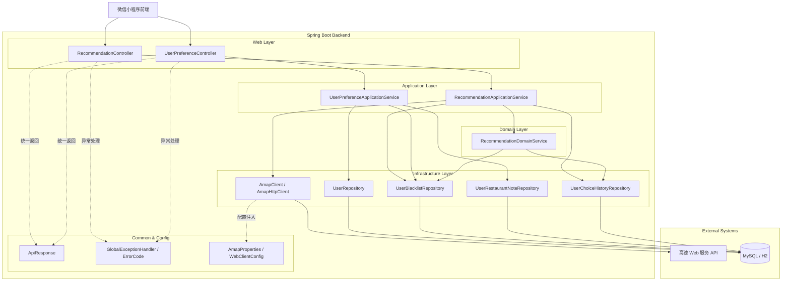
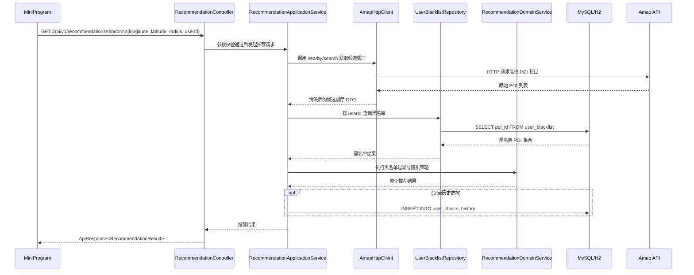
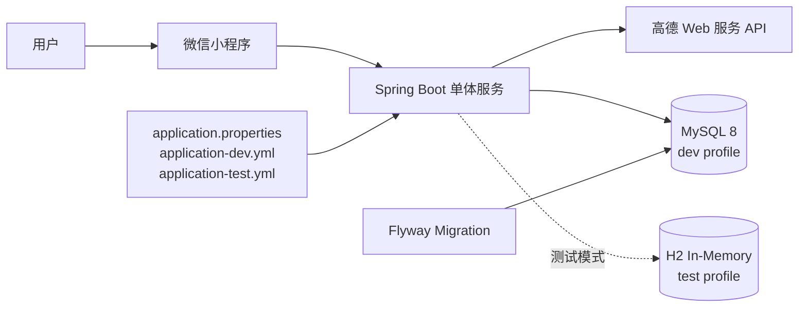
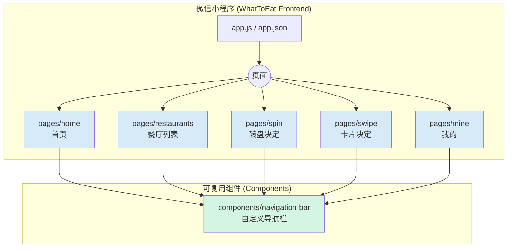

# 软件架构设计文档（后端）

## 1. 文档目标

本文档用于说明“今天吃什么（WhatToEat）”后端在本阶段的整体架构、模块边界、数据流、技术选型与运行方式。后续代码实现与测试以本设计为基准。

- 技术栈：Java 17 + Spring Boot 4.x + Spring Data JPA + MySQL
- 外部依赖：高德 Web 服务 API（餐厅主数据来源）
- 设计原则：高内聚、低耦合、先交付核心路径

---

## 2. 架构范围与约束

### 2.1 本阶段范围

1. 附近餐厅查询（高德）
2. 随机推荐（支持黑名单过滤）
3. 卡片候选列表
4. 用户偏好：拉黑/取消拉黑、备注

### 2.2 关键约束

- 餐厅主数据不落地为本地主表（来源统一为高德 POI）
- 本地数据库只保存用户侧数据（黑名单、备注、历史）
- 前端不直接调用高德 API，由后端统一代理与清洗

---

## 3. 技术选型确认

| 层级 | 选择 | 理由 |
|---|---|---|
| 后端框架 | Spring Boot 4 + Java 17 | 便于快速搭建 RESTful API，生态成熟，适合后续扩展参数校验、统一异常处理、配置管理与测试能力 |
| 数据访问 | Spring Data JPA + Hibernate | 适合本阶段以用户偏好数据为主的 CRUD 场景，开发成本低，和 Spring Boot 集成直接 |
| 数据库 | MySQL 8 | 适合承载结构化用户数据，和 JPA、Flyway 配套成熟，便于后续联调与部署 |
| 数据库迁移 | Flyway | 用版本化 SQL 管理表结构演进，避免人工改库导致环境不一致 |
| 外部服务集成 | 高德 Web 服务 API | 提供餐厅主数据与位置能力，避免本地维护完整餐厅主表 |
| 运行与部署方式 | 本地开发使用 `Spring Boot + Maven Wrapper`，后续部署采用单体服务 + MySQL | 本阶段先保证本地开发与联调效率，部署拓扑简单，便于课堂作业验收 |

---

## 4. 逻辑分层架构



### 4.1 分层职责

- **Controller**：参数接收、校验、返回统一响应结构
- **Application Service**：编排业务流程（例如推荐时先取候选再过滤）
- **Domain Service**：核心业务规则（随机策略、过滤策略）
- **Repository（JPA）**：用户侧数据持久化访问
- **Integration/Amap**：高德接口调用、超时与错误转换、DTO 映射
- **Common**：统一返回体、全局异常处理、业务错误码

---

## 5. 包结构实现

```text
backend/src/main/java/com/zjgsu/whattoeat/
├── controller/
├── service/
│   ├── application/
│   └── domain/
├── integration/
│   └── amap/
├── repository/
├── model/
│   ├── dto/
│   └── entity/
├── common/
└── config/
```

当前仓库已按上述结构落地，核心代码位置如下：

- `controller/RecommendationController.java`：餐厅推荐相关接口
- `controller/UserPreferenceController.java`：用户偏好相关接口
- `service/application/`：流程编排层
- `service/domain/`：推荐与过滤规则
- `integration/amap/`：高德接口封装
- `repository/`：JPA Repository
- `model/entity/`：用户侧数据实体
- `common/`：统一返回体、异常与错误码
- `config/`：配置绑定与 WebClient 配置

---

## 6. 核心业务流程

### 6.1 随机推荐流程



### 6.2 用户拉黑流程

1. 前端请求 `POST /api/v1/users/{userId}/blacklist/{poiId}`
2. 后端校验参数并检查唯一键（`user_id + poi_id`）
3. 持久化写入 `user_blacklist`
4. 返回统一成功响应

---

## 7. 异常与稳定性设计

### 7.1 异常分层

- 参数异常：400（参数缺失/格式错误）
- 业务异常：4xx（例如重复拉黑）
- 上游异常：502/503（高德接口失败或超时）
- 系统异常：500

### 7.2 韧性建议（实现阶段落地）

- 外部调用设置连接与读取超时
- 对高德返回做错误码映射，避免错误透传前端
- 记录关键链路日志（请求 ID / userId / poiId）

---

## 8. 部署与运行拓扑



### 8.1 环境划分

- `dev`：本地开发，连接本机 MySQL `whattoeat_dev`
- `test`：本地无 MySQL 验证或测试环境，使用 H2 内存数据库
- `prod`：生产环境（后续）

### 8.2 配置管理

- `application.properties` + `application-{profile}.yml`
- 敏感信息（如高德 key）通过环境变量或密钥管理注入

### 8.3 本地运行命令

1. 使用开发库运行：

```bash
cd backend
JAVA_HOME=$(/usr/libexec/java_home -v 17) ./mvnw spring-boot:run
```

2. 在未启动 MySQL 时验证后端启动：

```bash
cd backend
JAVA_HOME=$(/usr/libexec/java_home -v 17) ./mvnw spring-boot:run \
  -Dspring-boot.run.profiles=test \
  -Dspring-boot.run.useTestClasspath=true
```

3. 运行后端测试：

```bash
cd backend
JAVA_HOME=$(/usr/libexec/java_home -v 17) ./mvnw test
```

---

## 9. 与实现阶段的映射关系

- `docs/api.md`：接口契约与参数定义
- `docs/database.md`：ER、表结构、索引、迁移方案
- 本文档：系统边界与模块职责

三者共同作为后端实现与联调的基线。

---

## 10. 前端架构

### 10.1 页面与组件结构



