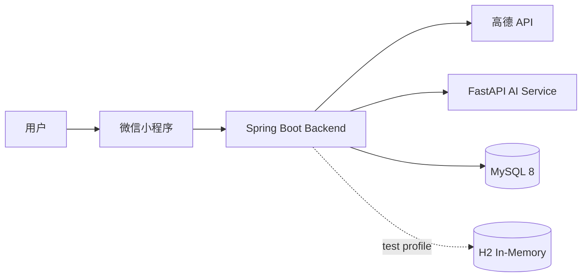

# 软件架构设计文档（后端）

## 1. 文档目标

本文档描述 **WhatToEat 当前仓库真实落地的后端架构**，用于给前后端联调、数据库演进、AI 能力扩展提供统一基线。

当前实现不是“纯高德代理 + 黑名单”的早期版本，而是已经进入 **高德主数据 + 本地评论与聚合增强 + AI 推荐增强** 的阶段。

- 技术栈：Java 17 + Spring Boot 4.x + Spring Data JPA + MySQL / H2
- 外部依赖：高德 Web 服务 API、内部 AI Service（OpenAI-compatible）
- 设计原则：主链路稳定优先、结构化返回优先、上游隔离优先、前端只对接 backend

---

## 2. 当前范围与约束

### 2.1 当前已落地范围

1. 附近餐厅查询（高德）
2. 关键词搜索（高德）
3. 随机推荐与卡片候选列表
4. 餐厅列表增强排序（基于本地聚合快照）
5. 用户黑名单 CRUD
6. 用户备注 CRUD
7. 用户对单店评论 CRUD
8. 餐厅公开评论分页查询
9. 餐厅评论聚合摘要与 AI 标签摘要
10. AI 推荐问答（同步 / 流式）

### 2.2 当前仍未接入主链路的能力

1. 还没有独立的“用户长期口味画像表”，当前采用轻量聚合接口实时生成画像
2. 还没有把 AI 摘要状态显式暴露给前端（当前只暴露摘要结果，不暴露 `aiStatus`）
3. 前端尚未真正接入 choice-history / recommendation-feedback / preference-profile 这组三个新能力

### 2.3 关键约束

- 餐厅主数据 **仍不落地为本地主表**，统一来源于高德 POI
- 本地数据库现在不仅保存用户侧数据，也保存 **餐厅评论事实表** 与 **餐厅聚合快照表**
- 前端不直接调用高德，也不直接调用 AI Service，只调用 `backend/`
- AI 只能在当前候选集合或当前餐厅评论语料范围内工作，不能脱离现有候选随意编造餐厅

---

## 3. 总体架构

```mermaid
flowchart TD
    FE[微信小程序前端]

    subgraph API[Spring Boot Backend]
        direction TB

        subgraph WEB[Web Layer]
            AC[AuthController]
            RC[RestaurantController]
            RECC[RecommendationController]
            BLC[UserBlacklistController]
            NTC[UserNoteController]
            RVC[RestaurantReviewController]
            RSC[RestaurantReviewSummaryController]
        end

        subgraph APP[Application Layer]
            AAS[AuthApplicationService]
            RQAS[RestaurantQueryApplicationService]
            RECAS[RecommendationApplicationService]
            BLAS[UserBlacklistApplicationService]
            NTAS[UserNoteApplicationService]
            RVAS[RestaurantReviewApplicationService]
            RVQAS[RestaurantReviewQueryApplicationService]
            RMAS[RestaurantMetricAggregationService]
            RVAIAS[RestaurantReviewAiApplicationService]
            UCHAS[UserChoiceHistoryApplicationService]
            URFAS[UserRecommendationFeedbackApplicationService]
            UPPAS[UserPreferenceProfileApplicationService]
        end

        subgraph DOMAIN[Domain Layer]
            RDS[RecommendationDomainService]
        end

        subgraph INFRA[Infrastructure Layer]
            AMAP[AmapClient / AmapHttpClient]
            AI[AiAssistantClient / AiHttpClient]
            UR[UserRepository]
            BLR[UserBlacklistRepository]
            NR[UserRestaurantNoteRepository]
            HR[UserChoiceHistoryRepository]
            RVR[RestaurantReviewRepository]
            RMSR[RestaurantMetricSnapshotRepository]
        end

        subgraph SUPPORT[Common & Config]
            RESP[ApiResponse]
            EX[GlobalExceptionHandler / ErrorCode]
            CFG[AmapProperties / AiServiceProperties / Web Config]
        end
    end

    subgraph EXT[External Systems]
        AMAPAPI[高德 Web 服务 API]
        AISVC[AI Service]
        DB[(MySQL / H2)]
    end

    FE --> AC
    FE --> RC
    FE --> RECC
    FE --> BLC
    FE --> NTC
    FE --> RVC
    FE --> RSC

    RC --> RQAS
    RECC --> RECAS
    RVC --> RVAS
    RSC --> RVQAS

    RECAS --> RDS
    RECAS --> AMAP
    RECAS --> AI
    RECAS --> BLR
    RECAS --> RMSR
    RQAS --> AMAP
    RQAS --> RMSR
    RVAS --> RVR
    RVAS --> RMAS
    RVAS --> RVAIAS
    RVQAS --> RVR
    RVQAS --> RMSR
    RVAIAS --> AI
    BLAS --> UR
    BLAS --> BLR
    NTAS --> UR
    NTAS --> NR

    AMAP --> AMAPAPI
    AI --> AISVC
    UR --> DB
    BLR --> DB
    NR --> DB
    HR --> DB
    RVR --> DB
    RMSR --> DB
```



---

## 4. 分层职责

### 4.1 Controller

负责参数接收、校验、返回统一 `ApiResponse`，并在需要时做最小权限校验。

当前主要控制器：

- `AuthController`
- `RestaurantController`
- `RecommendationController`
- `UserBlacklistController`
- `UserNoteController`
- `RestaurantReviewController`
- `RestaurantReviewSummaryController`

### 4.2 Application Service

负责业务编排与跨模块调用，不直接暴露给前端。

关键流程：

- `RestaurantQueryApplicationService`
  - 调高德 nearby / search
  - 合并 `restaurant_metric_snapshot`
  - 执行本地增强排序
- `RecommendationApplicationService`
  - 构建候选池
  - 应用黑名单过滤
  - 调 AI 生成结构化推荐
  - 在流式场景把上游工具调用翻译成 `recommendation.card`
- `RestaurantReviewApplicationService`
  - 评论校验 / 创建 / 更新 / 删除
  - 触发快照重算 + AI 标签重算
- `RestaurantReviewQueryApplicationService`
  - 公开评论分页查询
  - 评论摘要查询
- `RestaurantMetricAggregationService`
  - 聚合评论数 / 均分 / 均价
- `RestaurantReviewAiApplicationService`
  - 基于当前餐厅评论生成标签与摘要

### 4.3 Domain Service

- `RecommendationDomainService`
  - 黑名单过滤
  - 随机挑选策略

### 4.4 Infrastructure

- `integration/amap/*`：高德调用、DTO 清洗、错误转换
- `infrastructure/ai/*`：调用内部 AI Service，封装同步 / 流式、工具调用与 SSE 解析
- `repository/*`：JPA 持久化访问

---

## 5. 当前包结构与真实映射

```text
backend/src/main/java/com/zjgsu/whattoeat/
├── controller/
├── service/
│   └── application/          # 评论、画像、反馈等仍在该目录
├── application/
│   └── recommendation/       # 推荐主链路已迁到此处
├── domain/
│   └── recommendation/       # 推荐领域规则
├── integration/
│   └── amap/
├── infrastructure/
│   └── ai/                   # AI 集成已迁到此处
├── repository/
├── model/
│   ├── dto/
│   └── entity/
├── common/
└── config/
```

新增且必须纳入架构认知的模块：

- `service/application/RestaurantReview*`
- `service/application/RestaurantMetricAggregationService`
- `application/recommendation/`
- `domain/recommendation/`
- `infrastructure/ai/`
- `RestaurantReviewEntity`
- `RestaurantMetricSnapshotEntity`
- `RestaurantReviewRepository`
- `RestaurantMetricSnapshotRepository`
- `RestaurantReviewApplicationService`
- `RestaurantReviewQueryApplicationService`
- `RestaurantMetricAggregationService`
- `RestaurantReviewAiApplicationService`

---

## 6. 核心业务流程

### 6.1 餐厅查询与增强排序

1. 前端请求 `/api/v1/restaurants/nearby` 或 `/api/v1/restaurants/search`
2. 后端调用高德获取候选列表
3. 读取 `restaurant_metric_snapshot` 合并增强字段：
   - `avgRating`
   - `reviewCount`
   - `avgPerCapitaPrice`
   - `aiTags`
4. 若 `sort=distance`，直接返回当前页结果
5. 若是增强排序：
   - 先抓取放大的候选池
   - 在本地按评分 / 评论数 / 人均 / smart 排序
   - 再本地分页

> 注意：当前增强排序是“候选池内局部排序”，不是对高德全量结果做全局稳定排序，因此深分页语义不能简单按 `total` 推断。

### 6.2 评论写入与聚合刷新

1. 前端调用 `PUT /api/v1/users/{userId}/restaurant-reviews/{poiId}`
2. 后端校验 Bearer Token 与路径 `userId` 一致
3. 校验评分 / 人均 / 文本合法性
4. upsert `restaurant_review`
5. 调 `RestaurantMetricAggregationService.refreshSnapshot(poiId)`
6. 调 `RestaurantReviewAiApplicationService.refreshTagsForPoi(poiId)`
7. 返回当前用户评论详情

### 6.3 评论聚合摘要查询

1. 前端调用 `GET /api/v1/restaurants/{poiId}/review-summary`
2. 后端从 `restaurant_metric_snapshot` 读取：
   - 评论数
   - 平均评分
   - 平均人均
   - AI 标签
   - AI 摘要
3. 若无快照则稳定返回空态结构

### 6.4 AI 推荐问答

1. 前端可调用 `/api/v1/recommendations/ask` 或 `/ask/stream`，但正式聊天链路应优先 `/ask/stream`
2. 后端从高德拉取候选池
3. 可选应用 `userId` 对应黑名单过滤
4. 合并 `restaurant_metric_snapshot` 形成增强候选卡
5. 后端基于服务端 `Clock` 自动补充轻量时间语境（日期、星期、当前时段），前端无需再额外传时间/日期/天气字段
6. 把候选卡送入 AI Service
7. AI 只能从给定候选中做推荐
8. 后端返回：
   - 同步：`answer + recommendations[]`
   - 流式：`session.created / retrieval.* / recommendation.card / answer.* / done / error`

补充说明：

- 当前推荐主链路对 AI Service 使用的是流式推荐接口；同步接口也是由服务端聚合流式结果得到
- 因此前端若要做正式聊天体验，应优先接 `/ask/stream`

---

## 7. 稳定性与鲁棒性设计

### 7.1 上游隔离

- 高德异常统一映射为：`3001 / 3002 / 3003`
- AI 服务异常统一映射为：`3004 / 3005`
- 前端不需要感知内部模型协议，只消费 backend 统一结构

### 7.2 权限与一致性

- 评论接口要求 Bearer Token
- `token user != path userId` 时直接返回 `401 / 1003`
- 黑名单与评论的“用户身份”都以服务端认证结果为准，不能依赖前端本地缓存推断

### 7.3 空态设计

- 周边无结果：`404 / 3003`
- 当前用户未评论某店：`404 / 2104`
- 公开评论为空：`200 + items: []`
- 评论摘要为空：`200 + reviewCount=0 + aiTags=[]`

### 7.4 当前需要前后端共同认知的限制

1. `review-summary` 当前**不暴露 `aiStatus`**，所以前端无法严格区分“还在生成 / 生成失败 / 暂无摘要”，只能把 `aiSummary == null` 视为“摘要暂不可用”
2. 增强排序是候选池内本地排序，深翻页需要双重停止条件（`items.length === 0` 或达到 `total`）
3. `choice-history` 与 `recommendation-feedback` 已进入推荐过滤与 AI 上下文，但前端若不主动调用，对用户仍不会产生真实效果

---

## 8. 部署与运行拓扑



### 8.1 当前环境形态

- `dev`：本地 MySQL + 本地/外部 AI Service
- `test`：H2 + mock/stub 外部依赖
- `docker`：`docker-compose.yml` 同时拉起 `mysql + ai-service + backend`

### 8.2 配置要点

- `amap.*`：高德配置
- `wechat.auth.*`：登录配置
- `ai.service.*`：backend 到 AI Service 的调用配置
- AI Service 自身再通过环境变量连接 OpenAI-compatible 模型

---

## 9. 文档对齐要求

以下文档必须以“当前实现”而不是早期方案为准：

- `docs/api.md`
- `docs/api.yaml`
- `docs/database.md`
- `docs/backend.md`
- `docs/frontend-ai-review-integration.md`

尤其要避免继续使用以下旧说法：

- “本地数据库只保存黑名单、备注、历史”
- “当前只有随机推荐和卡片候选列表，没有评论与 AI”
- “recommendation 只基于高德结果池随机挑选”

这些说法都已经与仓库真实状态不一致。
