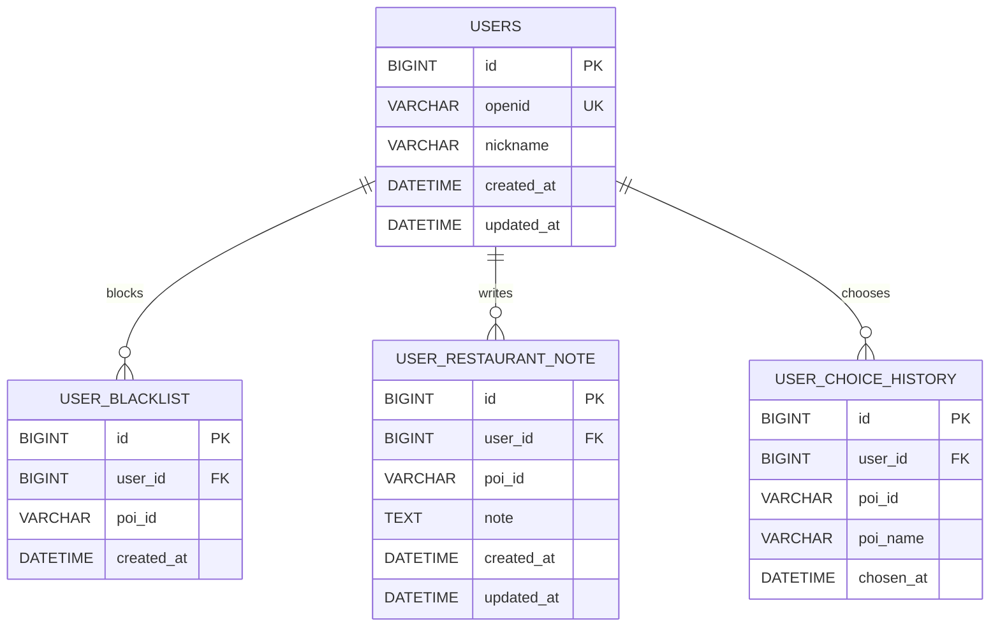

# 数据库设计文档（后端）

## 1. 设计目标

数据库仅承载用户侧状态，不承载餐厅主数据。餐厅信息统一由高德 Web 服务 API 提供，后端仅存储与用户相关的偏好和历史数据。

- 数据库：MySQL 8+
- ORM：Spring Data JPA
- 迁移工具：Flyway（推荐）

---

## 2. ER 设计



> 说明：`poi_id` 为高德 POI 唯一标识，作为外部关联键使用。

---

## 3. 表结构设计

## 3.1 users

| 字段 | 类型 | 约束 | 说明 |
|---|---|---|---|
| id | bigint | PK, auto increment | 用户主键 |
| openid | varchar(64) | UNIQUE, NOT NULL | 微信用户标识 |
| nickname | varchar(64) | NULL | 昵称 |
| created_at | datetime | NOT NULL | 创建时间 |
| updated_at | datetime | NOT NULL | 更新时间 |

## 3.2 user_blacklist

| 字段 | 类型 | 约束 | 说明 |
|---|---|---|---|
| id | bigint | PK, auto increment | 主键 |
| user_id | bigint | FK(users.id), NOT NULL | 用户 ID |
| poi_id | varchar(64) | NOT NULL | 高德 POI ID |
| created_at | datetime | NOT NULL | 拉黑时间 |

唯一约束：`uk_blacklist_user_poi (user_id, poi_id)`

## 3.3 user_restaurant_note

| 字段 | 类型 | 约束 | 说明 |
|---|---|---|---|
| id | bigint | PK, auto increment | 主键 |
| user_id | bigint | FK(users.id), NOT NULL | 用户 ID |
| poi_id | varchar(64) | NOT NULL | 高德 POI ID |
| note | text | NULL | 备注内容 |
| created_at | datetime | NOT NULL | 创建时间 |
| updated_at | datetime | NOT NULL | 更新时间 |

唯一约束：`uk_note_user_poi (user_id, poi_id)`（同一用户同一 POI 保持单条可更新备注）

## 3.4 user_choice_history

| 字段 | 类型 | 约束 | 说明 |
|---|---|---|---|
| id | bigint | PK, auto increment | 主键 |
| user_id | bigint | FK(users.id), NOT NULL | 用户 ID |
| poi_id | varchar(64) | NOT NULL | 高德 POI ID |
| poi_name | varchar(128) | NULL | 选择时记录的餐厅名称快照 |
| chosen_at | datetime | NOT NULL | 选择时间 |

---

## 4. 索引设计

| 表 | 索引 | 类型 | 用途 |
|---|---|---|---|
| users | uk_users_openid(openid) | unique | 登录/查找用户 |
| user_blacklist | uk_blacklist_user_poi(user_id, poi_id) | unique | 去重与过滤 |
| user_restaurant_note | uk_note_user_poi(user_id, poi_id) | unique | 备注 upsert |
| user_choice_history | idx_user_chosen(user_id, chosen_at) | normal | 历史查询 |

---

## 5. 迁移策略（Flyway）

## 5.1 目录规范

```text
backend/src/main/resources/db/migration/
  V1__init_users.sql
  V2__init_user_blacklist.sql
  V3__init_user_restaurant_note.sql
  V4__init_user_choice_history.sql
```

## 5.2 版本管理原则

1. 禁止手改线上库结构，统一走 migration
2. 每次结构变更对应一个新版本 SQL
3. 回滚通过“前滚修复”而非直接删历史脚本

---

## 6. JPA 映射建议

- `users` -> `UserEntity`
- `user_blacklist` -> `UserBlacklistEntity`
- `user_restaurant_note` -> `UserRestaurantNoteEntity`
- `user_choice_history` -> `UserChoiceHistoryEntity`

关键点：
- 在实体层体现唯一约束（`@Table(uniqueConstraints = ...)`）
- 时间字段建议统一自动填充策略（创建/更新时间）
- 建表 SQL 以 `backend/src/main/resources/db/migration/*.sql` 为准，文档字段说明与 migration 保持一致

---

## 7. 与推荐能力的关系

推荐接口执行顺序建议：

1. 从高德获取候选列表
2. 根据 `user_id` 查询 `user_blacklist` 的 `poi_id` 集合
3. 过滤候选列表
4. 执行随机策略并返回
5. 可选写入 `user_choice_history` 供后续去重优化

该流程确保“用户偏好优先于随机结果”。
