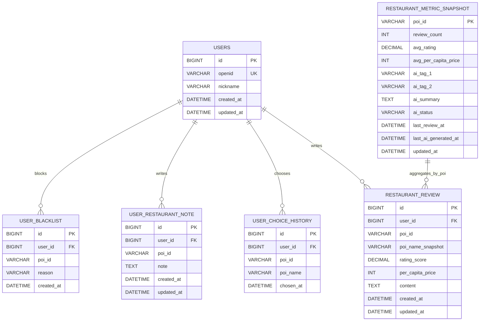

# 数据库设计文档（后端）

## 1. 设计目标

当前数据库不保存“餐厅主表”，但已经不再只是最小用户偏好库，而是承担三类数据：

1. 用户身份与用户侧状态
2. 用户对餐厅的事实评论
3. 基于评论聚合出的餐厅指标快照

因此当前数据库角色可以概括为：

- **不存主 POI 主数据**（仍以高德为准）
- **存用户侧关系与内容**（黑名单、备注、历史、评论）
- **存餐厅衍生聚合结果**（评分、人均、AI 标签、AI 摘要）

---

## 2. 当前 ER 设计



> `poi_id` 始终是外部主键：来自高德，不在本地维护餐厅主表。

---

## 3. 当前表结构

### 3.1 users

| 字段 | 类型 | 约束 | 说明 |
|---|---|---|---|
| id | bigint | PK, auto increment | 用户主键 |
| openid | varchar(64) | UNIQUE, NOT NULL | 微信用户标识 |
| nickname | varchar(64) | NULL | 昵称 |
| created_at | datetime | NOT NULL | 创建时间 |
| updated_at | datetime | NOT NULL | 更新时间 |

### 3.2 user_blacklist

| 字段 | 类型 | 约束 | 说明 |
|---|---|---|---|
| id | bigint | PK, auto increment | 主键 |
| user_id | bigint | FK(users.id), NOT NULL | 用户 ID |
| poi_id | varchar(64) | NOT NULL | 高德 POI ID |
| reason | varchar(255) | NULL | 拉黑原因 |
| created_at | datetime | NOT NULL | 创建时间 |

唯一约束：`uk_blacklist_user_poi (user_id, poi_id)`

### 3.3 user_restaurant_note

| 字段 | 类型 | 约束 | 说明 |
|---|---|---|---|
| id | bigint | PK, auto increment | 主键 |
| user_id | bigint | FK(users.id), NOT NULL | 用户 ID |
| poi_id | varchar(64) | NOT NULL | 高德 POI ID |
| note | text | NULL | 用户备注 |
| created_at | datetime | NOT NULL | 创建时间 |
| updated_at | datetime | NOT NULL | 更新时间 |

唯一约束：`uk_user_poi (user_id, poi_id)`

### 3.4 user_choice_history

| 字段 | 类型 | 约束 | 说明 |
|---|---|---|---|
| id | bigint | PK, auto increment | 主键 |
| user_id | bigint | FK(users.id), NOT NULL | 用户 ID |
| poi_id | varchar(64) | NOT NULL | 高德 POI ID |
| poi_name | varchar(128) | NULL | 选择时餐厅名快照 |
| chosen_at | datetime | NOT NULL | 选择时间 |

> 当前已接入推荐软过滤链路：推荐会优先避开近 3 天内最近吃过的餐厅；若过滤后完全无候选，后端才会回退到较宽松候选集。

### 3.5 restaurant_review

| 字段 | 类型 | 约束 | 说明 |
|---|---|---|---|
| id | bigint | PK, auto increment | 主键 |
| user_id | bigint | FK(users.id), NOT NULL | 评论用户 |
| poi_id | varchar(64) | NOT NULL | 高德 POI ID |
| poi_name_snapshot | varchar(128) | NULL | 评论时餐厅名快照 |
| rating_score | decimal(2,1) | NOT NULL | 评分，范围 0.5~5.0，步进 0.5 |
| per_capita_price | int | NOT NULL | 人均价格（元） |
| content | text | NOT NULL | 评论正文 |
| created_at | datetime | NOT NULL | 创建时间 |
| updated_at | datetime | NOT NULL | 更新时间 |

唯一约束：`uk_review_user_poi (user_id, poi_id)`

语义：

- 同一用户对同一餐厅只保留一条评论
- `PUT` 语义是 upsert，不区分“新增接口”和“更新接口”

### 3.6 restaurant_metric_snapshot

| 字段 | 类型 | 约束 | 说明 |
|---|---|---|---|
| poi_id | varchar(64) | PK | 高德 POI ID |
| review_count | int | NOT NULL, default 0 | 评论数 |
| avg_rating | decimal(2,1) | NULL | 平均评分 |
| avg_per_capita_price | int | NULL | 平均人均 |
| ai_tag_1 | varchar(32) | NULL | AI 标签 1 |
| ai_tag_2 | varchar(32) | NULL | AI 标签 2 |
| ai_summary | text | NULL | AI 摘要 |
| ai_status | varchar(16) | NOT NULL, default 'idle' | AI 状态 |
| last_review_at | datetime | NULL | 最近评论更新时间 |
| last_ai_generated_at | datetime | NULL | 最近 AI 生成时间 |
| updated_at | datetime | NOT NULL | 快照更新时间 |

`ai_status` 当前服务内部语义：

- `idle`：暂无评论或无需生成
- `pending`：评论聚合已刷新，等待 / 需要 AI 重算
- `ready`：AI 标签与摘要已生成
- `failed`：AI 重算失败

> 当前对外 API **未暴露 `ai_status`**，这是前后端联调时必须注意的限制。

### 3.7 recommendation_feedback

| 字段 | 类型 | 约束 | 说明 |
|---|---|---|---|
| id | bigint | PK, auto increment | 主键 |
| user_id | bigint | FK(users.id), NOT NULL | 用户 ID |
| poi_id | varchar(64) | NULL | 针对某个候选餐厅的反馈时记录对应 POI |
| poi_name_snapshot | varchar(128) | NULL | 反馈时餐厅名快照 |
| feedback_type | varchar(32) | NOT NULL | 反馈类型 |
| detail | varchar(255) | NULL | 自然语言补充 |
| request_question | varchar(255) | NULL | 触发反馈时的推荐问题上下文 |
| created_at | datetime | NOT NULL | 创建时间 |

语义：

- `ALREADY_ATE` 会同步写入 `user_choice_history`
- 其他近期反馈会进入推荐 AI 上下文；带 `poi_id` 的反馈还会参与短期软过滤

---

## 4. 索引与约束设计

| 表 | 索引 / 约束 | 类型 | 用途 |
|---|---|---|---|
| users | `uk_users_openid(openid)` | unique | 登录 / 查找用户 |
| user_blacklist | `uk_blacklist_user_poi(user_id, poi_id)` | unique | 去重与过滤 |
| user_restaurant_note | `uk_user_poi(user_id, poi_id)` | unique | 单用户单店唯一备注 |
| user_choice_history | `idx_user_chosen(user_id, chosen_at)` | normal | 历史查询 |
| restaurant_review | `uk_review_user_poi(user_id, poi_id)` | unique | 单用户单店唯一评论 |
| restaurant_review | `idx_review_poi_updated(poi_id, updated_at, id)` | normal | 某店公开评论倒序分页 |
| restaurant_metric_snapshot | `PRIMARY KEY(poi_id)` | pk | 单店聚合快照 |
| recommendation_feedback | `idx_feedback_user_created(user_id, created_at, id)` | normal | 用户反馈倒序分页 |
| recommendation_feedback | `idx_feedback_user_poi(user_id, poi_id)` | normal | 短期候选过滤 / 闭环分析 |

---

## 5. 迁移策略（当前真实版本）

### 5.1 迁移目录

```text
backend/src/main/resources/db/migration/
  V1__init_users.sql
  V2__init_user_blacklist.sql
  V3__init_user_restaurant_note.sql
  V4__init_user_choice_history.sql
  V6__add_reason_to_user_blacklist.sql
  V7__init_restaurant_review.sql
  V8__init_restaurant_metric_snapshot.sql
  V9__init_recommendation_feedback.sql
```

### 5.2 版本管理原则

1. 禁止手改库结构，统一走 Flyway migration
2. 结构演进只做“前滚修复”，不回写历史脚本
3. 文档必须与 migration 脚本保持一致，字段命名以 SQL 为准

---

## 6. JPA 映射

- `users` -> `UserEntity`
- `user_blacklist` -> `UserBlacklistEntity`
- `user_restaurant_note` -> `UserRestaurantNoteEntity`
- `user_choice_history` -> `UserChoiceHistoryEntity`
- `restaurant_review` -> `RestaurantReviewEntity`
- `restaurant_metric_snapshot` -> `RestaurantMetricSnapshotEntity`

关键实现点：

- `user_blacklist` / `user_restaurant_note` / `restaurant_review` 都体现了 `(user_id, poi_id)` 唯一约束
- `restaurant_metric_snapshot` 以 `poi_id` 作为主键，不使用自增 ID
- 评分 / 均分在 Java 侧使用 `BigDecimal`

---

## 7. 与当前业务能力的关系

### 7.1 查询与排序

- `/restaurants/nearby`、`/restaurants/search` 先调高德
- 再用 `restaurant_metric_snapshot` 补充：
  - 评分
  - 评论数
  - 人均
  - AI 标签
- 增强排序只依赖快照表，不直接扫描评论表

### 7.2 评论写入链路

- 评论事实写入 `restaurant_review`
- 聚合结果回写 `restaurant_metric_snapshot`
- 因此快照表属于 **读优化 / 展示优化表**

### 7.3 推荐链路

- `random` / `cards`：依赖高德 + 黑名单，不直接返回评论快照字段
- `ask` / `ask/stream`：依赖高德候选 + 黑名单 + `restaurant_metric_snapshot`

### 7.4 当前不能夸大的能力

以下能力在数据库层只是“有基础”，但业务上还没真正实现：

- 独立的长期画像表（当前仍为轻量聚合接口）
- 基于 `ai_status` 的前端细粒度摘要状态提示

---

## 8. 文档对齐结论

如果继续沿用“数据库只存黑名单、备注、历史”的旧描述，会误导以下工作：

1. 前端详情页评论对接
2. 列表评分 / 评论数 / AI 标签展示
3. AI 推荐问答候选增强
4. Docker Compose 环境理解

因此本文件应作为当前数据库状态的真实来源。
