# 摘要

本文围绕微信小程序餐厅推荐系统「今天吃什么 / WhatToEat」展开说明，内容包括需求背景、系统架构、核心功能实现、测试验证、部署实践与项目总结。系统面向在校大学生及校园周边职场人群，旨在降低日常就餐场景中的信息筛选成本和决策成本，提供餐厅查询、随机推荐、卡片滑选、评论聚合、个性化信号和 AI 推荐问答等功能。项目采用微信小程序原生前端、Spring Boot 后端、MySQL 数据库和 FastAPI 内部 AI Service 的分层架构，以高德 POI 作为餐厅主数据来源，由后端统一代理地图、推荐、评论与 AI 能力。本文依据仓库代码、接口契约、数据库迁移、测试记录和部署分支整理，重点呈现项目已实现能力、关键工程约束以及仍需改进的边界。

**关键词：** 微信小程序；餐厅推荐；Spring Boot；高德 POI；AI 推荐；CloudBase；Docker Compose

---

# 一、项目介绍 [沈哲伟、林佳涛]


## 1.1 背景与问题陈述

日常就餐选择是高校与办公场景中高频出现的轻量决策问题。尽管单次决策的业务复杂度不高，但用户通常需要在有限时间内从大量餐厅中筛选出符合距离、价格、口味和评价预期的选项，因此容易形成典型的**选择困难场景**：

- **候选数量较多但信息分散**：地图应用和外卖平台能够提供大量附近餐厅信息，但评分、评论、人均价格、距离等要素分散在不同页面和维度中，用户需要进行多轮比较才能形成判断。
- **固定生活圈带来重复决策**：在校学生和周边职场人群的就餐范围相对固定，长期使用同一批候选餐厅时容易产生重复选择和决策疲劳，系统需要记录用户偏好、黑名单和近期就餐历史来辅助推荐。
- **实际需求偏向快速可接受结果**：多数场景下，用户并不需要全局最优解，而是需要一个可解释、可接受、可直接执行的就餐选项，以减少就餐前的决策时间。

传统方式在该场景下存在一定局限：地图类应用更偏向"搜索-查看"流程，主动推荐和趣味交互能力较弱；外卖平台更多围绕促销、商家排序和交易转化设计，难以直接满足"快速给出一个可接受选择"的使用诉求。

基于上述问题，本项目以微信小程序为载体，设计并实现面向校园及周边场景的餐饮决策辅助系统。选择微信小程序而非独立 App 的主要原因在于：小程序无需下载安装，适合就餐前短时间、高频次的使用场景；同时能够复用微信登录、定位和云能力，降低用户使用门槛。在功能设计上，系统提供随机推荐（转盘 / 摇一摇）、卡片滑选、列表筛选、评论聚合摘要以及 AI 推荐问答等交互形式，以同时覆盖快速决策和条件化筛选两类需求。

## 1.2 项目目标与核心功能

### 1.2.1 项目目标

本项目的总体目标是：**以较低的用户决策成本，帮助用户在附近餐厅中快速、可信地完成就餐选择**。围绕该目标，系统设计了三个层次的具体目标：

1. **快速决策**：通过随机推荐、卡片滑选等轻量交互，使用户能够在较短时间内获得可接受的就餐候选。
2. **可信推荐**：以高德 POI 真实餐厅数据为基础，叠加本地沉淀的评论事实与聚合快照（评分、评论数、人均价格、AI 标签），提高推荐结果的可解释性。
3. **个性化与抗重复**：引入用户黑名单、就餐历史软过滤和 AI 推荐问答，使系统能够结合用户偏好与当前场景生成更匹配的推荐结果。

### 1.2.2 功能性需求

项目当前已实现的核心功能如下：

| 功能模块 | 已实现能力 |
|---------|-----------|
| 用户与账户 | 微信登录、当前用户信息查询、用户头像维护、Bearer Token 会话 |
| 餐厅查询 | 附近餐厅查询、关键词搜索 |
| 列表增强 | 评分 / 评论数 / 人均 / AI 标签增强字段；支持 `distance`/`avgRating`/`reviewCount`/`avgPriceAsc`/`avgPriceDesc`/`smart` 多种排序 |
| 趣味推荐 | 随机推荐（转盘 / 摇一摇）、卡片候选列表（滑选） |
| AI 推荐 | AI 推荐问答（同步接口 + 流式 SSE 接口） |
| 评论与聚合 | 当前用户单店评论 CRUD、公开评论分页列表、评论聚合摘要、AI 标签摘要 |
| 个性化数据 | 黑名单 CRUD、餐厅备注 CRUD、就餐历史记录与推荐软过滤、推荐反馈、口味画像 |

### 1.2.3 非功能性需求

- **性能**：餐厅列表和定位结果采用 TTL 缓存（餐厅 3 分钟、定位 5 分钟），减少重复请求；后端对餐厅聚合快照引入 Caffeine 本地缓存，列表接口设置 `Cache-Control: max-age=300`；前端对搜索框做 300ms 防抖，并使用图片懒加载和异步本地存储写入降低首屏与主线程压力。
- **可用性与鲁棒性**：前端请求层支持超时和指数退避重试；后端对高德、AI Service 等上游异常做统一错误码隔离（`3001`~`3005`），保证主链路在外部依赖异常时具备降级能力；AI 推荐链路具备 tool-call、JSON 解析和候选兜底的多级降级策略。
- **安全性**：受保护接口通过 `Authorization: Bearer <token>` 鉴权，并校验 token 用户与路径 `userId` 一致；后端对用户输入执行 XSS 清洗与长度校验，并配置安全 HTTP 头、CSRF 过滤等防护措施。
- **可观测性**：后端与 AI Service 均提供 `/health` 健康检查；后端通过 Actuator / Prometheus 暴露指标，AI Service 通过 `/metrics` 暴露轻量请求指标；服务日志统一按 JSON 行格式输出。
- **可维护性**：三端均接入 GitHub Actions CI 与 Codecov 覆盖率统计，并配合 Dependabot 依赖更新与 CodeRabbit AI 代码审查。

## 1.3 技术选型

项目采用前后端分离与内部 AI 服务协同的三层架构，各层技术选型及理由如下：

| 层次 | 技术选型 | 选择理由 |
|------|---------|---------|
| 前端 | 微信小程序原生开发 | 无需安装、使用门槛低，契合高频轻量场景；可直接复用微信登录与定位能力 |
| 后端 | Spring Boot 4 + Java 17 + Spring Data JPA | 生态成熟、分层清晰，适合承载鉴权、业务编排、上游聚合与错误隔离等重逻辑 |
| 数据库 | MySQL 8（dev/生产）/ H2（test） | MySQL 稳定可靠用于真实环境；H2 内存库用于测试环境，实现快速、隔离的自动化测试 |
| 数据库迁移 | Flyway | 以版本化 migration 脚本作为数据库结构的唯一真相源，保证多环境结构一致 |
| 地图与位置 | 高德 Web 服务 API（由后端调用） | 以高德 POI 作为餐厅主数据源，避免自建并维护庞大的餐厅主表 |
| AI 能力 | 内部 AI Service：FastAPI + Pydantic + OpenAI-compatible SDK | Python 生态便于对接 LLM；以独立服务封装推荐问答与评论摘要，与主后端解耦 |
| 部署 | Docker / Docker Compose + GitHub Actions CI/CD | 容器化编排 MySQL、backend 与 ai-service；CI/CD 覆盖自动化测试、构建与镜像校验 |

系统设计遵循以下关键架构约束：

- 餐厅主数据统一来源于高德 POI，**不在本地维护完整餐厅主表**；本地数据库仅保存用户侧数据、评论事实表与聚合快照。
- 前端**只对接后端**，不直接调用高德，也不直接调用 AI Service，由后端统一收口鉴权、聚合与错误语义。
- AI Service 是**内部依赖**，只能在后端给定的候选餐厅集合与评论语料范围内工作，不能脱离候选池生成不存在的餐厅结果。

## 1.4 团队分工

本项目由 2 名成员协作完成，主要分工如下：

| 姓名 | 学号 | 主要分工 |
| :--- | :--- | :--- |
| 沈哲伟 | 2312190313 | 项目负责人 / 后端服务开发（Spring Boot）与数据库设计；负责鉴权、餐厅查询聚合、推荐主链路、AI 集成、评论与聚合快照、CI/CD 与部署 |
| 林佳涛 | 2312190316 | 前端负责人 / 前端开发（微信小程序）与 UI 交互设计；负责登录、首页、列表、详情、转盘 / 滑选、AI 对话等页面及前端请求层、缓存与性能优化 |

# 二、版本控制与团队协作 [沈哲伟、林佳涛]

> 本章数据基于仓库 `develop` 分支截至 2026-06-12 的 Git 历史与远端分支列表整理。统计口径与采集命令见 2.3 节。

## 2.1 分支策略

本项目托管于 GitHub（仓库 `Ryan041001/WhatToEat`），采用以 `develop` 为集成主干的 **功能分支（Feature Branch）+ Pull Request** 协作模型。团队成员在功能分支中完成开发与自测，再通过 Pull Request 合入集成分支，从流程上避免直接修改主干导致的不稳定风险。整体分支模型如下图所示：

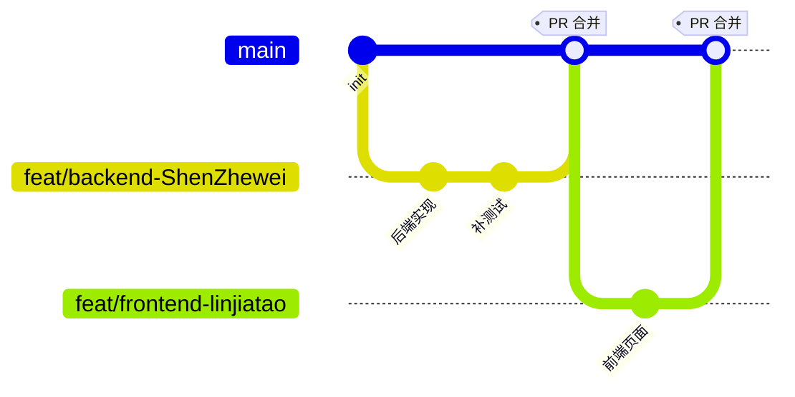
```mermaid
gitGraph
    commit id: "init"
    branch feat/backend-ShenZhewei
    checkout feat/backend-ShenZhewei
    commit id: "后端实现"
    commit id: "补测试"
    checkout main
    merge feat/backend-ShenZhewei tag: "PR 合并"
    branch feat/frontend-linjiatao
    checkout feat/frontend-linjiatao
    commit id: "前端页面"
    checkout main
    merge feat/frontend-linjiatao tag: "PR 合并"
```

> 注：图中 `main` 轨道代表本项目的集成主干 `develop`（mermaid `gitGraph` 默认主干名为 `main`，此处语义上对应 `develop`）。

各类分支的用途与约定：

| 分支类型 | 命名规则 | 用途 | 示例 |
|---|---|---|---|
| 集成主干 | `develop` | 团队集成分支，所有功能分支经 PR 合入，保持可构建、可联调 | `develop` |
| 功能分支 | `feat/<主题>-homework-<姓名>-<编号>` | 按"课程周次 / 作业主题 + 负责人"开分支，单人单主题隔离开发 | `feat/backend-homework-ShenZhewei-05`、`feat/frontend-homework-linjiatao-05` |
| 修复分支 | `fix/**` | 缺陷修复 | `fix/...` |
| 依赖更新分支 | `dependabot/**` | Dependabot 自动创建的依赖升级分支 | `dependabot/uv/ai-service/openai-2.37.0` |

本项目分支命名采用 **"主题 + 负责人"双维度标识**。例如 `feat/security-homework-ShenZhewei-10` 与 `feat/security-homework-linjiatao-10` 分别表示同一课程主题下两名成员的独立工作线。该命名方式有利于隔离并行开发、降低分支冲突，并在后续回溯时明确责任归属。

**保护规则**：`develop` 不接受直接 push，所有变更均通过 PR 合入；合并前需要通过关联的 CI 流水线，包括后端、前端、AI Service、gitleaks 与 CodeQL 等检查。质量门禁详见第十一章 11.3 节。

## 2.2 提交规范

**Commit message 规范**：团队采用 [Conventional Commits](https://www.conventionalcommits.org/) 约定式提交风格，以 `type(scope): subject` 形式描述变更类型与范围。仓库历史中主要包含以下提交类型：

- `feat`：新增功能（如 `feat(backend): ...`）
- `fix`：缺陷修复（如 `fix: resolve all CI compilation and runtime issues`）
- `perf`：性能优化（如 `perf(frontend): add 300ms debounce to restaurant search input`、`perf(backend): add Caffeine local cache for restaurant metric snapshots`）
- `docs`：文档变更（如 `docs: add contribution record for week 14`）

`scope` 用于标注影响范围（如 `backend`、`frontend`、`ai-service`），便于按模块检索和回溯历史变更。

**PR 流程**：功能分支开发完成后向 `develop` 发起 Pull Request。PR 标题沿用提交规范，描述中说明变更内容与验证方式；相关 CI 检查通过后方可合并。项目合并时保留 merge commit（仓库中可见 `Merge pull request #94 from ...` 等记录），以保留完整的分支汇入轨迹。

**代码审查**：项目接入了 **CodeRabbit AI 代码审查**（配置见 `.coderabbit.yaml`），用于在 PR 阶段提供自动化审查建议，作为人工 review 的补充。CodeRabbit 的自动审查依赖 GitHub 仓库侧安装并启用对应 App。

## 2.3 协作统计

**采集命令**如下，统计基于本地 `develop` 分支历史：

~~~ bash
git log --oneline | wc -l                          # 总提交数
git shortlog -sne --all                            # 按作者提交统计
git log --merges --oneline | wc -l                 # 合并提交（PR）数量
git branch -a                                      # 全部本地与远端分支
~~~

**总体数据**（截至 2026-06-14）：

| 指标 | 数值 |
|---|---|
| 总提交数 | 185 |
| 合并提交（PR）数 | 38 |
| 远端功能 / 作业分支 | 20+ 条（`feat/*-homework-*` 系列） |

**成员提交统计**：由于成员在不同设备和平台上使用过多个 Git 身份（同一人对应多个 name/email），下表按真实成员身份归并统计：

| 成员 | 关联 Git 身份 | 提交次数（约） | 主要负责 |
|---|---|---|---|
| 沈哲伟 | `Ryan041001`、`Ryan Shen`、`ShenZhewei` | 约 109 | 后端 / AI / 安全 / 测试 / 可观测性 |
| 林佳涛 | `hiko-1`、`jiatao lin` | 约 53 | 前端 / UI / 前端 CI / 云平台调研 |
| 自动化 | `dependabot[bot]` | 22 | 依赖升级提交 |
| 自动化 | `copilot-swe-agent[bot]` | 1 | 工具辅助提交 |

> 说明：上表提交次数为按邮箱 / 用户名归并后的近似值，多身份合并统计以本地 Git 历史为依据。若需进一步统计代码行增删，可结合 GitHub Insights 的 Contributors 页面进行复核。

**关键 PR 与贡献留痕**：仓库 `docs/contributions/` 目录按作业主题划分，包括 `02-ui`、`03-architecture`、`04-api`、`05-frontend`、`06-backend`、`07-ai`、`08-test`、`09-cicd`、`10-security`、`11-docker`、`12-cloud`、`13-monitoring`、`14-performance` 等。各目录保存了成员贡献说明，记录完成内容、PR 链接、问题与解决方案，构成团队协作过程的书面记录。近期关键 PR 包括 #93、#94（第 14 周性能优化）等。

# 三、UI/UX 设计与原型 [林佳涛、沈哲伟]

> 本章说明系统 UI/UX 设计过程与原型结果。林佳涛负责整体页面设计、设计规范制定与原型产出（首页、大转盘、卡片滑选、列表、个人中心），沈哲伟在此基础上完成玻璃态（Glass Morphism）视觉系统升级与导航栏统一。文中截图均来自仓库本地素材，不依赖外部链接。

## 3.1 用户画像与场景分析

本产品面向的核心用户为**在校大学生与校园周边职场人群**。该类用户通常具有就餐范围相对固定、时间碎片化、对价格敏感、决策频次高但单次决策投入意愿较低等特点。基于该用户群体，项目提炼出两类典型用户画像与三个核心使用场景。

**用户画像一：选择困难型学生用户。** 该类用户生活半径集中在宿舍、教学楼、食堂和校外商圈，需要高频重复进行午餐或晚餐选择。其核心诉求并非寻找绝对最优餐厅，而是快速获得风险较低、可以接受的推荐选项。对应到功能设计上，主要体现为大转盘、摇一摇、卡片滑选等**低认知负荷的随机决策**入口。

**用户画像二：偏好明确型职场用户。** 该类用户对人均价格、口味（清淡 / 重辣 / 高蛋白）和距离有相对明确的要求，倾向于通过自然语言表达需求，但不希望在多个应用之间反复切换比较。对应到功能设计上，主要体现为 **AI 推荐问答 + 列表筛选 + 评论聚合摘要** 的条件化决策路径。

三个核心使用场景如下：

| 场景 | 触发时机 | 用户诉求 | 对应功能入口 |
|------|----------|----------|--------------|
| 快速决策 | 临近就餐时间、缺少比较意愿 | 在较短时间内获得可接受结果 | 大转盘 / 摇一摇 / 卡片滑选 |
| 条件化筛选 | 有明确口味或预算 | 按条件缩小候选范围 | 列表筛选 + 排序 / AI 问答 |
| 餐厅确认 | 已锁定候选、需要进一步判断 | 查看评分、人均价格与评论摘要 | 详情页 + 评论聚合摘要 |

## 3.2 界面原型设计

小程序由 8 个页面构成，页面之间的跳转关系如下图所示。整体信息架构以登录页为入口、首页为中枢，并由首页向随机决策、列表筛选、AI 问答、个人中心和详情页等功能页发散。

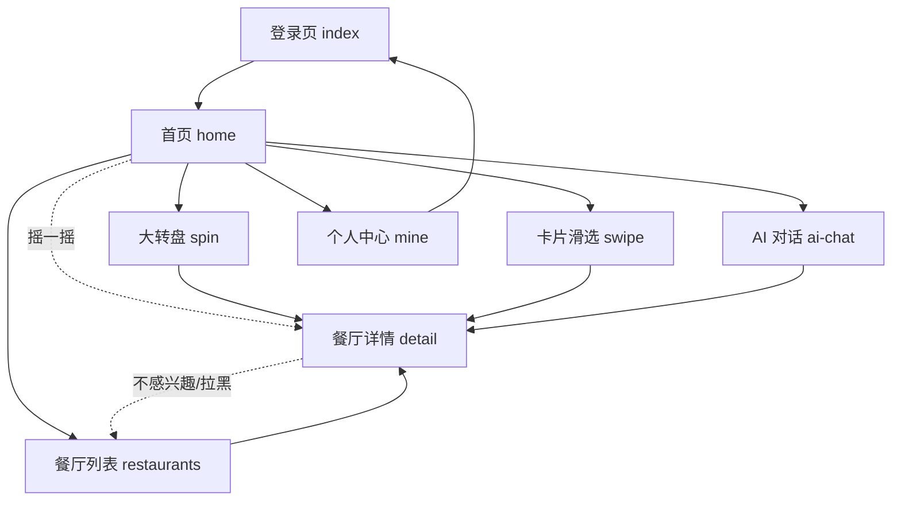
```mermaid
flowchart TD
    LOGIN[登录页 index] --> HOME[首页 home]
    HOME --> SPIN[大转盘 spin]
    HOME --> SWIPE[卡片滑选 swipe]
    HOME --> LIST[餐厅列表 restaurants]
    HOME --> CHAT[AI 对话 ai-chat]
    HOME --> MINE[个人中心 mine]
    HOME -. 摇一摇 .-> DETAIL[餐厅详情 detail]
    SPIN --> DETAIL
    SWIPE --> DETAIL
    LIST --> DETAIL
    CHAT --> DETAIL
    MINE --> LOGIN
    DETAIL -. 不感兴趣/拉黑 .-> LIST
```

各页面设计说明如下。

**首页（home）**：首页作为系统中枢页，顶部展示"总数 / 可选 / 已拉黑"三项统计，使用户能够快速了解候选规模；中部将 AI 推荐问答作为主要入口，下方并列大转盘、摇一摇、卡片滑选三个决策入口与热门推荐列表。其设计理念是"**决策强度分层**"，即通过随机决策、AI 问答和列表筛选分别服务于不同决策深度的用户。

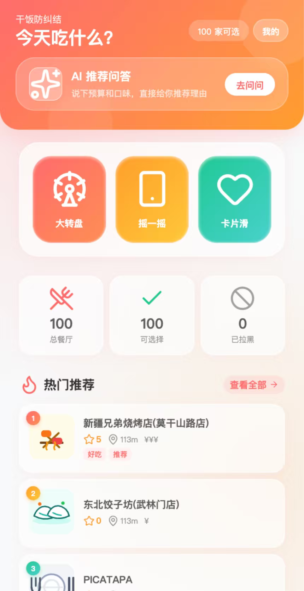

**大转盘与摇一摇（spin / shake）**：大转盘将餐厅选择过程转化为可视化抽取，摇一摇则利用移动端传感交互增强随机决策的即时性。两者均从全局可选餐厅集合中抽取结果，并排除已拉黑餐厅。

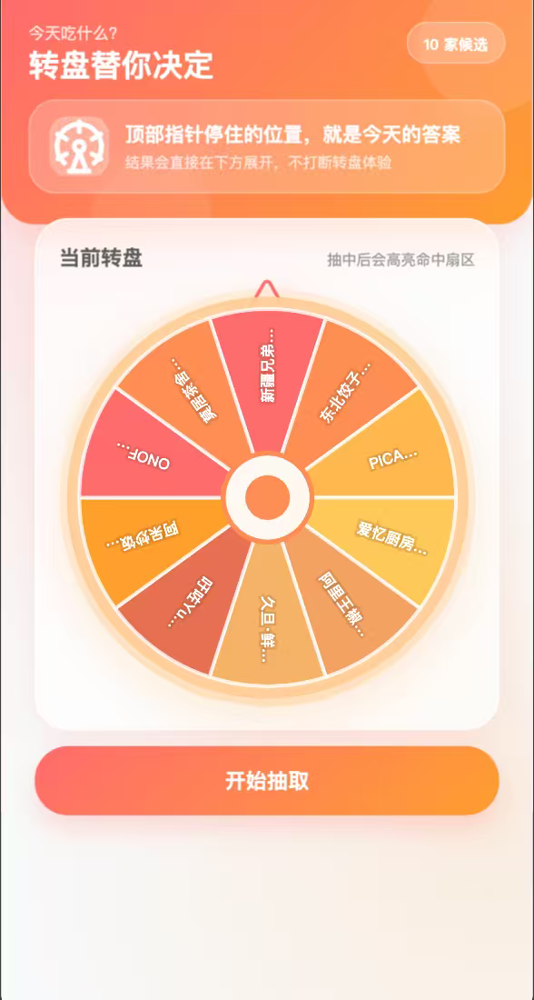

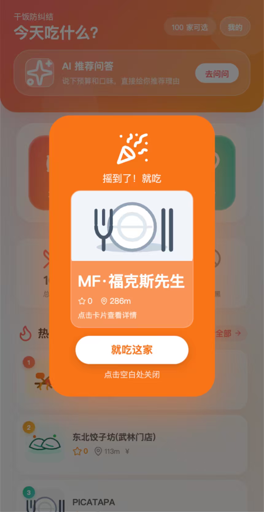

**卡片滑选（swipe）**：卡片滑选采用"左滑跳过 / 右滑喜欢"的交互范式，使用户在连续轻量操作中完成筛选，并在滑选结束后给出结算结果。该页面的设计重点在于手势识别、卡片堆叠和结算结果的一致性。

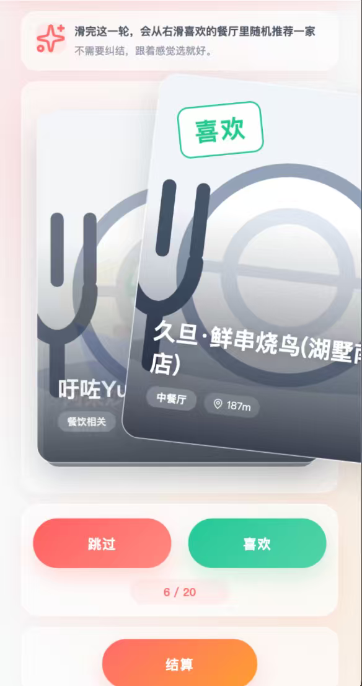

**餐厅列表（restaurants）**：列表页面面向"条件化筛选"场景，支持真实分类筛选、人均区间筛选与多种后端排序。界面保留搜索框、筛选条件和卡片流结构，筛选项来自真实结果集，避免仅在前端展示层构造无效筛选。

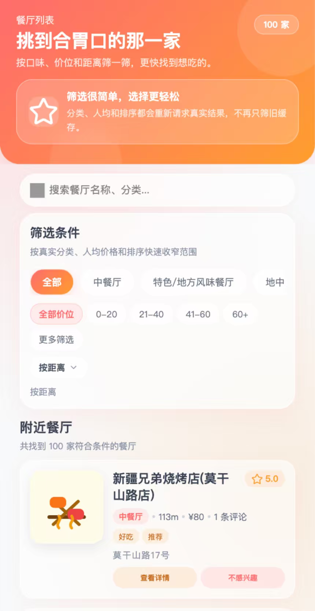

**餐厅详情（detail）**：详情页聚合餐厅基础信息、评论聚合摘要、公开评论与当前用户评论表单，评分采用星级滑动条输入。该页面是用户在推荐或筛选后进行二次确认的主要入口。

**个人中心（mine）**：个人中心展示当前用户昵称与统计信息，并提供退出登录入口。该页面保持较低信息密度，主要承载账户状态与基础个人信息。

**AI 对话（ai-chat）**：AI 对话页承载流式推荐问答，支持 Markdown 渲染与退出后恢复上一轮问答记录。用户可用自然语言描述预算、距离和口味偏好，系统返回推荐理由并渲染对应餐厅卡片。

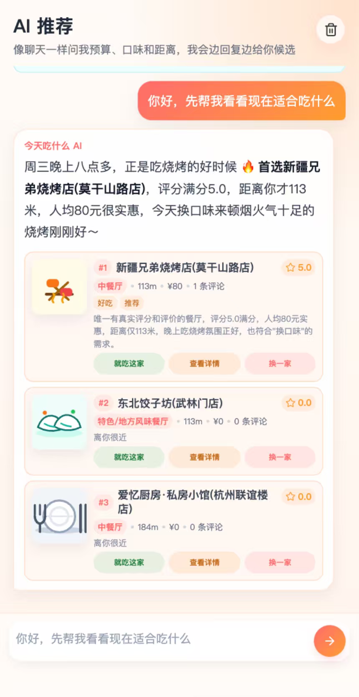

### 3.2.1 交互设计原则

针对微信小程序的移动端特性，设计遵循以下原则：

1. **手势优先、轻量操作**：核心决策动作（转盘转动、卡片左右滑）均设计为单指手势，减少层级跳转与表单填写，契合小程序轻量使用场景。
2. **屏幕适配**：布局以 flex 弹性盒为主、配合 `rpx` 响应式单位，保证在不同尺寸机型上的等比缩放；关键操作按钮置于拇指热区。
3. **状态可感知**：所有网络请求均配置统一的 `loading-spinner` 加载态；请求失败时使用 Toast 提示，401 状态自动跳转登录页，避免出现无反馈状态。
4. **导航一致性**：通过统一导航栏组件（`navigation-bar` / `unified-topbar`）保证各页面顶部风格一致，降低用户在页面间切换的认知成本。

### 3.2.2 用户体验设计与视觉风格

在视觉层面，项目建立了一套以**玻璃态（Glass Morphism）**为核心的设计系统：通过 `backdrop-filter` 毛玻璃模糊、半透明表面、柔和阴影与渐变氛围背景（`glass-atmosphere`）形成空间层次。为保证视觉一致性，玻璃态相关样式统一收口为 CSS 变量体系（如 `--glass-surface-*`、`--glass-border-*`），并集中在 `theme.css` 中管理，各页面复用同一套设计语言。

在体验细节上，前端通过本地缓存与 TTL 减少重复加载等待，通过图片懒加载降低首屏压力，通过搜索防抖减少无效请求，并通过统一加载态和错误态保证操作反馈的及时性。这些工程手段与视觉设计共同支撑了移动端体验的响应速度和稳定性目标。

> 设计稿来源说明：本项目的高保真原型最初在 Figma（Figma Make）中产出，其代码包内含来自 **shadcn/ui** 的组件（MIT 许可，https://github.com/shadcn-ui/ui ）以及来自 **Unsplash** 的示意图片（Unsplash 许可，https://unsplash.com/license ）；详见 `docs/design/ATTRIBUTIONS.md`。正式上线的小程序界面为微信原生 WXML/WXSS 重新实现，未直接打包上述第三方前端组件。

# 四、软件架构设计 [沈哲伟]

## 4.1 整体架构

WhatToEat 采用**三层服务 + 单一对外网关**的整体架构：微信小程序作为唯一前端入口，Spring Boot 后端作为唯一对外网关，内部再编排高德地图、AI Service 与数据库三类依赖。整体结构如下图所示：

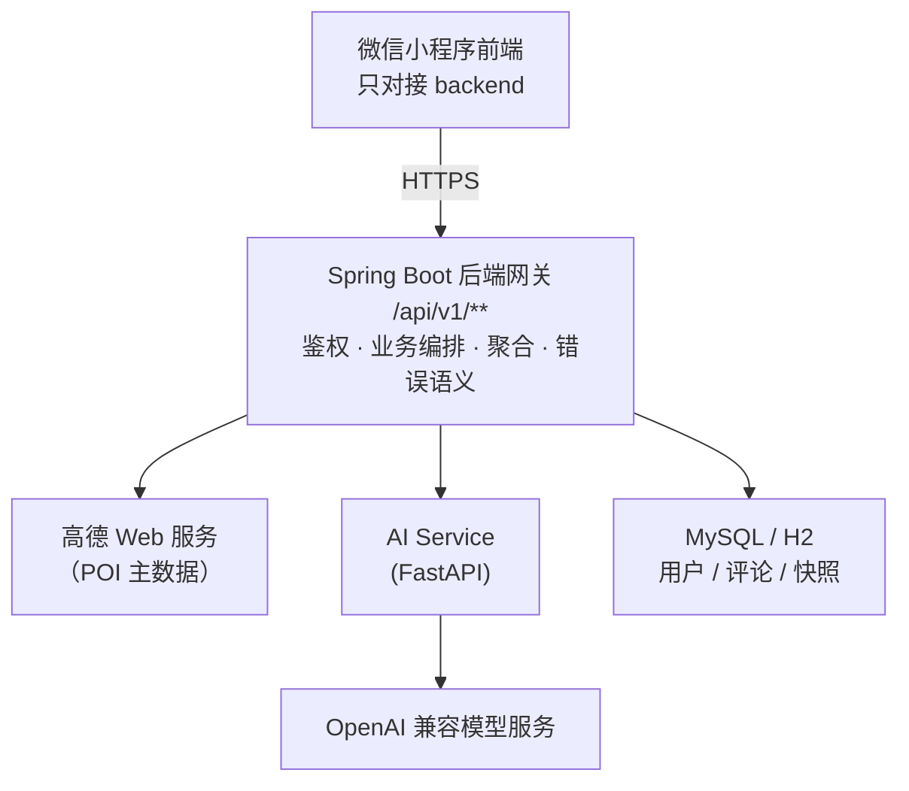
```mermaid
flowchart TD
    FE["微信小程序前端<br/>只对接 backend"]
    GW["Spring Boot 后端网关<br/>/api/v1/**<br/>鉴权 · 业务编排 · 聚合 · 错误语义"]
    AMAP["高德 Web 服务<br/>（POI 主数据）"]
    AI["AI Service<br/>(FastAPI)"]
    DB["MySQL / H2<br/>用户 / 评论 / 快照"]
    LLM["OpenAI 兼容模型服务"]

    FE -->|HTTPS| GW
    GW --> AMAP
    GW --> AI
    GW --> DB
    AI --> LLM
```

各部分职责与设计理由如下：

- **微信小程序前端（表现层）**：承载登录、首页、列表、详情、转盘、滑选、AI 对话、个人中心等页面。前端**只与后端通信**，既不直接调用高德，也不直接调用 AI Service。该设计将地图密钥、模型协议、错误映射等敏感且易变的细节收敛到后端，前端只消费统一响应；相应代价是前端能力依赖后端接口实现，不能绕过后端独立联调。
- **Spring Boot 后端（业务逻辑层 / 对外网关）**：对外暴露统一前缀 `/api/v1/**` 的 REST 接口，负责鉴权、参数校验、业务编排、候选池构建、聚合增强与上游错误隔离。后端作为唯一业务网关，是保障"前端简单、上游可替换、契约稳定"的关键设计。
- **高德 Web 服务 API（外部数据源）**：提供附近餐厅与关键词搜索的 POI 候选。项目**不在本地维护餐厅主表**，餐厅主数据始终以高德为准，本地只保存用户侧数据与评论衍生的聚合结果。这一约束避免了维护一份庞大且会过期的餐厅主数据，但也意味着深分页、全局排序等能力受高德返回方式限制。
- **AI Service（内部依赖，FastAPI）**：供后端调用，完成评论标签摘要与推荐问答增强。它不是前端可直接访问的接口层，而是被后端"包"在内部，再由 AI Service 去对接 OpenAI 兼容模型。
- **MySQL / H2（数据访问层）**：开发与 Docker 环境使用 MySQL 8，测试环境使用 H2 内存库。数据库保存用户、黑名单、备注、就餐历史、评论事实表与餐厅聚合快照。

## 4.2 技术架构分层

### 4.2.1 表现层（前端）

前端是微信小程序原生工程（非 React/Vue），其内部模块关系为：

- **全局状态层 `app.js`**：维护 `globalData`（餐厅缓存、用户态、黑名单、定位），并提供 `bootstrapRestaurants()` 等核心入口；页面共享同一份全局缓存，不引入额外的状态管理库。
- **网络层 `api/`**：`client.js` 统一封装请求（注入 Bearer Token、处理 401、超时与指数退避重试）；`base-url.js` 区分开发者工具与真机的后端地址；其余按资源拆分为 `auth.js`、`restaurants.js`、`blacklist.js`、`reviews.js`、`recommendation-chat.js` 等模块。
- **页面层 `pages/`**：每个页面直接消费全局缓存与 API 模块，通过 `setData()` 驱动视图。
- **组件层 `components/`**：`navigation-bar`、`restaurant-card`、`loading-spinner` 等可复用 UI 单元。

这样设计的理由是：小程序场景下页面数量有限、数据共享需求集中，用"全局缓存 + 薄页面"的模式比引入重型状态管理更轻量；网络层单独抽出则保证了鉴权与重试逻辑只写一次、全局一致。

### 4.2.2 业务逻辑层（后端）

后端是分层 Spring Boot 应用，但需特别说明：**推荐与 AI 集成已从早期的 `service/application` 目录演进出更清晰的包边界**。真实的包结构与职责为：

- `controller/`：薄控制器，只做参数接收/校验并返回统一 `ApiResponse`。
- `service/application/`：评论、聚合、画像、反馈等应用编排。
- `application/recommendation/`：推荐主链路编排（`RecommendationApplicationService` 等）。
- `domain/recommendation/`：推荐领域规则（候选过滤、随机策略）。
- `integration/amap/`：高德调用、DTO 清洗、错误转换。
- `infrastructure/ai/`：内部 AI Service 适配，封装同步/流式推荐与评论摘要。
- `repository/`：JPA 持久化。
- `model/entity/`、`model/dto/`：实体与传输模型。
- `common/`、`config/`：统一响应、异常处理、配置绑定。

分层调用遵循"控制器 → 应用服务 → 领域服务 / 基础设施"的单向依赖，业务编排不下沉到控制器，上游调用细节不上浮到应用层。

### 4.2.3 数据访问层

数据访问通过 Spring Data JPA + Hibernate 完成，数据库结构以 **Flyway 迁移脚本**为唯一真相（详见第 7.3 节）。当前共 7 张业务表：`users`、`user_blacklist`、`user_restaurant_note`、`user_choice_history`、`restaurant_review`、`restaurant_metric_snapshot`、`recommendation_feedback`。

数据访问模式上有两个关键设计：

1. **读写分离的聚合快照**：评论写入 `restaurant_review`（事实表），随后聚合结果回写 `restaurant_metric_snapshot`（快照表）。列表增强排序只读快照表，不实时扫描评论表，把"展示优化"与"写入事实"解耦。
2. **本地缓存加速热点读**：对餐厅聚合快照引入 Caffeine 本地缓存，并对餐厅列表接口加 `Cache-Control: max-age=300`，减少高频重复读。

### 4.3 关键设计决策

| 决策点 | 选择 | 理由 |
|--------|------|------|
| 前端是否直连高德/AI | 否，统一走后端 | 收敛密钥与模型协议，前端只消费稳定契约；上游可替换 |
| 是否维护餐厅主表 | 否，以高德 POI 为准 | 避免维护会过期的庞大主数据；本地只存用户侧与衍生数据 |
| 接口风格 | REST（`/api/v1` 前缀 + 统一 `ApiResponse`） | 小程序与 Apifox 联调友好，语义直观，版本前缀便于演进 |
| 数据库 | MySQL 8（运行）/ H2（测试） | MySQL 贴近生产；H2 内存库让 CI 测试无需外部依赖、启动快 |
| AI 调用形态 | 后端→AI Service 只请求流式 | 同步接口也由服务端聚合流式结果，避免维护两套上游链路 |
| 推荐是否自由生成 | 否，严格限定在候选池内 | 防止模型编造不存在的餐厅，保证推荐可落地、可校验 |
| 结构化变更管理 | Flyway 迁移，禁止手改库 | 结构演进只前滚、不回写历史，保证文档与库一致 |

# 五、API 设计 [沈哲伟]

## 5.1 设计原则

后端对外接口遵循以下统一原则，确保前端联调与 Apifox 测试有一致的预期：

- **统一前缀与版本**：所有接口挂在 `/api/v1/**` 下，版本号前缀为后续不兼容演进预留空间。
- **资源化命名**：以名词复数表达资源（`restaurants`、`recommendations`、`users/{userId}/blacklist`），用 HTTP 方法表达动作（GET 查询、POST 创建、PUT 创建或更新、DELETE 删除）。
- **统一响应包络**：所有接口返回 `{ code, message, data }` 三段式结构，`code=0` 表示成功，失败时 `data` 通常为 `null`。前端只需判断一处 `code` 即可区分成败。
- **HTTP 状态码 + 业务码双层语义**：HTTP 状态码表达请求层面的结果（200/201/400/401/404/409/502/504），业务码表达更细的失败原因（如 `1003` token 无效、`3003` 高德无结果、`2104` 评论不存在）。
- **上游错误隔离**：高德与 AI 的失败被统一映射为 `3001~3005`，前端无须感知上游协议细节。
- **契约即文档**：以 `docs/api.yaml`（OpenAPI）为主契约，可直接导入 Apifox / Postman / Swagger Editor。

统一返回格式示例：

~~~json
{ "code": 0, "message": "success", "data": { } }
~~~

失败示例：

~~~json
{ "code": 1003, "message": "未登录或token无效", "data": null }
~~~

## 5.2 接口文档

当前已实现**十组资源**：`auth`、`restaurants`、`recommendations`、`users/{userId}/blacklist`、`users/{userId}/notes`、`users/{userId}/restaurant-reviews`、`users/{userId}/choice-history`、`users/{userId}/recommendation-feedback`、`users/{userId}/preference-profile`、`restaurants/{poiId}/review-summary`。下面按模块列出主要接口。

> 注：下列接口契约均以仓库 `docs/api.yaml` 主契约及后端实现为依据；项目中设置了 `OpenApiContractTest`，用于校验路径、参数与成功响应结构的一致性，降低"文档与代码漂移"风险。

### 5.2.1 用户认证接口

| 方法 | 路径 | 鉴权 | 说明 |
|------|------|------|------|
| POST | `/api/v1/auth/wechat-login` | 否 | 微信登录，返回 token 与用户信息；配置真实微信凭据时调用 `jscode2session`，本地开发可 mock |
| POST | `/api/v1/auth/logout` | 是 | 登出，失效当前会话 |
| GET | `/api/v1/auth/me` | 是 | 查询当前登录用户信息 |

登录请求体含 `code`（小程序 `wx.login()` 返回的临时登录凭证）、`nickname`、`avatarUrl`；登录成功返回 `token`，后续受保护接口通过 `Authorization: Bearer <token>` 传递会话。后端在配置 `WECHAT_APP_ID`、`WECHAT_APP_SECRET` 且关闭 mock 时，会调用微信 `jscode2session` 换取真实 `openid`；dev/test 环境保留 mock 兜底以便本地联调。`nickname` 按纯文本保存，后端会移除 HTML / script 标签。

### 5.2.2 餐厅查询与推荐接口

| 方法 | 路径 | 鉴权 | 说明 |
|------|------|------|------|
| GET | `/api/v1/restaurants/nearby` | 否 | 附近餐厅查询，支持 sort/category/价格区间筛选 |
| GET | `/api/v1/restaurants/search` | 否 | 关键词搜索 |
| GET | `/api/v1/recommendations/random` | 否 | 随机推荐一家（转盘 / 摇一摇） |
| GET | `/api/v1/recommendations/cards` | 否 | 候选卡片列表（滑选） |
| POST | `/api/v1/recommendations/ask` | 否 | AI 推荐问答（同步） |
| POST | `/api/v1/recommendations/ask/stream` | 否 | AI 推荐问答（SSE 流式，正式聊天首选） |

查询接口的关键语义：坐标须为 **GCJ-02**（火星坐标系）；`sort` 支持 `distance / avgRating / reviewCount / avgPriceAsc / avgPriceDesc / smart`；返回项除基础 POI 字段外，还会合并本地聚合增强字段 `avgRating / reviewCount / avgPerCapitaPrice / aiTags`。当高德无结果时返回 `404 / 3003`。推荐接口 `userId` 为可选，传入后会应用黑名单过滤，并对 `random / cards` 额外避开近 3 天吃过、近 7 天负反馈的餐厅。

### 5.2.3 用户侧资源接口（黑名单 / 备注 / 评论）

| 方法 | 路径 | 说明 |
|------|------|------|
| POST / DELETE / GET | `/api/v1/users/{userId}/blacklist[/{poiId}]` | 黑名单加入 / 移除 / 分页查询 |
| POST / GET / PUT / DELETE | `/api/v1/users/{userId}/notes[/{noteId}]` | 备注 CRUD 与分页（支持 keyword 筛选） |
| GET / PUT / DELETE | `/api/v1/users/{userId}/restaurant-reviews/{poiId}` | 当前用户单店评论查询 / upsert / 删除 |
| GET | `/api/v1/restaurants/{poiId}/reviews` | 公开评论分页查询 |
| GET | `/api/v1/restaurants/{poiId}/review-summary` | 评论聚合摘要、AI 标签与场景解释 |

这些接口均要求 Bearer Token（公开评论与摘要查询除外），且服务端会校验 token 对应用户与路径 `userId` 一致，不一致返回 `401 / 1003`。评论 `PUT` 为 upsert 语义：`ratingScore` 仅允许 `0.5~5.0` 且按 `0.5` 步进，`perCapitaPrice` 须为正整数，`content` 按纯文本净化后不能为空且不超过 1000 字。

### 5.2.4 个性化信号接口（历史 / 反馈 / 画像）

| 方法 | 路径 | 说明 |
|------|------|------|
| POST / GET | `/api/v1/users/{userId}/choice-history` | 记录 / 查询"最近吃过" |
| POST / GET | `/api/v1/users/{userId}/recommendation-feedback` | 记录 / 查询推荐反馈 |
| GET | `/api/v1/users/{userId}/preference-profile` | 轻量口味画像 |

推荐反馈 `feedbackType` 支持 `TOO_EXPENSIVE / TOO_FAR / DONT_WANT_THIS_TODAY / LOOKS_UNHYGIENIC / ALREADY_ATE`。其中 `ALREADY_ATE` 会同步写入 choice-history，形成"最近吃过，先别推"的闭环；其余反馈进入 AI 推荐上下文，带 `poiId` 时参与短期软过滤。

### 5.2.5 业务错误码

错误码按资源段分组，便于前端定位：参数与认证 `1001~1005`、黑名单 `2001~2002`、备注 `2003~2005`、评论 `2101~2104`、上游服务 `3001~3005`（高德失败/超时/无结果、AI 失败/超时）、系统兜底 `9000`。

### 5.2.6 流式推荐事件协议

`/ask/stream` 返回 `text/event-stream`，前端可见事件序列为：`session.created → retrieval.started → retrieval.completed → recommendation.card（可多次）→ answer.delta（多次）→ answer.done → done`，异常时发 `error`。其中 `recommendation.card` 与最终 `answer` 来自同一批已选餐厅；为保证卡片与文案一致，卡片可能先于 `answer.delta` 到达。前端应忽略未识别的新事件类型以保证向前兼容。

## 5.3 接口安全设计

- **身份认证**：微信 `code2session` 登录能力 + Bearer Token 会话，会话由后端 `InMemorySessionStore` 维护；本地 dev/test 可使用 mock 登录兜底。受保护接口在无有效 token 时返回 `401 / 1003`。
- **越权防护**：所有 `users/{userId}/**` 接口都校验 token 对应用户与路径 `userId` 一致，防止 A 用户操作 B 用户资源。
- **CSRF 防护**：对无 Bearer Token 的状态变更请求要求 `X-CSRF-Token` 头，缺失返回 `403 / 1005`（由 `CsrfTokenFilter` 实现）。
- **输入净化**：自然语言问题、评论内容、昵称等文本字段在落库或送入 AI 前，统一经 `XssSanitizer` 移除 HTML / script 标签，并做长度上限校验。
- **安全响应头**：由 `SecurityHeadersFilter` 统一注入安全相关 HTTP 头。

（更完整的安全分析见第九章。）

## 5.4 接口测试

接口测试以 Spring Boot 的 `@WebMvcTest` / `@SpringBootTest` 为主，配合 H2 内存库，做到无外部依赖即可在 CI 中跑通。关键测试覆盖：

- **契约一致性**：`OpenApiContractTest` 校验实现与 `docs/api.yaml` 的路径、查询参数和成功响应结构一致，防止"文档与代码漂移"。
- **控制器测试**：`RecommendationControllerTest`、`RestaurantControllerTest`、`RestaurantReviewControllerTest`、`UserBlacklistControllerTest`、`UserNoteControllerTest` 等覆盖正常路径与错误码分支。
- **安全测试**：`AuthSecurityTest`、`RecommendationSecurityTest`、`ReviewSecurityTest`、`AiRecommendationSecurityTest` 覆盖越权、缺 token、输入注入等场景。
- **边界回归**：覆盖空 `userId` 路径段（`/api/v1/users//blacklist`）、CORS 预检（`OPTIONS /api/v1/restaurants/nearby`）、相同时间戳分页稳定排序等历史问题。

测试用例数与覆盖率统计见第十章。

# 六、前端实现 [林佳涛]

> 本章描述微信小程序前端的真实实现，所有页面、模块、数据流均与 `frontend/` 目录下的当前代码一致。

## 6.1 技术栈与开发环境

### 6.1.1 技术栈

前端是**微信小程序原生工程**，没有引入 React / Vue / Taro 等跨端框架，技术构成为：

| 层面 | 采用技术 | 说明 |
|------|---------|------|
| 结构 | WXML | 小程序页面结构描述语言 |
| 样式 | WXSS | 小程序样式语言，支持 `rpx` 响应式单位 |
| 逻辑 | JavaScript (ES Module) | 页面逻辑、API 封装、工具函数 |
| 平台能力 | 微信小程序 API (`wx.*`) | 登录、定位、网络请求、本地存储等 |
| 状态 | `App.globalData` + 页面 `setData()` + `wx.Storage` | 无独立状态管理库 |

选择原生开发而非跨端框架的理由：项目只面向微信小程序单一平台，原生方案没有运行时框架开销和编译中间层，**冷启动更快、包体更小**，也更贴近"即用即走"的产品定位；同时直接使用 `wx.*` 原生 API，避免框架封装层在定位、流式网络请求等能力上的兼容损耗。

### 6.1.2 开发环境

- 开发工具：微信开发者工具，直接打开 `frontend/` 目录
- 后端地址：开发者工具默认 `http://127.0.0.1:8080/api/v1`，真机默认使用宿主机局域网 IP（在 `frontend/api/base-url.js` 维护）
- 测试：使用 Jest 编写工具函数与逻辑层单元测试（`frontend/tests/`、`frontend/scripts/*.test.js`），通过 `frontend-ci.yml` 在 CI 中执行
- 第三方依赖（仅开发期，来源见第三方库清单）：Jest（测试框架）、ESLint（代码检查）；运行时代码不依赖任何 npm 包，全部使用小程序原生能力

### 6.1.3 工程结构

前端按"页面层 / API 层 / 组件层 / 工具层"四层组织：

~~~ text
frontend/
├── app.js            # 全局状态中枢：用户态、餐厅缓存、黑名单、定位
├── app.json          # 页面注册、权限声明、窗口配置
├── api/              # 网络层
│   ├── client.js               # 统一请求封装（Token 注入、重试、401 处理）
│   ├── base-url.js             # 开发者工具 / 真机基地址切换
│   ├── auth.js / restaurants.js / blacklist.js / reviews.js
│   ├── recommendation-chat.js  # AI 流式问答 SSE 解析
│   └── user-signals.js         # 选择历史 / 反馈 / 画像信号
├── components/       # navigation-bar / bottom-nav / restaurant-card / loading-spinner
├── pages/            # index/home/restaurants/detail/spin/swipe/ai-chat/mine
└── utils/            # restaurant-state / restaurant-filters / rating-stars 等
~~~

## 6.2 核心功能模块实现

### 6.2.1 全局状态与网络层

前端没有使用状态管理库，而是以 `app.js` 的 `globalData` 作为单一数据源，集中维护用户态（`token` / `user`）、餐厅缓存（`restaurants`）、黑名单（`blacklistPoiIds`）和定位（`location`）。这样设计的优点是**轻量、无额外依赖、跨页面共享直接**；代价是缺乏响应式订阅机制，因此各页面在 `onShow` 时主动从全局缓存拉取最新数据。

核心入口是 `bootstrapRestaurants()`，它把"取定位 → 拉附近餐厅 → 合并黑名单状态 → 写入缓存"串成一条链路，并带 **TTL 缓存**避免重复请求（餐厅 3 分钟、定位 5 分钟）。其简化逻辑如下（伪代码）：

~~~ js
async bootstrapRestaurants({ force, sort }) {
  // 命中缓存：非强制刷新且已有足够数据，直接返回
  if (!force && sort === 'distance' && restaurants.length >= 12) return restaurants;
  const location = await resolveCurrentLocation();          // 含权限申请 + 降级
  // 并行拉取餐厅列表与黑名单
  const [list, blacklist] = await Promise.all([
    GetNearbyRestaurants({ ...location, size: 30, sort }),
    loadBlacklistPoiIds()
  ]);
  const merged = mergeBlacklistState(list.map(mapToCard), blacklist);
  cacheRestaurants(merged);                                  // 异步写本地存储
  return merged;
}
~~~

网络层 `api/client.js` 统一封装 `wx.request`，承担四项职责：自动注入 `Authorization: Bearer <token>`、统一 401 处理（清理登录态并跳转登录页）、**仅对网络层错误做指数退避重试**（最多 3 次，业务错误直接抛出）、以及可控的静默错误模式。区分"网络错误可重试 / 业务错误不可重试"是这一层的关键设计——避免把一个 `400 参数错误`反复重发三次。

### 6.2.2 用户登录与鉴权模块

登录页（`pages/index/`）实现的是微信小程序登录流程：用户在页面内选择头像、填写昵称，前端调用 `wx.login()` 获取临时 `code`，再连同 `nickname` / `avatarUrl` 提交到后端 `POST /api/v1/auth/wechat-login`。后端在真实部署中可通过微信 `jscode2session` 换取 `openid`，本地开发环境则保留 mock 兜底。登录成功后，前端由 `app.setAuth()` 把后端签发的 `token` 与用户信息写入 `globalData` 和本地存储；后续所有受保护请求由 `client.js` 自动携带 Token，无需各页面重复处理。

登录态的生命周期由前端统一管理：Token 失效时后端返回 401，`client.js` 捕获后清空本地登录态并重定向到登录页；用户主动退出时由 `app.clearAuth()` 清理 Token、用户信息和黑名单缓存。

### 6.2.3 餐厅推荐交互模块

这是前端最具产品特色的部分，围绕"快速决策"提供了多种交互形态，全部复用同一份全局餐厅缓存：

- **大转盘（`pages/spin/`）**：从全局可选餐厅（已排除黑名单）中随机抽取，转盘动画停在选中项。抽选逻辑独立封装在 `spin-logic.js` 中并配有单元测试，与渲染解耦。
- **卡片滑选（`pages/swipe/`）**：左右滑动表达"喜欢 / 跳过"，滑完结算结果并可跳转详情，模拟 Tinder 式的轻决策体验。
- **列表筛选（`pages/restaurants/`）**：核心筛选条件（分类、人均区间、排序）变化时重新请求后端，由后端执行真实的分类筛选、价格区间筛选和增强排序，前端不再对缓存做"假筛选"。搜索输入接入了 300ms 防抖，避免逐字触发请求。
- **AI 对话（`pages/ai-chat/`）**：接入流式推荐接口，详见 6.2.4。

### 6.2.4 AI 流式对话模块（实现难点）

小程序环境**没有浏览器原生的 `EventSource`**，无法直接消费 SSE 流，这是本模块最大的实现难点。解决方案是基于 `wx.request` 的分块接收能力（`enableChunked: true` + `onChunkReceived`）手写一个 SSE 解析器（`api/recommendation-chat.js`）：

~~~ js
// 1. 以 arraybuffer 分块接收，手动解码（兼容无 TextDecoder 的环境）
// 2. 按 SSE 帧分隔符 "\n\n" 切分，逐帧解析 event: / data:
requestTask.onChunkReceived((res) => {
  rawBuffer += decodeChunk(res.data);
  let i;
  while ((i = rawBuffer.indexOf('\n\n')) !== -1) {
    const frame = rawBuffer.slice(0, i);
    rawBuffer = rawBuffer.slice(i + 2);
    const parsed = parseEventFrame(frame);    // -> { event, data }
    if (parsed) onEvent(parsed);              // 回调上层渲染
  }
});
~~~

页面据此对后端事件（`session.created` / `recommendation.card` / `answer.delta` / `answer.done` / `done` / `error`）做增量渲染：卡片事件即时插入推荐卡，`answer.delta` 逐段拼接打字机式回答。这种设计的优点是**首字节响应快、有"正在生成"的实时反馈**；难点在于必须自己处理粘包/拆包（一个网络块可能含半帧或多帧）、UTF-8 多字节字符跨块截断、以及未识别事件类型的向前兼容。前端对未来新增的未知事件直接忽略，保证后端协议演进时不会崩。

## 6.3 性能优化实践

前端已落地的性能优化（均为已实现代码，对应 commit 见第十五章）：

| 优化项 | 实现方式 | 作用 |
|--------|---------|------|
| 请求缓存 TTL | 餐厅 3 分钟 / 定位 5 分钟缓存窗口，命中则跳过请求 | 减少重复网络请求与高德调用 |
| 搜索防抖 | 列表搜索输入加 300ms `debounce` | 避免逐字触发后端请求 |
| 图片懒加载 | 所有列表/卡片图片加 `lazy-load` | 减少首屏图片并发加载 |
| 异步存储写入 | 缓存写入从 `setStorageSync` 改为异步 `setStorage` | 避免同步写阻塞主线程 |
| 请求超时与重试 | 默认 10s 超时 + 网络错误指数退避 | 弱网下提升成功率，不拖死页面 |
| 按需注入 | `app.json` 配置 `lazyCodeLoading: requiredComponents` | 仅加载页面实际用到的组件代码 |

> 说明：以上为定性的优化措施与实现依据；项目未做正式的 Before/After 帧率/耗时基准实测，本文不提供未经验证的量化对比数据，相关边界详见第十五章。

## 6.4 兼容性处理

- **运行环境区分**：通过 `wx.getSystemInfoSync().platform === 'devtools'` 判断是否在开发者工具中运行，据此切换后端基地址，并在定位失败时为开发者工具提供兜底坐标。
- **真机网络地址**：真机不能使用 `127.0.0.1`，基地址逻辑会自动切到宿主机局域网 IP，并支持运行时通过 `setApiBaseUrl()` 覆写，适配换网场景。
- **流式解码兼容**：分块解码优先用 `TextDecoder`，在不支持的环境降级为手动 `Uint8Array` + `decodeURIComponent(escape())` 解码，兼容旧版小程序基础库。
- **定位权限降级**：`resolveCurrentLocation()` 实现了"实时定位 → 全局缓存 → 本地存储缓存 → 开发者工具兜底坐标"的多级降级，避免因单次定位失败导致整页无数据。

# 七、后端实现 [沈哲伟]

## 7.1 技术栈与架构

后端采用 **Spring Boot 4 + Java 17** 技术栈，核心依赖如下（均通过 Maven 引入，未直接复制源码）：

| 库 / 框架 | 版本 | 用途 | 来源 |
|-----------|------|------|------|
| Spring Boot | 4.0.6 | Web 框架、依赖注入、自动装配 | https://spring.io/projects/spring-boot |
| Spring Data JPA | 随 Boot | ORM 持久化（底层 Hibernate） | https://spring.io/projects/spring-data-jpa |
| Flyway | 随 Boot | 数据库版本化迁移 | https://flywaydb.org |
| MySQL Connector/J | 随 Spring Boot 4.0.6 管理 | MySQL 驱动（runtime） | https://dev.mysql.com/downloads/connector/j/ |
| H2 Database | 随 Boot | 内存数据库（test profile） | https://www.h2database.com |
| Caffeine | 随 Boot | 本地缓存（聚合快照） | https://github.com/ben-manes/caffeine |
| Micrometer + Prometheus | 随 Boot | 指标采集与导出 | https://micrometer.io |
| Logstash Logback Encoder | 7.4 | 结构化 JSON 日志 | https://github.com/logfellow/logstash-logback-encoder |

选择 Spring Boot 的理由：其一，分层与依赖注入机制成熟，便于把"控制器—应用编排—领域规则—基础设施"清晰拆开；其二，JPA + Flyway 组合让数据模型演进可版本化、可回溯；其三，Actuator + Micrometer 让可观测性"开箱即用"，无需额外搭建监控栈。

后端不是简单的三层 CRUD，而是按职责划分为五层包结构：

~~~ text
com.zjgsu.whattoeat
├── controller/          薄控制器：参数校验、返回统一 ApiResponse
├── application/         应用编排层
│   └── recommendation/  推荐主链路（候选加载、卡片组装、流式聚合）
├── service/application/ 评论、聚合、画像、反馈等应用服务
├── domain/              领域层
│   └── recommendation/  推荐领域规则（随机挑选、候选过滤）
├── integration/         上游集成
│   ├── amap/            高德调用、DTO 清洗、错误转换
│   └── wechat/          微信 jscode2session 客户端与 mock 兜底
├── infrastructure/ai/   内部 AI Service 适配（同步/流式、SSE 解析）
├── repository/          JPA 持久化
├── model/{entity,dto}/  实体与传输模型
├── common/              统一响应、异常、安全过滤器、Web 过滤器
└── config/              配置绑定（高德、AI、缓存、CORS）
~~~

> 说明：推荐主链路（`application/recommendation/`）与 AI 集成（`infrastructure/ai/`）是从早期的 `service/application/` 中演进独立出来的，这是本项目后端最核心、改动最频繁的两块。

## 7.2 核心业务模块实现

### 7.2.1 用户认证与授权

当前认证已经接入微信小程序登录主流程：前端通过 `wx.login()` 获取临时 `code`，提交 `code`、`nickname`、`avatarUrl` 到 `POST /api/v1/auth/wechat-login`；后端 `AuthApplicationService` 在配置 `WECHAT_APP_ID`、`WECHAT_APP_SECRET` 且关闭 `WECHAT_MOCK_LOGIN_ENABLED` 时，通过 `WechatAuthClient` 调用微信 `jscode2session` 换取真实 `openid`。dev/test 环境仍保留 mock 兜底，便于无微信正式凭据时联调和自动化测试。登录成功后，后端 upsert 用户、生成 Bearer Token，并存入 `InMemorySessionStore`（内存会话存储）；后续受保护接口通过 `Authorization: Bearer <token>` 携带会话。

授权的关键约束是**身份一致性校验**：所有 `users/{userId}/**` 接口都会校验"Token 解析出的用户"与"路径 `userId`"是否一致，不一致即返回 `401 / 1003`。这样即使前端本地缓存被篡改，也无法越权操作他人数据——用户身份始终以服务端认证结果为准，不依赖前端传入值。

### 7.2.2 餐厅查询与增强排序服务

`RestaurantQueryApplicationService` 负责餐厅查询。由于餐厅主数据不落本地表，查询链路是"**高德实时拉取 + 本地快照增强**"：

1. 调用 `AmapClient` 获取附近 / 关键词候选；
2. 用 `restaurant_metric_snapshot` 补充评分、评论数、人均、AI 标签等增强字段；
3. 若 `sort=distance`，直接返回当前页；
4. 若是增强排序（`avgRating` / `reviewCount` / `avgPriceAsc` / `avgPriceDesc` / `smart`），先抓取放大的候选池，在本地按对应维度排序后再本地分页。

该模块存在一个重要设计权衡：**增强排序是"候选池内局部排序"，不是对高德全量结果的全局稳定排序**。因此深分页不能仅依据 `total` 推断，需要以"当前页为空或达到 total"作为双重停止条件。这是上游不提供按本地指标排序能力时的工程折中。

### 7.2.3 推荐业务逻辑

推荐是后端最复杂的链路，由 `application/recommendation/` 与 `domain/recommendation/` 协作完成，对外提供四种能力：随机推荐、卡片候选、AI 问答（同步）、AI 问答（流式）。其中候选加载逻辑统一收口在 `RecommendationCandidateLoader`，关键伪代码如下：

~~~ text
load(userId, 经纬度, radius, 目标数量, 额外排除集):
    黑名单集 ← 若 userId 存在则查 user_blacklist，否则空
    软过滤集 ← 近 3 天 choice_history ∪ 近 7 天负向 feedback 的 poiId
    排除集 ← 黑名单 ∪ 软过滤 ∪ 额外排除集
    候选 ← []
    while 候选数 < 目标数量 且 高德仍有下一页:
        page ← 高德拉取下一页
        候选 += page 中不在排除集的项
    if 候选为空 且 软过滤导致排空:
        候选 ← 仅应用黑名单过滤的较宽松候选集   // 回退，避免直接空结果
    return 候选
~~~

上述逻辑体现了两个设计要点：一是**分页补足**，用于避免"单页结果被黑名单过滤后误判为无结果"；二是**软过滤可回退**，即近期就餐历史属于软约束，当候选池被过滤为空时可自动放宽，保证推荐链路仍然可用。

### 7.2.4 评论写入与聚合刷新

评论采用 `PUT /restaurant-reviews/{poiId}` 的 **upsert 语义**（同一用户对同一店仅一条评论，由唯一约束 `uk_review_user_poi` 保证）。`RestaurantReviewApplicationService` 在校验评分（0.5~5.0 步进 0.5）、人均（正整数）、文本（XSS 净化后非空且 ≤1000 字）后写入评论事实表，随即触发两步聚合刷新：

1. `RestaurantMetricAggregationService.refreshSnapshot(poiId)`——重算评论数 / 均分 / 均价，回写 `restaurant_metric_snapshot`；
2. `RestaurantReviewAiApplicationService.refreshTagsForPoi(poiId)`——调用 AI Service 重算标签与摘要。

因此 `restaurant_metric_snapshot` 是一张**读优化 / 展示优化表**：列表增强排序、详情摘要、AI 推荐候选增强都直接读它，无需在查询时扫描评论明细表，把聚合成本前移到了写入时。

## 7.3 数据库设计

数据库的核心设计原则是：**不保存餐厅主表，`poi_id` 始终作为来自高德的外部主键**。本地库承担三类数据：用户身份与状态、用户对餐厅的事实评论、基于评论聚合出的餐厅指标快照。ER 关系如下：

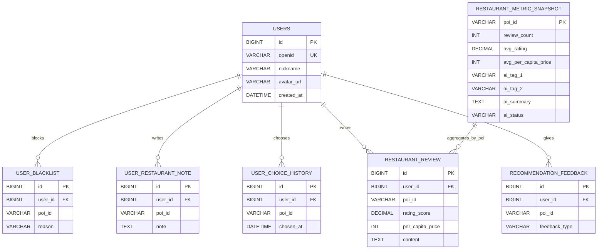
```mermaid
erDiagram
    USERS ||--o{ USER_BLACKLIST : blocks
    USERS ||--o{ USER_RESTAURANT_NOTE : writes
    USERS ||--o{ USER_CHOICE_HISTORY : chooses
    USERS ||--o{ RESTAURANT_REVIEW : writes
    USERS ||--o{ RECOMMENDATION_FEEDBACK : gives
    RESTAURANT_METRIC_SNAPSHOT ||--o{ RESTAURANT_REVIEW : aggregates_by_poi

    USERS {
      BIGINT id PK
      VARCHAR openid UK
      VARCHAR nickname
      VARCHAR avatar_url
      DATETIME created_at
    }
    USER_BLACKLIST {
      BIGINT id PK
      BIGINT user_id FK
      VARCHAR poi_id
      VARCHAR reason
    }
    USER_RESTAURANT_NOTE {
      BIGINT id PK
      BIGINT user_id FK
      VARCHAR poi_id
      TEXT note
    }
    USER_CHOICE_HISTORY {
      BIGINT id PK
      BIGINT user_id FK
      VARCHAR poi_id
      DATETIME chosen_at
    }
    RESTAURANT_REVIEW {
      BIGINT id PK
      BIGINT user_id FK
      VARCHAR poi_id
      DECIMAL rating_score
      INT per_capita_price
      TEXT content
    }
    RESTAURANT_METRIC_SNAPSHOT {
      VARCHAR poi_id PK
      INT review_count
      DECIMAL avg_rating
      INT avg_per_capita_price
      VARCHAR ai_tag_1
      VARCHAR ai_tag_2
      TEXT ai_summary
      VARCHAR ai_status
    }
    RECOMMENDATION_FEEDBACK {
      BIGINT id PK
      BIGINT user_id FK
      VARCHAR poi_id
      VARCHAR feedback_type
    }
```

各表职责简述：

- **users**：用户身份，`openid` 唯一。
- **user_blacklist**：黑名单，`(user_id, poi_id)` 唯一，用于推荐硬过滤。
- **user_restaurant_note**：单用户单店唯一备注。
- **user_choice_history**：最近吃过记录，进入推荐软过滤。
- **restaurant_review**：评论事实表，单用户单店唯一，`PUT` 为 upsert。
- **restaurant_metric_snapshot**：聚合快照，以 `poi_id` 为主键（不用自增 ID），存评分/人均/AI 标签/AI 摘要/`ai_status`。注意 `ai_status` 在库内有 `idle/pending/ready/failed` 四态，但**对外 API 不暴露**。
- **recommendation_feedback**：推荐反馈闭环，`ALREADY_ATE` 会同步写入 choice_history。

**索引策略**针对真实查询模式设计，关键索引包括：

| 表 | 索引 | 用途 |
|---|---|---|
| restaurant_review | `idx_review_poi_updated(poi_id, updated_at, id)` | 某店公开评论倒序分页 |
| recommendation_feedback | `idx_feedback_user_created(user_id, created_at, id)` | 用户反馈倒序分页 |
| recommendation_feedback | `idx_feedback_user_poi(user_id, poi_id)` | 短期候选软过滤 |
| user_choice_history | `idx_user_chosen(user_id, chosen_at)` | 最近吃过查询 |

这些索引都把"排序字段 + id"作为复合索引，既支撑分页排序，又用 `id` 作二级排序消除"相同时间戳跨页重复/漏项"的问题（该问题在开发过程中曾实际出现，见 7.5 节）。

**迁移策略**：库结构变更统一走 Flyway（`db/migration/V1~V10`），禁止手改库结构，只做"前滚修复"不回写历史脚本，文档字段命名以 SQL 为准。

## 7.4 中间件与工具集成

### 7.4.1 缓存机制（Caffeine 本地缓存）

考虑到课程作业的部署规模，未引入 Redis，而是使用 **Caffeine 本地缓存**（`config/CacheConfig.java`）缓存餐厅聚合快照（`restaurant_metric_snapshot`）。这类数据读多写少（评论写入才变更），适合本地缓存。这样在列表增强、详情摘要、推荐候选增强等高频读路径上，避免了对同一批 `poi_id` 快照的重复数据库查询。同时餐厅列表查询接口附加了 `Cache-Control: max-age=300` 响应头（`RestaurantCacheControlFilter`），让客户端侧也能复用结果。

### 7.4.2 日志系统（结构化 JSON 日志）

后端通过 `logback-spring.xml` 把控制台日志输出为 **JSON 行格式**，字段含 `@timestamp`、`level`、`application`、`thread_name`、`logger_name`、`message`、`traceId`。业务请求经过 `TraceIdFilter`，自动生成或复用 `X-Trace-Id` 写入 MDC，并记录请求路径、方法、状态码、耗时。`/health` 与 `/actuator/**` 通过 `shouldNotFilter` 跳过追踪日志，避免健康检查轮询污染业务日志。（详见第十四章可观测性。）

### 7.4.3 统一响应与全局异常

`common/` 包提供两个贯穿性中间件：`ApiResponse<T>` 统一所有接口的 `{code, message, data}` 返回结构；`GlobalExceptionHandler` 将 `BusinessException`（携带 `ErrorCode`）、参数校验异常、上游异常统一映射为规范的 HTTP 状态码 + 业务码。上游隔离是该层的重要职责：高德异常统一映射为 `3001/3002/3003`，AI 异常映射为 `3004/3005`，前端无需感知内部协议细节。

此外 `common/web/` 下还有面向安全的过滤器（`SecurityHeadersFilter`、`CsrfTokenFilter`）与 XSS 净化器（`common/security/XssSanitizer`），将在第九章安全设计展开。

## 7.5 性能优化实践

后端性能优化围绕"减少重复工作"展开。需要说明的是：受课程作业环境限制，下表中部分优化**未做严格的压测对比**，因此"优化效果"以定性的复杂度 / 调用次数变化描述为主，不提供未经验证的数值结论。

| 优化项 | 优化前 | 优化后 | 说明 |
|--------|--------|--------|------|
| 聚合快照本地缓存 | 每次列表/推荐查询都查库读快照 | Caffeine 缓存命中后零数据库往返 | 读多写少数据，命中率高 |
| 列表接口 HTTP 缓存 | 无缓存头，客户端每次重新请求 | `Cache-Control: max-age=300` | 客户端 5 分钟内复用 |
| 推荐候选分页补足 | 仅取一页，过滤后易误判空 | 按页补足至目标数量或耗尽 | 见 7.2.3，正确性 + 减少误判重试 |
| 数据库复合索引 | 仅按时间排序，跨页重复 | `(排序字段, id)` 复合索引 | 稳定分页 + 命中索引覆盖 |

下面记录两个**有据可查的真实优化决策**（来自开发过程与提交记录）：

1. **分页稳定性问题**：黑名单与备注分页最初只按时间字段排序，相同时间戳下会出现跨页重复或漏项。解决方式是把分页排序统一收口为"时间 + `id`"的稳定排序，并补充了 tied-timestamp 回归测试。
2. **推荐空结果误判**：推荐接口最初只依赖一页高德结果，过滤黑名单后容易把"还有后续可选"的场景误判为无结果。解决方式是改为按页持续补足候选，直到达到目标数量或上游耗尽，再执行随机/卡片返回。

这些优化的共同点是：**先保证正确性，再追求效率**，并且每一项都伴随回归测试落地，而非临时调优。

# 八、AI 工程化应用 [沈哲伟]

> 本章分两个维度：8.1、8.2 讲**开发过程中如何借助 AI 工具提效与排障**（工程化辅助），8.3 讲**产品本身集成的 AI 能力**（即 AI 推荐问答与评论标签摘要的技术实现）。其中 8.3 与 `ai-service/`、`backend/infrastructure/ai/` 的真实代码严格对应。

## 8.1 AI 辅助开发实践

在本项目开发过程中，AI 工具主要用于资料整理、问题排查、代码初稿生成和文档初稿整理。以下内容区分**仓库中有可验证痕迹**的部分与**团队成员个人使用经验**两类进行说明。

### 8.1.1 已集成到仓库的 AI 协作工具

仓库中实际配置并启用的 AI 工程化工具如下，它们的配置文件可在代码库中直接核实：

| 工具 | 配置位置 | 用途 |
|------|----------|------|
| CodeRabbit | `.coderabbit.yaml` | Pull Request 自动代码审查，对每个 PR 给出 AI 审查意见 |
| Dependabot | `.github/dependabot.yml` | 依赖更新与安全告警，跨 GitHub Actions / Maven / uv / npm / Dockerfile 生态 |
| CodeQL | `.github/workflows/codeql.yml` | 静态代码安全扫描（GitHub 官方语义分析引擎） |

> 说明：CodeRabbit 的实际自动审查还需要在 GitHub 仓库侧安装并启用 CodeRabbit App；本仓库已提交其配置文件 `.coderabbit.yaml` 作为接入准备。以上工具均为第三方服务，来源见第「第三方库与开源引用」一章。

CodeRabbit 在团队的 PR 流程里承担"第一道自动审查"的角色：开发者提交 PR 后，它会先于人工审查给出潜在问题（命名、空指针风险、重复逻辑等），人工审查再在其基础上做业务正确性判断。这种"AI 初筛 + 人工终审"的组合，在 2 人小团队中显著降低了相互 review 的负担。

### 8.1.2 团队成员使用的 AI 编码助手

团队在开发过程中主要使用了两款命令行 AI 编码助手，并配合 **superpowers** 技能体系来规范 AI 的工作流程：

| 工具 | 类型 | 主要使用场景 |
|------|------|-------------|
| Claude Code | Anthropic 官方 CLI 编码助手 | 多文件实现、重构、调试、文档撰写、代码审查 |
| Codex | OpenAI 命令行编码助手 | 后端 / 算法类任务的代码生成与交叉验证 |
| superpowers skills | Claude Code 的技能（skill）扩展体系 | 用结构化工作流约束 AI 的行为，如头脑风暴、测试驱动开发、系统化调试、计划编写与执行 |

三者的协作方式可以概括为：**用 superpowers 的 skills 把"该怎么做"固化成可复用的流程，再由 Claude Code 与 Codex 分别承担实现与交叉验证**。具体实践如下：

- **结构化工作流（superpowers skills）**：在功能实现前，使用头脑风暴类 skill 梳理需求与边界，再使用计划编写类 skill 形成实现步骤；遇到缺陷时，使用系统化调试 skill 先定位根因，再执行修改。该流程有助于提高 AI 辅助产出的可控性，并与"先收紧契约、再补回归测试"的开发节奏保持一致。
- **代码生成与脚手架**：在编写重复性较高的样板代码（如各资源的 Controller、DTO、JPA Repository、单元测试骨架）时，借助 Claude Code 与 Codex 生成初稿，再逐行核对字段命名、校验注解与契约文档是否一致。两个工具并用时，也会把一方的产出交给另一方做交叉检查，降低单一模型的盲区。
- **文档编写**：本项目文档体系（`docs/architecture.md`、`docs/database.md`、`docs/api.md` 等）及本报告在整理时使用 Claude Code 辅助梳理结构与措辞，但所有技术事实均以代码为准逐条复核，确保"文档与代码一致"。
- **经验总结**：AI 工具在生成初稿方面效率较高，但在保证结果与既有代码契约一致方面仍需人工复核，尤其是错误码、字段命名、分页排序等细节。流程化 skill 在一定程度上缓解了该问题，因为其要求在实现前明确需求、在完成后进行验证，从而降低偏离项目契约的风险。

## 8.2 AI 辅助故障排查

> 本节记录开发联调过程中借助 AI 分析定位问题的真实案例。以下案例的"问题"与"解决"部分均来自仓库内贡献记录（`docs/contributions/06-backend/ShenZhewei.md`）中真实发生的工程问题。

### 案例一：Docker Compose 下后端连接 MySQL 8 反复重启

- **问题描述**：Docker Compose 模式下，后端连接 MySQL 8 时报 `Public Key Retrieval is not allowed`，容器不断重启，从联调侧看像是"接口不可用"，难以第一时间定位到是数据库连接握手问题。
- **提供给 AI 的上下文**：容器启动日志中的异常堆栈、MySQL 连接 URL 配置、`compose.yaml` 中的服务依赖关系。
- **AI 辅助分析方向**：异常本质是 MySQL 8 默认使用 `caching_sha2_password` 认证插件，JDBC 在未开启公钥检索时无法完成握手，因此需要在连接串补充 `allowPublicKeyRetrieval=true` 并确认 `useSSL` 配置。
- **实际解决结果**：为 `dev` 与 `docker` profile 补充 `allowPublicKeyRetrieval=true`，并把 Docker profile、Compose 文件与本地启动说明一并收口，本机与容器环境均能稳定启动。

### 案例二：非法路径参数被误包装为 500

- **问题描述**：在 Apifox 中若 `userId` 环境变量未真正绑定到路径参数，最终请求 URL 会变成 `/api/v1/users//blacklist`；早期后端把这种非法路径错误包装成 `500 系统异常`，误导联调方向。
- **提供给 AI 的上下文**：异常类型 `NoResourceFoundException`、`GlobalExceptionHandler` 现有映射逻辑、对应的错误码表。
- **AI 给出的分析方向**：该异常属于"路由层面未匹配"，语义上是客户端错误而非系统错误，应单独映射为 4xx 而非落入 5xx 兜底分支。
- **实际解决结果**：将 `NoResourceFoundException` 单独映射为客户端错误，并在 `docs/api.yaml`、`docs/api.md` 中明确区分 OpenAPI 的 `{userId}` 占位符与 Apifox 的 `{{userId}}` 变量写法，补充了调试链路说明。

> 经验小结：AI 在读取异常堆栈并给出根因方向方面具有较高效率，但最终方案仍需结合本项目错误码体系与接口契约进行人工判断。例如案例二中"应归为 4xx 还是 5xx"属于 API 语义设计问题，不能仅依据通用经验处理。

## 8.3 AI 功能集成

本项目集成的 AI 能力是**餐厅推荐问答**与**评论标签摘要**两类，技术实现与 `ai-service/`（FastAPI）和 `backend/infrastructure/ai/` 严格对应。

### 8.3.1 两层收口的 AI 架构

项目刻意不在 Spring Boot 后端里直接调用大模型，而是采用**两层收口**：

```text
  微信小程序前端  ──►  Spring Boot 后端  ──►  内部 AI Service  ──►  OpenAI-compatible 模型
   (只调 backend)      (候选池 / 权限 / 契约)    (FastAPI / Prompt / 解析)    (gpt-4.1-mini 默认值)
```

这样分层的工程价值有三点：

1. **前端零模型耦合**：前端不需要理解任何模型协议或错误格式，只消费后端统一的 SSE 事件与 `ApiResponse`。
2. **后端只管业务边界**：后端负责候选池构建、黑名单与权限校验、`poiId` 二次校验和对外契约，不关心模型细节。
3. **模型可替换**：更换模型供应商时，改动被收敛在 `ai-service/` 内部；模型通过 `OPENAI_API_KEY` / `OPENAI_BASE_URL` / `OPENAI_MODEL` 环境变量配置，默认值为 `gpt-4.1-mini`，并非硬绑定。

### 8.3.2 核心约束：推荐严格限定在候选池内

本项目 AI 推荐最重要的工程约束是：**模型不允许脱离后端给定的候选餐厅自由编造**。约束链路如下：

1. 候选餐厅先由后端从高德拉取并决定；
2. AI 只能从该候选集合中选择；
3. 后端拿到 AI 返回后，再次校验 `poiId` 是否在候选池内；
4. 只有校验通过的结果才会下发前端。

送入模型的候选不仅是高德原始字段，还叠加了本地沉淀的增强信息：`avgRating`、`reviewCount`、`avgPerCapitaPrice`、`aiTags`、`aiSummary`，以及后端根据类别和标签派生的轻量信号 `derivedTags`（如"高蛋白""清淡""热汤""健身友好""快餐"）。

### 8.3.3 工具调用驱动的卡片推荐

推荐链路没有让模型直接吐一段自然语言再去反推店名，而是**先用工具调用确定结构化推荐卡片，再生成与卡片一致的回答**。AI Service 向模型注册了一个工具 `show_restaurant_card`，其参数为 `poiId`、`reason`、`rank`（推荐顺位，1 表示最推荐）。处理流程的伪代码如下：

```text
// ai-service: 推荐主流程（伪代码，简化自 app/domain/recommendation/service.py）
def stream_recommend(request):
    # 1. 让模型通过 tool call 选出推荐餐厅（带 rank）
    choices, tool_calls = recommend_with_tool_calls(request)
    if not choices:                       # 2. 工具调用失败则降级到 JSON 解析
        choices = recommend_with_json_fallback(request)
    if not choices:                       # 3. 再失败则取候选前 3 兜底
        choices = request.candidates[:3]

    # 4. 先把卡片事件发出去，再流式生成与卡片一致的回答文本
    emit_tool_calls(choices)
    answer = stream_answer_from_choices(request, choices)
    yield ("answer.done", {"answer": answer})
    yield ("done", {"finishReason": "stop"})
```

这种"工具调用优先 + JSON 降级 + 候选兜底"的三级策略保证了**即使模型不配合也总能返回可用结果**，是工程鲁棒性的关键设计。

后端侧（`RecommendationApplicationService`）则把上游的 `tool.call` 翻译成前端可消费的 `recommendation.card` 事件，并保证卡片与最终 `answer` 来自同一批已选餐厅；当模型给出的卡片不足时，后端还会按答案文本中出现的店名顺序做 fallback 补齐。

### 8.3.4 流式输出与 `<think>` 标签过滤

由于微信小程序没有原生 EventSource，AI 对话采用 SSE（Server-Sent Events），后端通过 `SseEmitter` 异步推流，前端用 `wx.request` 的 `enableChunked + onChunkReceived` 手工切帧解析。对外暴露的事件序列为：`session.created → retrieval.started → retrieval.completed → recommendation.card → answer.delta → answer.done → done`（异常时为 `error`）。

考虑到部分推理型模型会输出 `<think>...</think>` 思维链，AI Service 实现了一个流式状态机 `StreamingAnswerSanitizer`，在 token 逐块到达时实时剔除 think 标签内容，并妥善处理"标签被切分到两个 chunk"的边界情况，确保用户看到的回答里不混入模型的内部思考。

### 8.3.5 评论标签摘要

第二类 AI 能力服务于餐厅列表与详情的展示增强。当用户写入或更新评论后，后端 `RestaurantReviewAiApplicationService` 会调用 AI Service 的评论标签接口，输入某家餐厅的评论集合，输出 1~2 个标签（每个 ≤8 字）和一句摘要（≤80 字），结果回写到 `restaurant_metric_snapshot` 表的 `ai_tag_1` / `ai_tag_2` / `ai_summary` 字段。

需要特别说明的**对外契约约定**是：后端内部为快照维护了 `ai_status`（`idle` / `pending` / `ready` / `failed`），但**当前对外 API 不暴露该状态**。因此前端可感知的契约为：只要 AI 结果未进入 `ready`，`review-summary` 一律表现为 `aiTags=[]`、`aiSummary=null`，前端应统一理解为"当前无可展示的 AI 结果"，而非"数据库中不存在相关记录"。

### 8.3.6 已实现与尚未实现的边界

为遵循"不描述未实现功能"的要求，此处明确划清当前 AI 能力的边界：

- **已实现**：评论标签抽取与摘要、基于候选池的推荐问答（同步 + 流式）、工具调用驱动的结构化卡片、服务端自动注入时段语境、轻量多轮 refine（`previousQuestion` / `rejectedPoiIds` / `selectedPoiIds` / `userSignals`）、基于实时聚合的轻量口味画像。
- **尚未实现**：长对话式会话记忆、独立的长期用户画像表、向前端暴露 `aiStatus`、单店自由问答、基于向量库 / RAG 的评论检索增强。当前 AI 形态属于"轻量 AI-native"，而非重型 agent / RAG 系统。

# 九、安全设计 [沈哲伟]

> 本章对应 `docs/security-review.md`（2026-05-06 AI 辅助安全审查记录）以及后端安全相关代码与测试。需要先明确两个边界：其一，本项目使用微信小程序登录 + 后端 Bearer Token 会话，不在本地存储用户密码，因此不涉及密码哈希存储这一类防护；其二，下文所列防护措施均为**已落地并有回归测试覆盖**的实现，章节末尾单独列出尚未解决的剩余风险，以保证文档与现状一致。

## 9.1 安全威胁分析

本项目以 OWASP Top 10 为分析框架，结合"小程序前端 + Spring Boot 后端 + 内部 AI Service + 高德上游"的真实系统形态，梳理出主要安全威胁，并按风险等级排序：

| 威胁类别（OWASP 对应） | 在本项目中的具体场景 | 风险等级 |
|------|------|------|
| 敏感信息泄露（A02） | 配置文件中明文数据库凭据、硬编码高德 API Key，泄露后可直接访问数据库或盗刷地图配额 | 高 |
| 注入 / 存储型 XSS（A03） | 登录昵称、评论正文、AI 推荐问题与上下文均来自用户输入，若原样存储 / 回显 / 转发给 AI，未来前端误用富文本渲染时可触发存储型 XSS | 高 |
| 失效的访问控制（A01） | 用户黑名单、备注、评论等接口以 `userId` 定位资源，若不校验 token 与路径用户一致，会形成越权读写 | 中 |
| 失效的身份认证（A07） | 会话 token 若无明确过期、登出后仍可复用，会扩大会话泄露的影响面 | 中 |
| 资源耗尽 / Prompt 注入放大（A04 不安全设计） | AI 推荐的超长问题或超大上下文数组会放大资源消耗、日志噪声和 prompt 注入风险 | 中 |
| 安全配置缺陷（A05） | 缺少 `X-Content-Type-Options`、`X-Frame-Options` 等基础安全响应头 | 低 |
| 跨站请求伪造（CSRF） | 无 Bearer Token 的状态变更请求若被误接入 cookie session，存在 CSRF 风险 | 低 |

上述威胁均在 2026-05-06 的安全审查中被识别，并已在后续 PR（#55 / #56）中完成修复，下节逐项说明对应的防护实现。

## 9.2 安全防护措施

### 9.2.1 身份认证与授权

**认证方案**：当前采用"微信 `code2session` 登录能力 + Bearer Token 会话"。前端通过 `wx.login()` 获取 code 后调用 `POST /api/v1/auth/wechat-login`，后端在生产配置下向微信换取 `openid`，再签发项目自己的 token；dev/test 环境可 mock 该过程。后续受保护接口在请求头携带 `Authorization: Bearer <token>`。会话状态由后端 `InMemorySessionStore` 维护，**token 具有明确的过期时间，登出后立即失效**——这一语义由 `AuthSecurityTest`、`InMemorySessionStoreTest` 锁定，防止会话被无限期复用。

**授权与越权防护**：所有 `users/{userId}/**` 形态的受保护接口，都不是简单"信任路径里的 userId"，而是在服务端**校验 Bearer Token 对应的真实用户与路径 `userId` 一致**；不一致时统一返回 `401 / 1003`。这从根本上堵住了"换个 userId 就能读别人黑名单 / 评论"的水平越权。需要强调的是，用户身份始终以服务端认证结果为准，绝不依赖前端本地缓存推断。

### 9.2.2 输入验证与注入防护

**SQL 注入防护**：后端数据访问层完全基于 **Spring Data JPA / Repository** 实现，所有查询通过方法名派生或参数绑定生成，**不存在字符串拼接 SQL**，从机制上规避了 SQL 注入。

**存储型 XSS 防护**：该项是本项目安全实现的重点。系统实现了统一的 `XssSanitizer`，按"纯文本语义"清洗用户输入——去除 HTML 标签、`<script>`/`<style>` 内容、`on*` 事件属性以及 `javascript:` 等危险协议。所有进入业务链路的用户文本（登录昵称、评论正文、AI 推荐问题及其上下文）都先经过净化再落库或转发。其处理流程可表示为：

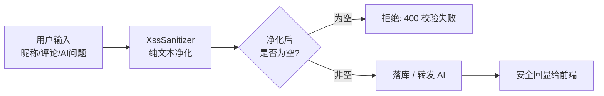
```mermaid
flowchart LR
    IN[用户输入<br/>昵称/评论/AI问题] --> SAN[XssSanitizer<br/>纯文本净化]
    SAN --> CHK{净化后<br/>是否为空?}
    CHK -->|为空| REJ[拒绝: 400 校验失败]
    CHK -->|非空| STORE[落库 / 转发 AI]
    STORE --> OUT[安全回显给前端]
```

该防护由 `XssSanitizerTest`、`ReviewSecurityTest`、`RecommendationSecurityTest`、`AiRecommendationSecurityTest` 四组测试回归覆盖。

**输入边界校验**：针对 AI 推荐接口，系统补充了完整的长度与数量边界（详见第五章 5.2 节）：`question` / `previousQuestion` 限 500 字符，三个上下文数组各最多 20 项，POI ID 单项最多 128 字符，用户信号单项最多 64 字符。这既防止资源耗尽，也压缩了 prompt 注入的攻击面。

### 9.2.3 敏感数据保护

**凭据外置**：审查发现的最高风险项是配置文件明文凭据。修复后，数据库账号密码、高德 API Key、OpenAI Key 等敏感配置**全部改为从环境变量读取**（`DB_USER` / `DB_PASSWORD` / `AMAP_KEY` / `OPENAI_API_KEY` 等），仓库内仅保留 `.env.example` 作为不含真实值的配置模板。

**密码存储**：如前所述，本项目使用微信登录身份，不提供本地账号密码体系，**不存储本地用户密码**，因此不涉及 bcrypt / argon2 等密码哈希环节。该说明用于界定系统边界，并非能力遗漏。

**错误信息收敛**：业务异常通过统一 `ApiResponse` 返回固定业务码和消息，未知异常统一映射为系统错误码，**响应体绝不暴露堆栈信息**，避免通过报错泄露内部实现细节。

### 9.2.4 其他安全措施

- **安全响应头**：通过 `SecurityHeadersFilter` 统一注入 `X-Content-Type-Options`、`X-Frame-Options`、`Referrer-Policy` 等基础安全头，由 `SecurityHeadersFilterTest` 覆盖。
- **CSRF 最小防护**：通过 `CsrfTokenFilter`，对无 Bearer Token 的非安全方法（状态变更请求）要求携带 `X-CSRF-Token` 防护头，缺失时返回 `403 / 1005`，并以统一 `ApiResponse` 返回。
- **上游隔离**：高德与 AI 上游的异常被统一映射为 `3001~3005` 业务码，前端无需感知内部协议；AI 推荐结果始终受候选池约束，模型不能推荐候选 POI 之外的餐厅，这本身也是对 prompt 注入的一道业务层兜底。

## 9.3 安全审计

本项目在 CI 层面接入了三类自动化安全扫描（详见 `.github/workflows/`，第三方工具均注明来源）：

| 工具 | 用途 | 来源 |
|------|------|------|
| gitleaks | 密钥 / 凭据泄露扫描 | <https://github.com/gitleaks/gitleaks> |
| CodeQL | 静态代码安全分析（覆盖 main / master / develop） | <https://codeql.github.com> |
| Dependabot | 依赖版本与安全更新提醒 | GitHub 内置 |

**验证记录**：安全相关测试可通过 `./mvnw -Dtest=XssSanitizerTest,RecommendationSecurityTest,CsrfTokenFilterTest test` 单独运行；PR #55 / #56 的远端检查（gitleaks、CodeQL、后端 / 前端 / AI Service）均已通过。

**剩余风险说明**：以下问题尚未彻底解决，列出以保证文档与现状一致：

1. `X-CSRF-Token` 目前只做"防护头存在性检查"，**尚未实现正式的 token 生成与绑定校验**；若未来改用 cookie session，需升级为标准 CSRF token 机制。
2. Prompt 注入无法仅靠 HTML 净化彻底解决，后续应继续在 AI Service 的系统提示词、工具调用边界和输出校验层加固。
3. 后端调用内部 AI Service 当前**未加服务间鉴权**；若部署到共享网络，建议增加内部 API Key。

> **本节由 AI 辅助生成，依据 `docs/security-review.md` 与安全相关代码 / 测试整理，经人工审核修改。**

# 十、软件测试 [沈哲伟、林佳涛]

> 本章后端与 AI Service 测试由沈哲伟负责，前端测试由林佳涛负责。文中测试规模以当前仓库测试代码与各成员的测试贡献记录（`docs/contributions/08-test/ShenZhewei.md`、`docs/contributions/08-testing/linjiatao.md`）为依据；覆盖率与用例数会随代码演进变化，因此最终通过状态以 CI 最近一次运行结果和本地复现命令为准。

## 10.1 测试策略

本项目是「微信小程序 + Spring Boot 后端 + FastAPI AI Service」三端协作的系统，三端技术栈、运行环境和易错点各不相同，因此测试策略按各端特性分层设计。整体遵循「**测试金字塔**」思想：以快速、稳定、可在 CI 中反复运行的单元测试与契约测试为主体，以跨层集成测试覆盖关键链路，端到端测试则按当前真实落地情况单独说明。

各端的测试目标与框架选型如下：

| 测试层次 | 覆盖对象 | 技术栈 / 框架 | 主要目标 |
|---------|---------|--------------|---------|
| 后端单元 / 切片测试 | Controller、Application Service、Domain Service、Filter、集成客户端 | JUnit 5 + Spring Boot Test + Mockito | 校验业务编排、错误码语义、鉴权边界、上游隔离 |
| 后端契约测试 | 对外 API 与 OpenAPI 契约 | Spring Boot Test（`OpenApiContractTest`） | 保证实现与 `docs/api.yaml` 一致 |
| AI Service 单元 / 契约测试 | 推荐服务、标签服务、模型客户端、内部 API | pytest + pytest-cov | 覆盖回退逻辑、SSE 事件形状、超时与上游异常映射 |
| 前端单元 / 交互测试 | 组件交互、请求封装、工具函数、转盘逻辑 | Jest + babel-jest（对 `wx` 做 mock） | 校验关键交互、401 失效、网络失败提示等用户可感知行为 |

测试设计有三条贯穿原则：

1. **优先固定回退分支而非只测主路径**。AI 推荐链路既有结构化工具调用，又有文本生成和流式输出，最容易在重构中破坏的是「LLM 失败 / 返回不完整 / 流式中断」时的兜底行为，因此 AI Service 专门为「文本生成失败回退」「JSON 无效回退」「流式失败回退」「仅隐藏推理内容回退」补了测试。
2. **为可测试性改造代码**。后端 `UserChoiceHistoryApplicationService` 与 `UserRecommendationFeedbackApplicationService` 原先直接使用 `LocalDateTime.now()`，导致「最近 3 天吃过」「最近 7 天反馈」这类时间窗口逻辑对系统当前时间敏感、断言不稳定；测试阶段将其改为注入 `Clock`，再用固定时刻构造回归测试，使时间窗口可复现、可断言。
3. **优先覆盖关键路径与失败路径**。前端不追求覆盖率数字本身，而是优先覆盖导航跳转、卡片点击、摇一摇、401 鉴权失效、网络失败提示等用户视角的关键行为。

## 10.2 单元测试

### 10.2.1 后端单元测试

后端当前共有 **34 个测试类**（位于 `backend/src/test/java/com/zjgsu/whattoeat/`），按职责可分为四组：

- **控制器测试**：覆盖认证、餐厅查询、推荐、评论、黑名单、备注、选择历史、反馈、口味画像等控制器，校验参数校验、HTTP 状态码与统一 `ApiResponse` 结构。
- **应用 / 领域服务测试**：覆盖评论聚合、AI 标签、黑名单、选择历史、反馈等服务的业务规则与时间窗口边界。
- **集成客户端测试**：`AmapHttpClientTest`、`AiHttpClientTest`、`WechatAuthClientTest` 校验对高德、内部 AI Service、微信登录的请求构造、SSE 多行 `data` 解析、流式聚合以及超时 / 上游异常到业务错误码的映射。
- **安全与基础设施测试**：`XssSanitizerTest`、`CsrfTokenFilterTest`、`SecurityHeadersFilterTest`、`TraceIdFilterTest`、`InMemorySessionStoreTest` 等，锁定输入净化、CSRF 防护头、安全响应头、链路追踪与会话过期语义。

以时间窗口测试为例，其核心思路（伪代码）是用固定时钟消除「当前时间」这一不确定因素：

```text
固定 Clock = 2026-04-22T12:00:00
写入一条 "3天前吃过" 的 choice-history
调用 "最近吃过过滤"
断言：该 poiId 被判定为「最近吃过」并参与软过滤
```

后端使用 Spring Data JPA / Repository 查询，未出现字符串拼接 SQL，因此单元测试的重点放在业务编排与边界条件，而非 SQL 注入构造。

### 10.2.2 AI Service 单元测试

AI Service 当前共有 **4 个测试文件**（`ai-service/tests/`），覆盖：

- `test_services.py`：推荐服务与标签服务，重点是上述四类回退分支。
- `test_openai_compatible.py`：OpenAI-compatible 客户端的 JSON mode fallback、tool call 解析、stream delta 聚合、timeout / upstream error 映射。
- `test_api_contracts.py`：内部 API 契约，直接校验 `/health`、`/internal/review-tags`、`/internal/recommend`、`/internal/recommend/stream` 的 HTTP 状态、错误映射、SSE 事件名与 OpenAPI schema 引用。
- `test_config.py`：配置加载与默认值校验。

最近一次记录的执行结果为 `35 passed`（命令：`uv run --with pytest --with pytest-cov pytest -q`）。

### 10.2.3 前端单元 / 交互测试

前端仓库中共有 **7 个测试相关文件**，其中 Jest 配置当前实际匹配并执行的是 `frontend/tests/` 下的 **5 个测试文件**，合计 **29 个测试用例**，分类如下：

- 正常情况测试：20 个；边界 / 异常情况测试：9 个。
- 组件 / 交互测试 9 个、Mock API 测试 4 个、工具函数 / 逻辑测试 16 个。

由于小程序的 `wx.request`、`wx.navigateTo` 等 API 无法在 Node 环境直接运行，前端测试统一对 `wx` 对象做 mock，并用 `babel-jest` 转译 ESM 模块，保证测试可在任意组员机器上通过 `npm test` / `npm run test:coverage` 复现。

前端整体行覆盖率为 **77.55%**，其中通用组件（bottom-nav、loading-spinner、navigation-bar、restaurant-card）与 `utils/rating-stars.js` 达到 100%，请求封装 `api/client.js` 为 90.19%。覆盖率相对偏低的是 `pages/spin/spin-logic.js`（60.34%）与 `utils/restaurant-state.js`（63.63%），属于后续可补强的部分。

## 10.3 集成测试

本项目的集成测试主要由两部分承担：

1. **后端切片 / 上下文集成测试**：控制器测试通过 `MockMvc` 走完整的「路由 → 参数校验 → 应用服务 → 统一响应」链路，对高德与 AI Service 等外部依赖使用 mock / stub，在 `test` profile 下用 H2 内存数据库替代 MySQL，从而在不依赖真实外部服务的前提下验证跨层行为。
2. **OpenAPI 契约测试**：`OpenApiContractTest` 将实现的路径参数、查询参数与成功响应结构与 `docs/api.yaml` 主契约比对，确保「文档与代码一致」这一硬性要求在 CI 层面被持续校验，而不是靠人工核对。

此外，AI Service 的 `test_api_contracts.py` 与后端的 `AiHttpClientTest` 一起，构成了「后端 ↔ AI Service」这条内部调用链的双向契约保障：AI Service 侧锁定自己产出的事件形状，后端侧锁定自己对这些事件的解析与聚合，任何一侧改动破坏约定都会被测试捕获。

CI 中的 `docker compose config` 校验与 backend Docker build check 也可视为部署层面的集成校验，确保编排文件与镜像构建始终可用（详见第十一、十二章）。

## 10.4 端到端测试

需要说明：**本项目当前没有引入 Playwright / Detox 等独立的端到端自动化测试框架**。原因是前端为微信小程序，其完整运行依赖微信开发者工具与真机环境，常规浏览器端 E2E 工具无法直接驱动小程序运行时。

当前「端到端」级别的验证以**手动联调 + 服务级健康检查**的方式覆盖：通过 Docker Compose 在本地同时拉起 MySQL、backend、ai-service（及托管小程序静态包的 frontend 容器），借助各服务的 healthcheck 与 `/health`、`/metrics` 端点确认链路连通，再用微信开发者工具按真实交互路径（登录 → 列表 → 详情评论 → 推荐 → AI 对话）人工走查。这一现状在第十七章「问题与反思」中也作为待改进项予以保留。

## 10.5 测试结果汇总

> 下表按当前仓库测试代码整理；其中后端「规模」按测试类计，AI Service 与前端按当前测试文件 / 用例计。部分覆盖率指标由 CI 上传至 Codecov 汇总，报告中仅列出已稳定采集的数据。

| 测试范围 | 规模 | 通过情况 | 覆盖率 |
|---------|------|---------|--------|
| 后端（JUnit 5） | 34 个测试类 | 由 `./mvnw test` 与 CI 校验 | JaCoCo 报告经 CI 上传 Codecov（backend flag） |
| AI Service（pytest） | 4 个测试文件 / 35 个测试函数 | 最近记录为 `35 passed` | pytest-cov 报告经 CI 上传 Codecov（ai-service flag） |
| 前端（Jest） | 5 个执行测试文件 / 29 个测试用例 | `npm test -- --runInBand` 可复现通过 | 行覆盖率 77.55% |

三端覆盖率均通过 GitHub Actions 按 flag 上传至 Codecov，并在 `README.md` 顶部以徽章持续展示，可点击查看最新趋势。

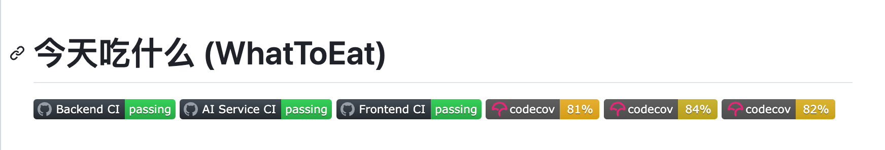

> 本节测试数据由团队成员采集自真实测试运行与贡献记录，并经人工核对；行文由 AI 辅助整理，经人工审核修改。

# 十一、持续集成与持续交付（CI/CD） [林佳涛]

> 本章基于仓库 `.github/` 下的真实工作流配置撰写，所有 workflow 名称、触发条件、阶段划分均与 `.github/workflows/*.yml` 实际文件一致。

## 11.1 CI/CD 方案

本项目采用 **GitHub Actions** 作为持续集成与持续交付平台。选择它的核心理由是：仓库托管在 GitHub 上，Actions 与仓库原生集成、无需额外搭建 CI 服务器，且对公开仓库免费；同时它的多 workflow、矩阵构建、缓存和 Secrets 管理能力，足以覆盖本项目"三套技术栈（Java 后端 / Python AI 服务 / 小程序前端）+ 容器构建 + 远程部署"的全部需要。

整体 CI/CD 体系由 7 个相互独立、各司其职的工作流组成，分布在 `.github/workflows/` 下：

| 工作流文件 | 名称 | 触发时机 | 主要职责 |
|---|---|---|---|
| `ci.yml` | Backend CI | push / PR / 手动 | 后端测试、覆盖率、打包、Docker 构建校验 |
| `ai-service-coverage.yml` | AI Service CI | push / PR | AI 服务测试与覆盖率上传 |
| `frontend-ci.yml` | Frontend CI | push / PR | 前端 lint、测试与覆盖率上传 |
| `backend-deploy.yml` | Backend CD | main / `v*` tag / 手动 | 构建并推送后端镜像到 GHCR，可选 SSH 部署 |
| `docker.yml` | Docker | — | 容器镜像构建相关流程 |
| `codeql.yml` | CodeQL | push / PR / 定时 | GitHub 官方静态代码安全扫描 |
| `security.yml` | Security | push / PR | 依赖与代码安全检查 |

这种"一栈一流水线"的拆分方式，其优势是**任一技术栈的改动只触发与之相关的流水线**，互不阻塞、反馈更快；相应代价是 workflow 文件数量较多、需要分别维护，但对本项目的三栈结构而言，职责清晰带来的收益高于维护成本。

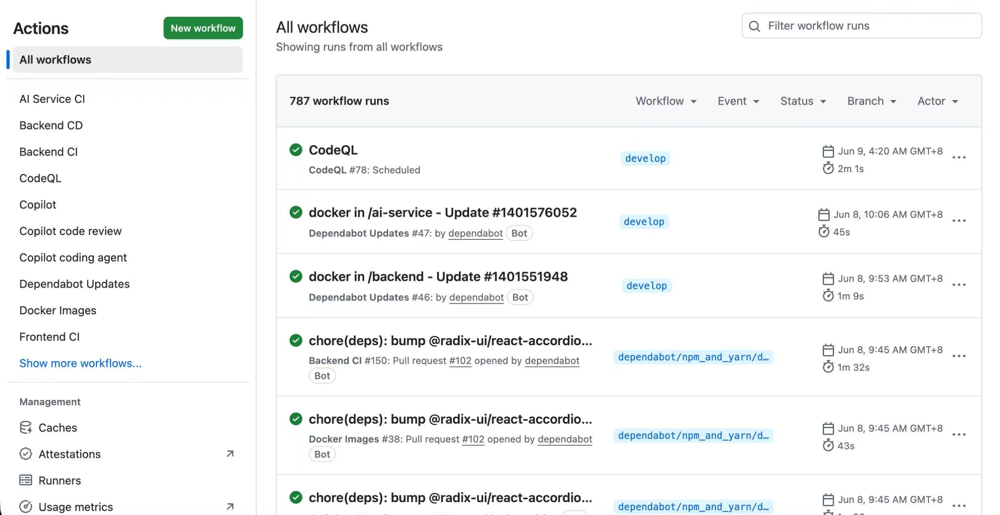

整体流转可概括为下图：

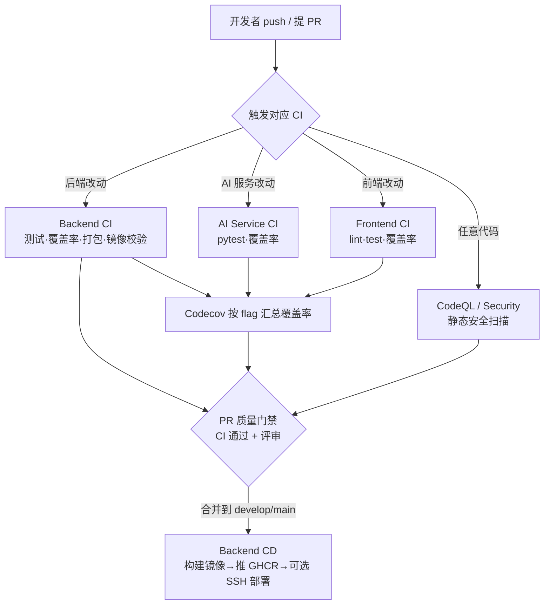
```mermaid
flowchart TD
    DEV[开发者 push / 提 PR] --> CI{触发对应 CI}
    CI -->|后端改动| BCI[Backend CI<br/>测试·覆盖率·打包·镜像校验]
    CI -->|AI 服务改动| ACI[AI Service CI<br/>pytest·覆盖率]
    CI -->|前端改动| FCI[Frontend CI<br/>lint·test·覆盖率]
    CI -->|任意代码| SEC[CodeQL / Security<br/>静态安全扫描]
    BCI --> COV[Codecov 按 flag 汇总覆盖率]
    ACI --> COV
    FCI --> COV
    BCI --> GATE{PR 质量门禁<br/>CI 通过 + 评审}
    COV --> GATE
    SEC --> GATE
    GATE -->|合并到 develop/main| CD[Backend CD<br/>构建镜像→推 GHCR→可选 SSH 部署]
```

## 11.2 自动化流水线

以最核心的 **Backend CI（`ci.yml`）** 为例，它把后端的质量校验拆成了四个有依赖关系的并行/串行 Job，体现了"快速失败、按需串联"的设计：

1. **backend-lint（Lint & Compile Check）**：执行 `./mvnw -B -DskipTests validate` 与 `compile`，只做 POM 校验和编译，不跑测试，因此能在最短时间内拦住"连编译都过不了"的提交。
2. **backend-test（Test & Coverage）**：执行 `./mvnw -B test jacoco:report`，跑全量后端测试并用 JaCoCo 生成覆盖率报告，再通过 `codecov/codecov-action` 以 `backend` flag 上传到 Codecov。
3. **backend-package（Package）**：`needs: [backend-test, backend-lint]`，只有测试和 lint 都通过后才构建可运行 JAR 并作为 artifact 上传——保证产物一定来自已验证的代码。
4. **docker-build（Docker Build Check）**：`needs: backend-package`，先 `docker compose config` 校验编排文件，再用 Buildx 构建后端镜像（`push: false`，仅校验不推送），并启用 GitHub Actions 缓存（`type=gha`）加速。

几个值得说明的工程化细节（均来自真实配置）：

- **并发取消**：通过 `concurrency` 配置 `cancel-in-progress: true`，同一分支的旧 CI 在新提交到来时自动取消，节省 Runner 资源。
- **最小权限**：`permissions: contents: read`，工作流默认只读仓库内容，遵循最小权限原则。
- **测试环境隔离**：在 `env` 中固定 `SPRING_PROFILES_ACTIVE=test`、`AMAP_KEY=test-key`、`AI_SERVICE_TIMEOUT_SECONDS=1` 等，使 CI 跑在 H2 + stub 上游的可重复环境里，不依赖真实高德 / AI Key。
- **构建矩阵**：后端按项目约束固定 Java 17，但保留 `matrix` 写法便于未来扩展；AI 服务覆盖 Python 3.11/3.12，前端覆盖 Node 18/20。
- **本地干跑兼容**：所有 artifact / Codecov 上传步骤都用 `if: ${{ !env.ACT }}` 守卫，使开发者可以用 `act` 在本地 dry-run workflow 而不触发外部上传。

**持续交付**由 `backend-deploy.yml` 承担：在推送到 `main`、打 `v*` tag 或手动触发时，构建后端镜像并推送到 GitHub Container Registry（GHCR）；当手动触发并勾选 `deploy_to_server` 时，再通过 SSH 连接到目标服务器完成部署。部署所需的 `GHCR_USER`、`BACKEND_DEPLOY_HOST`、`AMAP_KEY`、`DB_PASSWORD` 等敏感信息全部通过 GitHub 仓库 Secrets 注入，不落代码。

> 第三方 Action 来源说明：本流水线使用的 `actions/checkout`、`actions/setup-java`、`actions/upload-artifact`（GitHub 官方，MIT）、`codecov/codecov-action`（Codecov 官方）、`docker/setup-buildx-action`、`docker/build-push-action`（Docker 官方）均通过 GitHub Actions Marketplace 引用，未复制其源码。

## 11.3 分支保护与质量门禁

项目以 `develop` 为主集成分支，功能开发遵循"功能分支 → PR → 合并"的流程（分支命名如 `feat/**`、`fix/**`，已在 `ci.yml` 的 `branches` 触发列表中显式覆盖）。质量门禁由以下几层共同构成：

- **CI 必须通过**：PR 会自动触发对应的 Backend / AI / Frontend CI，以及 CodeQL、Security 扫描，测试或编译失败会阻断合并。
- **代码审查**：合并采用 PR 评审机制（仓库历史中可见 #93、#94 等通过 Pull Request 合并的记录），并配置了 **CodeRabbit** AI 代码审查（`.coderabbit.yaml`）作为人工评审的补充。
- **覆盖率可见**：三条 CI 分别以 `backend` / `ai-service` / `frontend` 三个 flag 上传 Codecov，README 中的覆盖率徽章实时反映各栈测试覆盖情况，使覆盖率退化在评审阶段即可被发现。
- **依赖更新**：通过 `.github/dependabot.yml` 配置 Dependabot，覆盖 GitHub Actions、Maven、uv、npm 与 Dockerfile，常规版本更新合并为月度跨生态 PR，并忽略高风险大版本升级。

# 十二、系统部署 [沈哲伟]

> 本章对应仓库根目录的 `compose.yaml`（本地联调）、`compose.prod.yaml`（生产编排）、`deploy.sh`（一键部署脚本）以及各服务的 `Dockerfile`。所描述的服务划分、端口、健康检查与资源限制均与这些文件保持一致。
> 本章部署方案由沈哲伟负责；除当前 `develop` 分支的 Compose 生产编排外，VPS 与 CloudBase 联调工作保存在远端 `deploy-cloudbase` 分支中。当前分支可见的云服务贡献记录为 `docs/contributions/12-cloud/linjiatao.md`。

## 12.1 部署架构

本项目采用**全容器化部署**：后端、AI Service、MySQL 三个服务都打包为独立 Docker 镜像，通过 Docker Compose 统一编排；微信小程序前端由于其运行在微信客户端内、需通过微信开发者工具上传发布，并不真正"部署"到服务器，但仓库仍提供了一个基于 Nginx 的 `frontend` 静态托管服务，用于在本地或服务器上预览小程序源码包。整体部署拓扑如下：

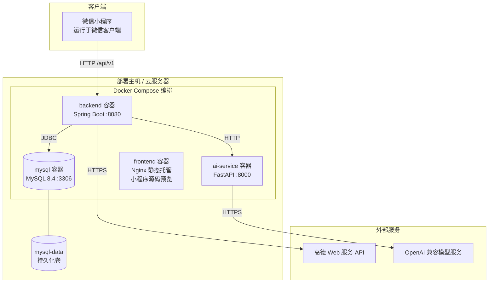
```mermaid
flowchart TB
    subgraph CLIENT[客户端]
        WX[微信小程序<br/>运行于微信客户端]
    end

    subgraph HOST[部署主机 / 云服务器]
        direction TB
        subgraph COMPOSE[Docker Compose 编排]
            BE[backend 容器<br/>Spring Boot :8080]
            AI[ai-service 容器<br/>FastAPI :8000]
            DB[(mysql 容器<br/>MySQL 8.4 :3306)]
            FE[frontend 容器<br/>Nginx 静态托管<br/>小程序源码预览]
        end
        VOL[(mysql-data<br/>持久化卷)]
    end

    subgraph EXT[外部服务]
        AMAP[高德 Web 服务 API]
        LLM[OpenAI 兼容模型服务]
    end

    WX -->|HTTP /api/v1| BE
    BE -->|JDBC| DB
    BE -->|HTTP| AI
    BE -->|HTTPS| AMAP
    AI -->|HTTPS| LLM
    DB --- VOL
```

部署架构的几个关键设计：

- **服务依赖与启动顺序**：`backend` 通过 Compose 的 `depends_on` + `condition: service_healthy` 等待 `mysql` 和 `ai-service` 都进入健康状态后才启动，避免后端在数据库或 AI 服务尚未就绪时反复重启。
- **健康检查贯穿每个服务**：四个容器都配置了 `healthcheck`——MySQL 用 `mysqladmin ping`，backend 与 frontend 用 `wget` 探活各自的 HTTP 端点，ai-service 用一段内联 Python 请求 `/health`。这让"服务起来了"变成可被编排系统自动判定的事实，而非靠人工观察。
- **数据持久化隔离**：MySQL 数据通过命名卷 `mysql-data` 挂载，容器重建不会丢库；而无状态的 backend / ai-service 可以随时重建。
- **统一对外端口**：backend 固定暴露宿主机 `8080`，与前端 `base-url.js` 中的默认地址约定一致，降低联调时端口对不齐的成本。

## 12.2 容器化方案

项目提供两套 Compose 编排文件，分别面向不同场景，这是本项目容器化设计中最重要的一个区分：

| 维度 | `compose.yaml`（本地联调） | `compose.prod.yaml`（生产编排） |
|------|--------------------------|-------------------------------|
| 环境变量缺省策略 | 大量使用 `${VAR:-默认值}`，缺省也能起 | 关键变量使用 `${VAR:?报错}`，缺失直接拒绝启动 |
| 镜像 | 直接 `build` 本地构建 | 支持 `image:` 指定预构建镜像，回退到 `build` |
| 资源限制 | 不限制，方便开发 | 通过 `deploy.resources.limits.memory` 限制各服务内存 |
| 健康检查节奏 | 间隔 10s、重试 10 次，偏向快速反馈 | 间隔 30s、重试 3~5 次，偏向稳定 |
| MySQL 端口 | 映射到宿主机，方便本地连库调试 | 不对外映射，仅在内部网络可达 |

这种"两套文件"的设计理念是：**本地环境以"低门槛、易启动"为先**，让任何成员 `clone` 下来填个 `.env` 就能跑起整套系统；**生产环境以"显式、安全、可控"为先**，用 `${VAR:?}` 语法强制要求必须显式提供数据库密码、高德 Key、OpenAI Key 等敏感配置，杜绝"用默认密码上生产"这类隐患，同时为每个服务设定内存上限，防止单个服务异常时拖垮整台主机。

三个服务的镜像构建各自独立：backend 基于 JDK 镜像构建可执行 JAR，ai-service 基于 Python 镜像安装依赖后启动 uvicorn，MySQL 直接使用官方 `mysql:8.4` 镜像。后端 CI 流水线中专门有一个 `docker-build` 任务，会执行 `docker compose config` 校验编排文件语法、并实际构建后端镜像（`push: false`，只验证可构建性），把"镜像能不能成功构建"也纳入了持续集成的检查范围。

> 说明：本项目未使用 Kubernetes，编排统一以 Docker Compose 为准。`mysql:8.4` 为 Docker 官方镜像（来源：https://hub.docker.com/_/mysql ）。

## 12.3 部署步骤

以生产编排为例，从零部署的完整步骤如下，全部步骤均可复现：

```bash
# 1. 克隆仓库
git clone https://github.com/Ryan041001/WhatToEat.git
cd WhatToEat

# 2. 准备生产环境变量（从模板复制后填写真实值）
cp .env.example .env
# 在 .env 中至少填写：
#   DB_NAME / DB_USER / DB_PASSWORD / DB_ROOT_PASSWORD  —— 数据库账号
#   AMAP_KEY                                            —— 真实高德 Web 服务 Key
#   OPENAI_API_KEY / OPENAI_BASE_URL / OPENAI_MODEL     —— AI 模型配置

# 3. 一键构建并启动（脚本内部调用 compose.prod.yaml）
./deploy.sh
```

`deploy.sh` 的执行逻辑是：先校验 `.env` 是否存在（不存在直接报错退出），再执行 `docker compose -f compose.prod.yaml up -d --build --wait`，其中 `--wait` 会阻塞直到所有服务的健康检查通过（默认超时 120 秒，可通过 `DEPLOY_HEALTH_TIMEOUT_SECONDS` 调整），最后打印各服务状态。这意味着脚本返回成功时，整套系统已经是"健康可用"状态，而不只是"容器已创建"。

部署完成后的验证方式：

```bash
curl http://<服务器地址>:8080/health          # 后端健康检查
curl http://<服务器地址>:8080/actuator/prometheus  # 后端指标（受控网络内）
# AI Service 默认仅在 Compose 内部网络可达，可进入容器或临时映射端口验证 /health
```

前端联调最后一步：把小程序 `frontend/api/base-url.js` 中的后端地址切换为服务器的公网/局域网地址（或通过该模块提供的运行时覆写方法设置），即可让小程序对接已部署的后端。

## 12.4 环境配置

项目通过 `.env` 文件 + Compose 变量插值统一管理环境配置，并以 Spring Profile 区分运行形态：

- **配置注入方式**：所有敏感信息（数据库密码、高德 Key、OpenAI Key）都不写死在代码或镜像里，而是通过 `.env` 注入容器环境变量。仓库提供 `.env.example` 作为模板，真实 `.env` 不纳入版本控制。
- **三套后端 Profile**：
  - `dev`：本地直接 `mvnw spring-boot:run`，连接本机 MySQL；
  - `test`：使用内存 H2，供单元/集成测试与 CI 使用（CI 中 `SPRING_PROFILES_ACTIVE=test`）；
  - `docker`：容器内运行，数据库主机名为 Compose 服务名 `mysql`，AI 地址为 `http://ai-service:8000`。
- **开发与生产的隔离**：开发环境靠"缺省值兜底"降低门槛，生产环境靠"缺失即报错"强制显式配置（见 12.2 的对比表），两者使用不同的 Compose 文件，从机制上避免误用。

# 十三、云服务应用 [沈哲伟]

> 本章对应远端 `deploy-cloudbase` 分支、当前分支可见的 `docs/contributions/12-cloud/linjiatao.md` 以及该分支中的 `docs/cloudbase-deployment.md`。需要先说明一个边界：**CloudBase 代理到 VPS 的方案已经实现并保留为备选部署方案，但由于当前网络环境下“微信云托管 -> VPS HTTPS 后端”链路不够稳定，最终没有作为长期线上入口采用**。因此本章描述的是已实现、已验证过关键配置的云部署实践与取舍，而非将其表述为稳定上线方案。

## 13.1 云平台选型

云服务应用阶段先后评估了三类方案：自建 VPS、Railway PaaS、微信云托管 CloudBase。Railway 方案有配置文件和调研记录，但未完成长期线上验证；真正完成实现与联调快照的是沈哲伟在 `deploy-vps` / `deploy-cloudbase` 方向推进的 **VPS + CloudBase 代理** 方案。

| 候选方案 | 特点 | 采用情况 | 主要原因 |
|---------|------|:-------:|---------|
| VPS + Docker Compose | 完全可控，可直接运行 backend / MySQL / AI Service | 已用于业务服务承载与联调 | 成本低、与第十二章生产编排一致、便于排查 |
| Railway PaaS | 支持 Dockerfile 与托管 MySQL | 仅完成配置与调研 | 线上地址未长期验证，报告不写成最终上线方案 |
| CloudBase 代理到 VPS | 小程序通过 `wx.cloud.callContainer` 进入云托管代理，再转发到 VPS HTTPS 后端 | 已实现为备选方案 | 规避小程序自有域名/备案问题，CloudBase 只做轻量转发 |
| 全 CloudBase 私网部署 | 后端、AI Service、数据库全部迁入云托管 | 后续可选 | 需要私有网络和云数据库等付费能力，当前未采用 |

选择 CloudBase 代理模式的核心原因是：微信小程序正式链路不能简单依赖公网 IP 或未备案域名，而 CloudBase 可以作为小程序合法入口；同时 VPS 继续承载 Spring Boot backend、MySQL 和 AI Service，避免立刻迁移数据库与内部服务。

## 13.2 CloudBase 代理到 VPS 架构

低成本代理模式的目标链路如下：

~~~ text
微信小程序
  -> wx.cloud.callContainer
  -> whattoeat-backend (cloudbase-proxy，微信云托管)
      -> https://38.65.93.54/api/v1/* (VPS Nginx)
          -> Spring Boot backend
          -> VPS MySQL
          -> VPS ai-service
          -> 高德 Web 服务 API
~~~

关键约束：

- 小程序正式链路不再用 `wx.request` 直连 VPS 公网 IP，而是统一走 `wx.cloud.callContainer`。
- CloudBase 服务名固定为 `whattoeat-backend`，前端请求头带 `X-WX-SERVICE=whattoeat-backend`。
- CloudBase 代理只做请求转发，不保存业务数据；真实业务数据仍在 VPS MySQL 中。
- 后端仍是唯一业务入口，前端不直接调用高德或 AI Service。

下图为 CloudBase 后端代理服务配置验证截图，展示服务端口、实例规格与环境变量等关键配置项。

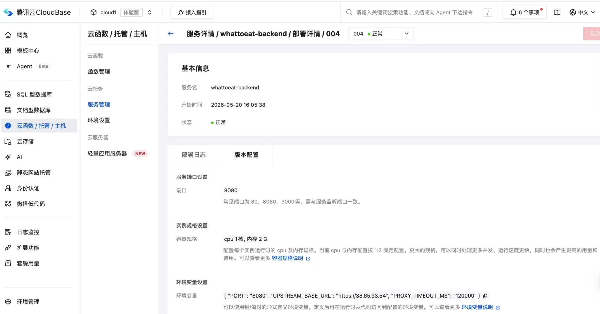

## 13.3 部署配置与环境变量

`deploy-cloudbase` 分支新增了 `cloudbase-proxy/` 轻量代理服务，核心配置如下：

| 配置项 | 值 |
|-------|----|
| 服务名 | `whattoeat-backend` |
| 源码目录 | `cloudbase-proxy/` |
| Dockerfile | `cloudbase-proxy/Dockerfile` |
| 服务端口 | `8080` |
| 健康检查 | `GET /health` |

CloudBase 代理环境变量：

~~~ text
PORT=8080
UPSTREAM_BASE_URL=https://38.65.93.54
PROXY_TIMEOUT_MS=120000
~~~

其中 `UPSTREAM_BASE_URL` 指向 VPS 的 HTTPS 入口，不能填写 `http://38.65.93.54:8080`，因为 VPS 上 Spring Boot backend 仅绑定在 `127.0.0.1:8080`，公网访问由 Nginx 暴露为 HTTPS。`PROXY_TIMEOUT_MS=120000` 用于支撑 AI 推荐 SSE 流式响应，避免默认短超时提前断流。

如果未来升级为全 CloudBase 私网部署，后端可使用 `cloudbase` profile，并配置：

~~~ text
SPRING_PROFILES_ACTIVE=cloudbase
PORT=8080
DB_URL=jdbc:mysql://<CloudBase MySQL 内网地址>:3306/<数据库名>?useSSL=false&allowPublicKeyRetrieval=true&serverTimezone=Asia/Shanghai&characterEncoding=utf8
DB_USER=<数据库账号>
DB_PASSWORD=<数据库密码>
AMAP_KEY=<高德 Web 服务 Key>
WECHAT_APP_ID=<小程序 AppID>
WECHAT_APP_SECRET=<小程序 AppSecret>
WECHAT_MOCK_LOGIN_ENABLED=false
AI_SERVICE_BASE_URL=http://<whattoeat-ai 内网域名>
AI_SERVICE_TIMEOUT_SECONDS=5
~~~

## 13.4 验证记录与未采用原因

从 `deploy-vps` / `deploy-cloudbase` 分支记录看，部署相关提交包括：

- `435d07d feat(deploy): 固定小程序VPS联调入口`
- `68b6361 feat(deploy): 通过 CloudBase 移除正式链路域名依赖`
- `894c239 feat(deploy): 用 CloudBase 代理承接 VPS 后端入口`
- `9db56b2 fix(deploy): 指向 VPS 的 HTTPS 代理入口`
- `92d9825 fix(deploy): 放宽 CloudBase 代理流式超时`
- `4806f22 fix(frontend): 固定小程序云托管环境`
- `f202ee9 修正云托管调用的开发者工具身份`

配套验证包括前端测试与 lint、后端测试、AI Service 测试、`cloudbase-proxy` Node 测试，以及 backend / ai-service / cloudbase-proxy 三个镜像的 Docker build check。

最终没有采用 CloudBase 代理作为长期线上入口，主要原因是目标环境下 CloudBase 到 VPS HTTPS 后端链路不够稳定；AI 推荐流式接口还依赖长连接 / 分块传输，在代理层或上游链路不稳定时更容易提前中断。因此，该方案作为**已实现的备选云部署方案**保留，用于展示小程序免自有域名备案的部署思路；长期稳定部署仍以第十二章的 VPS + Docker Compose 生产编排为主。

# 十四、可观测性与监控 [沈哲伟]

> 本章对应 `docs/monitoring.md` 与后端 / AI Service 的真实可观测性实现。需要先说明一个边界：**本项目当前没有接入 Sentry、Grafana Cloud、UptimeRobot 等第三方 SaaS 监控服务**，可观测性能力全部由项目内自研的「结构化日志 + 链路追踪 + 指标埋点 + 健康检查」四件套构成，并以标准协议（JSON 日志行、Prometheus 文本格式）对外开放，便于后续在受控网络内对接外部监控栈。本章只描述已经落地的部分，规划态能力不计入。

## 14.1 错误追踪与链路追踪

如上所述，项目未引入独立的错误追踪 SaaS（如 Sentry）。当前采用的是一套**基于 TraceId 的请求级链路追踪方案**，在没有外部依赖的前提下，实现「任意一条异常日志都能反查到完整请求上下文」。

实现位于后端 `common/web/TraceIdFilter`，核心逻辑：

- 每个进入 `/api/v1/**` 的业务请求，过滤器会读取请求头 `X-Trace-Id`；若不存在则生成一个新的 traceId，并写入日志框架的 MDC（Mapped Diagnostic Context）。
- 该 traceId 会贯穿这次请求的所有日志行，并在响应头回写，便于前端 / 联调方把一次失败请求的 traceId 直接贴给后端定位。
- 过滤器在请求结束时统一记录一条访问日志，包含请求路径、方法、HTTP 状态码与耗时（latencyMs）。
- 通过覆写 `shouldNotFilter`，对 `/health` 与 `/actuator/**` 探活流量**跳过追踪日志**，避免健康检查轮询淹没真正的业务日志。

异常的「捕获」则收口在全局异常处理器 `common/web/GlobalExceptionHandler`（详见第七、九章）：所有 `BusinessException` 被映射为带业务错误码的结构化响应并记录日志，未预期的 `RuntimeException` 统一落为 `9000 系统异常`。也就是说，错误不是被某个 SaaS 探针被动采集，而是在框架层主动归一化、带 traceId 落盘，再由运维人员通过日志检索定位。

该方案的取舍在于：优点是零外部依赖、零额外成本、数据完全自持，契合课程作业与本地部署场景；代价是缺少 SaaS 形态的错误聚合面板与自动告警，需要人工检索日志。综合当前系统规模与部署条件，这一取舍是可接受的，并在 14.4 节预留了后续接入外部告警的路径。

## 14.2 日志管理

后端与 AI Service 都采用**结构化 JSON 行日志**，让日志可以被机器解析、便于后续接入 ELK / Loki 等日志栈。两端方案对齐但技术实现不同：

**后端（Spring Boot）** 通过 `backend/src/main/resources/logback-spring.xml` 将控制台日志输出为 JSON 行，关键字段包括 `@timestamp`、`level`、`application`、`thread_name`、`logger_name`、`message`，以及由 MDC 注入的 `traceId`。一条典型的访问日志如下（来自真实运行输出）：

~~~ json
{"@timestamp":"2026-05-27T10:30:28.790+08:00","level":"INFO","application":"WhatToEat",
 "logger_name":"com.zjgsu.whattoeat.common.web.TraceIdFilter","traceId":"trace-fixed-001",
 "message":"request path=/api/v1/restaurants/nearby method=GET status=200 latencyMs=0 traceId=trace-fixed-001"}
~~~

**AI Service（FastAPI）** 通过 `ai-service/app/utils/logger.py` 配置 Python 标准库 `logging`，同样输出 JSON 行，字段包括 `time`、`level`、`message`、`module`，以及由 HTTP 中间件注入的 `method`、`path`、`status_code`、`response_time_ms`。该中间件（见 `app/main.py`）会为每个请求记录状态码与响应耗时。

> 第三方库说明：后端 JSON 日志依赖 **Logstash Logback Encoder**（`net.logstash.logback:logstash-logback-encoder`，来源 <https://github.com/logfellow/logstash-logback-encoder>）配合 Spring Boot 自带的 Logback 实现；AI Service 仅使用 Python 标准库 `logging`，未引入 Loguru / structlog 等第三方日志库。模板示例中提到的 Pino 并未在本项目中使用。

日志级别通过各自的 profile 配置控制（dev 默认 INFO，可按包名调高到 DEBUG）。本地查看方式：直接观察服务控制台输出，或在 Docker Compose 模式下使用 `docker compose logs -f backend` / `docker compose logs -f ai-service`。

## 14.3 健康检查与可用性监控

后端与 AI Service 都提供了轻量的 `GET /health` 端点，用于容器编排与上层探活，返回统一的 JSON 结构：

~~~ json
{ "status": "healthy", "timestamp": "2026-05-27T10:30:28.687922Z", "version": "0.0.1-SNAPSHOT" }
~~~

- **后端**：`HealthController` 提供 `/health`，同时保留 Spring Boot Actuator 的 `/actuator/health` 作为更细粒度的健康检查（包含数据库连接等组件状态）。
- **AI Service**：`app/api/routes/health.py` 提供 `/health`，返回服务状态、时间戳与版本号。

这两个端点已经在部署链路中被真实使用：`deploy.sh` 通过 `docker compose up --wait` 依赖健康检查判断服务是否就绪；`deploy-cloudbase` 分支中的 CloudBase 代理也提供 `/health`，用于云托管服务健康检查。

可用性监控方面，**当前未接入 UptimeRobot / Better Stack 等外部 Uptime 服务**。本地与容器环境下通过 Docker 健康检查与手动 `curl` 验证：

~~~ bash
curl http://127.0.0.1:8080/health
curl http://127.0.0.1:8000/health
~~~

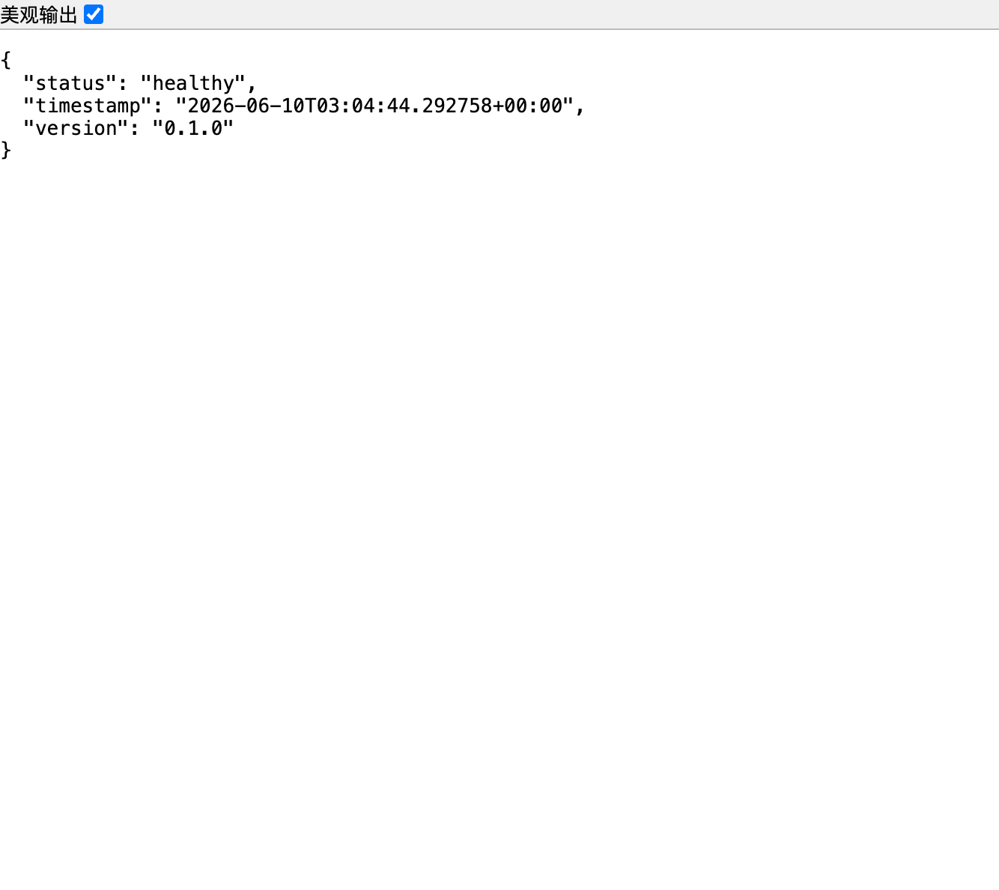

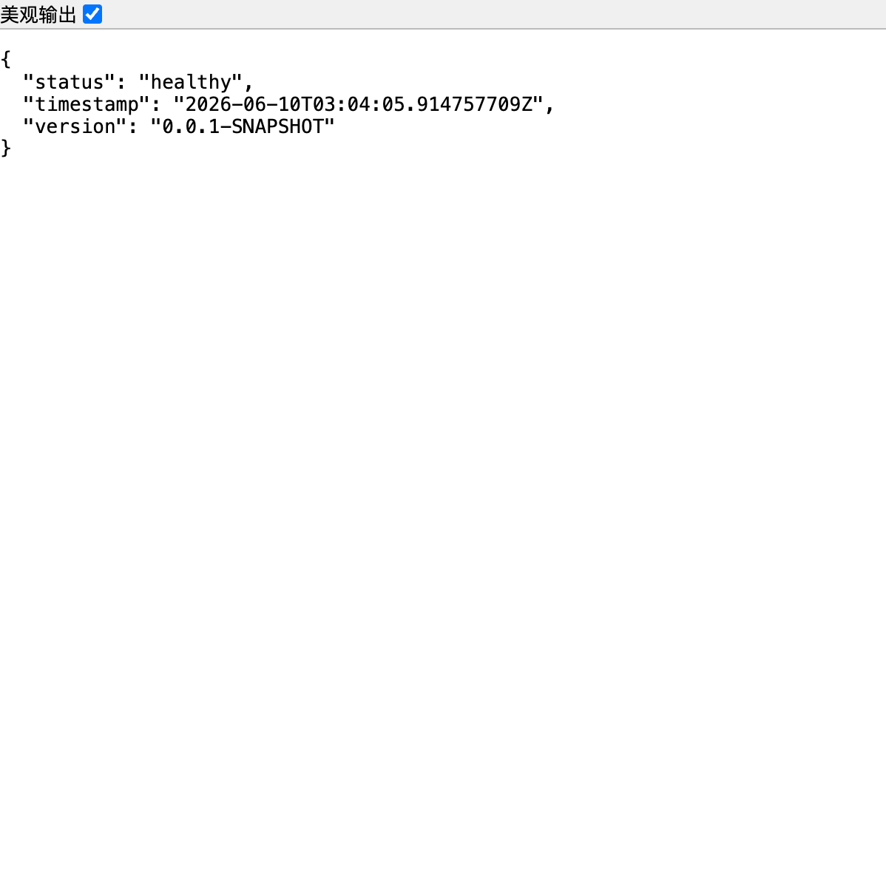

## 14.4 指标监控

两端都暴露了基础指标端点，但分量不同：后端走标准 Prometheus 生态，AI Service 走轻量自研 JSON 指标。

**后端**使用 Spring Boot Actuator + Micrometer + Micrometer Prometheus Registry，在 dev / test / docker profile 下暴露：

~~~ text
GET /actuator/metrics
GET /actuator/metrics/http.server.requests
GET /actuator/prometheus
~~~

可观测的关键指标包括：HTTP 请求计数与响应时间、5xx 错误数量与比例，以及 JVM、线程、数据库连接池等运行时指标。在此之上，项目还**针对业务主链路增加了自定义埋点**——推荐服务的 `recommendation.requests` 计数器和餐厅查询的 `restaurant.query.requests` 计数器，都带有 `endpoint`（random / cards / ask / ask-stream 等）与 `result`（success / 具体错误码 / SYSTEM_ERROR）两个维度的标签。由此可以从指标层面直接区分「哪个推荐入口、成功还是失败、失败是什么类型」，而不只是看到一个笼统的请求总数。对应实现见 `RecommendationApplicationService` 的 `incrementRequestCounter`（第七章已述）。

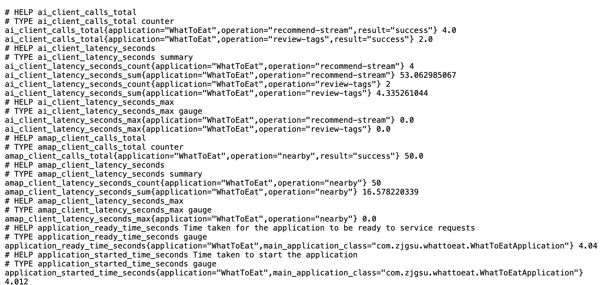

出于安全考虑，默认与 docker profile 已**收紧 Actuator 暴露范围**，生产建议只保留 `health`，仅在受控网络内开放 `prometheus`（详见第九章）。

**AI Service**暴露一个轻量 JSON 指标端点 `GET /metrics`（实现见 `app/core/metrics.py`），由 HTTP 中间件在每个请求结束时累加，返回示例：

~~~ json
{ "requestCount": 12, "errorCount": 1, "averageResponseTimeMs": 8.342, "errorRate": 0.0833 }
~~~

其中 `requestCount` 为启动以来处理的请求总数，`errorCount` 统计 5xx 请求数，`errorRate` 为错误率。它没有引入 prometheus_client 等重型依赖，而是用最小代价覆盖「请求量 / 错误率 / 平均耗时」三项核心指标。

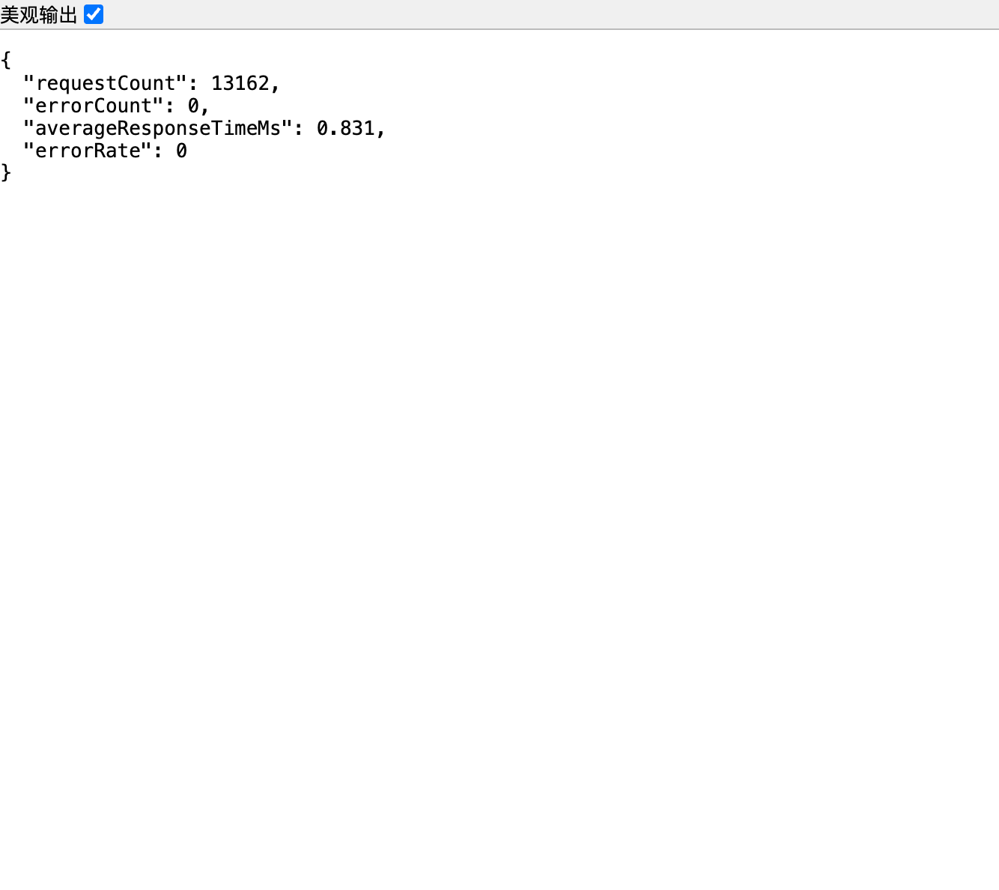

**告警预留**：当前作业未接入外部告警服务，但 `docs/monitoring.md` 已整理出一组推荐的告警规则，供后续部署时配置——服务连续 3 次 `/health` 失败触发不可用告警；5 分钟内 5xx 错误率超过 5% 触发错误告警；5 分钟内 P95 响应时间超过 2 秒触发性能告警。这是 14.1 节提到的「未来对接外部监控栈」的具体落点。

> 第三方库与来源说明：后端指标依赖 **Micrometer**（<https://micrometer.io>）与 **Spring Boot Actuator**（随 Spring Boot 一同引入，<https://spring.io/projects/spring-boot>）；AI Service 的 `/metrics` 为自研实现，未使用第三方指标库。本章描述的所有端点、字段与指标标签均与仓库当前代码一致。

# 十五、性能优化 [沈哲伟、林佳涛]

> 本章描述本项目实际实施的性能优化工作。需要先说明一个边界：**本项目当前没有搭建专门的压测环境，也没有采集严格的 Before/After 端到端时延数字**（餐厅数据来自高德实时接口，时延受外部网络与配额影响较大，难以构造稳定可复现的基准）。因此本章遵循课程「性能优化与移动端体验」强调的「先测量、找瓶颈、改一处、验证、记录」原则，优化以**减少重复工作量**为目标（重复请求、重复数据库读取、重复主线程阻塞），并通过代码审查与回归测试确认行为不变；优化效果以**机制层面的定性分析**为主，定量压测列为后续工作。本章只描述已合并到 `develop` 分支的真实优化项。

## 15.1 优化方法论与分析基线

项目未直接凭经验追加缓存或索引，而是先进行了一次**全表索引覆盖分析**作为优化基线（见 `docs/db-index-analysis.md`）。方法是：对照所有 JPA Repository 的 finder 方法与对应的 Flyway migration DDL，逐表检查每个高频查询的 `WHERE` 条件与 `ORDER BY` 字段是否被现有索引覆盖。

分析结论是一个较易被忽视但十分关键的结果——**当前无需新增任何数据库索引**：

| 表 | 高频查询 | 覆盖索引 | 是否覆盖 |
|---|---|---|---|
| users | findByOpenid | uk_openid(openid) | 是 |
| user_blacklist | findByUserId / findByUserIdAndPoiId | uk_user_poi(user_id, poi_id) | 是 |
| user_restaurant_note | findByUserId / 内容筛选 | uk_user_poi(user_id, poi_id) | 是 |
| user_choice_history | findByUserIdOrderByChosenAtDesc | idx_user_chosen(user_id, chosen_at) | 是 |
| restaurant_review | 某店公开评论倒序分页 | idx_review_poi_updated(poi_id, updated_at, id) | 是 |
| restaurant_metric_snapshot | findAllById（批量） | PK(poi_id) | 是 |
| recommendation_feedback | 用户反馈倒序分页 | idx_feedback_user_created(user_id, created_at, id) | 是 |

唯一的低优先提醒是 `restaurant_review` 按 `updatedAt` 排序当前用户评论时理论上会触发 filesort，但单用户评论量通常仅 0~10 条，排序成本可忽略；只有在数据量大幅增长后才需要考虑追加 `(user_id, updated_at, id)` 复合索引。这一分析本身就是对课程"先测量再优化"原则的实践——把"要不要加索引"变成有依据的判断，而不是猜测。

> 数据来源：`docs/db-index-analysis.md`，采集于 2026-06-03，对应分支 `feat/optimize-linjiatao-14`。

## 15.2 后端性能优化项（沈哲伟、林佳涛）

后端优化的核心思路是：**让"餐厅聚合快照"这一最高频被读取的热点数据，在列表查询与 AI 推荐两条链路上共享同一套缓存读取路径，消除重复数据库访问**。

**优化项 1：餐厅聚合快照引入 Caffeine 本地缓存。** 餐厅列表、详情、AI 推荐三条链路都要读 `restaurant_metric_snapshot`（评分 / 评论数 / 人均 / AI 标签），且同一批请求里同一家餐厅会被反复访问。系统为快照读取接入了 Caffeine 本地缓存（5 分钟 TTL），并在用户写入评论触发快照重算时主动驱逐对应缓存项，保证"读得快"与"改得准"兼顾。

**优化项 2：抽出共享的 `RestaurantMetricSnapshotLookup` 组件。** 优化前，餐厅列表查询已经走了缓存，但 AI 推荐卡片组装（`RecommendationCardAssembler`）仍直接绕过缓存从 repository 读快照，在推荐问答这种高频场景下造成重复 DB 访问。为此抽出统一的快照读取组件，使 `RestaurantQueryApplicationService` 和 `RecommendationCardAssembler` 都走同一套"缓存命中优先、未命中再批量查库并回填"的路径。其读取逻辑可用如下伪代码概括：

```text
读取一批 poiId 的快照(poiIds):
    去重并保留输入顺序
    对每个 poiId 先查 Caffeine 缓存
    收集所有"缓存未命中"的 poiId
    若存在未命中项:
        对未命中项发起一次 findAllById(批量查库)   # 不是逐条查
        把查到的结果回填缓存
    按原始输入顺序合并缓存命中 + 新查结果并返回
```

这样做有两个收益：一是同一批请求里的重复 POI 只查一次（去重），二是真正缺失的 POI 才发起**一次**批量 `findAllById`，避免了 N+1 式的逐条查询。

**优化项 3：HTTP 响应缓存头。** 为餐厅列表类接口补充 `Cache-Control: max-age=300`，允许客户端在 5 分钟内复用结果。实现中存在一个需要额外处理的细节：全局的 `SecurityHeadersFilter` 默认会下发 `Cache-Control: no-store`，从而压制客户端缓存。解决方式是新建 `RestaurantCacheControlFilter`，以更低优先级（`HIGHEST_PRECEDENCE + 20`）运行，专门覆盖餐厅接口的缓存头，避免与安全头冲突。

**优化项 4：候选池扩容 + 跨页拼接。** 把附近餐厅候选池从 30 扩到 100，提升餐厅密集区域的可选丰富度。但高德单页实际只返回 50 条，因此后端在业务请求 `size > 50` 时自动跨高德页拼接结果，`size <= 50` 的小页请求保持原有单次上游调用路径，不引入额外开销。

## 15.3 前端性能优化项（林佳涛）

前端优化围绕"减少无效请求、避免主线程阻塞、降低首屏资源压力"展开，共 5 项：

| 优化项 | 实现机制 | 预期效果 |
|---|---|---|
| 缓存 TTL | `app.js` 集中加 TTL 检查（餐厅 3min / 位置 5min），各页面 `onShow` 的 `force:true` 在窗口内自动降级为用缓存 | 减少页面切换时的重复 `nearby` 请求与定位调用 |
| 搜索防抖 | 餐厅搜索输入加 300ms 防抖（`restaurants.js`） | 连续输入只发最后一次请求，减少无效上游调用 |
| 请求超时 + 退避重试 | `client.js` 设 10s 超时，仅网络错误按指数退避（最多 3 次）重试 | 弱网下提升成功率，同时避免对业务错误盲目重试 |
| 异步存储 | `app.js` 缓存写入从 `setStorageSync` 改为异步 `setStorage` | 避免大数据量同步写盘阻塞主线程，改善滑动流畅度 |
| 图片懒加载 | 7 个页面/组件的 `<image>` 统一加 `lazy-load` | 列表滚动时按需加载图片，降低首屏流量与解码压力 |

这些优化的共同特点是"集中改一处、各页面受益"——例如 TTL 检查集中在 `app.js`，页面层代码无需改动即可享受缓存收益，降低了改动面和回归风险。

## 15.4 优化效果与回归保护

由于未开展正式压测，本报告不提供未经验证的 Before/After 时延数字，而采用"优化前状态、优化后机制、验证方式"的形式说明优化效果。

| 优化项 | 优化前状态 | 优化后机制 | 验证方式 |
|---|---|---|---|
| 快照读取 | 列表走缓存、AI 推荐直连 DB | 两条链路共享缓存，重复 POI 去重批量查 | 单元测试覆盖缓存命中、缺失回填与复用路径 |
| HTTP 缓存头 | 餐厅接口被全局 `no-store` 压制 | 餐厅接口 `max-age=300` 可客户端缓存 | 过滤器测试与接口响应头检查 |
| 缓存 TTL | 每次 `onShow` 强制刷新 | 窗口内复用缓存，减少重复请求 | 前端逻辑测试与手动页面切换验证 |
| 搜索防抖 | 每次按键触发请求 | 300ms 内合并为一次请求 | 前端交互测试 |
| 图片加载 | 一次性加载全部图片 | 滚动到可视区才加载 | 页面代码检查与真机/开发者工具走查 |

所有后端优化都通过回归测试确认"行为不变、只是更快"：新增了"缓存命中不访问 repository""缓存缺失只批量查未命中 POI 并回填""推荐卡片富化复用共享 lookup""大 size 跨高德页拼接"等单元测试。当前分支可见的测试规模为后端 34 个测试类、AI Service 4 个测试文件 / 35 个测试函数、前端 Jest 实际执行 5 个 suites / 29 个测试用例；优化项来源为 `docs/contributions/14-performance/linjiatao.md` 与 `docs/db-index-analysis.md`。这保证了性能优化以回归测试为保护，而不是只依赖人工观察。

> **本节由 AI 辅助生成，经人工审核修改。** 优化项与机制均依据 `docs/contributions/14-performance/` 与 `docs/db-index-analysis.md` 的真实记录整理；由于未开展正式压测，本文不编造定量性能数据。

# 十六、功能展示 [沈哲伟、林佳涛]

## 16.1 系统演示

系统核心功能截图已在第三章界面原型设计与第十一至十四章工程化章节中随对应说明插入。本节从功能验收角度对可演示链路进行汇总，避免将截图集中堆叠在文末。

| 演示模块 | 可验证功能 | 图文说明位置 |
|---------|-----------|--------------|
| 登录与首页 | `wx.login()` 获取 code，后端签发 token，首页展示候选统计与决策入口 | 第三章 3.2 |
| 大转盘 / 摇一摇 | 从可选餐厅集合中随机抽取结果，并排除黑名单餐厅 | 第三章 3.2 |
| 卡片滑选 | 左滑跳过、右滑喜欢，完成轻量筛选并跳转详情 | 第三章 3.2 |
| 餐厅列表 | 分类筛选、人均筛选、增强排序与餐厅卡片展示 | 第三章 3.2、第六章 6.2.3 |
| AI 推荐对话 | 流式回答、推荐卡片渲染、Markdown 展示与会话恢复 | 第三章 3.2、第六章 6.2.4 |
| 工程化能力 | CI、部署、健康检查、监控指标 | 第十一至十四章 |

## 16.2 性能测试结果

如第十五章所述，本项目尚未搭建专门的压测环境采集严格的负载性能数据。本阶段以功能回归、接口健康检查和指标端点可用性作为性能优化后的主要验证方式：

- **后端接口指标**：后端通过 Actuator 暴露 `GET /actuator/metrics/http.server.requests` 与 Prometheus 指标，用于观察 `nearby`、`search`、`ask` 等高频接口的请求量与响应耗时。
- **AI Service 指标**：AI Service 通过 `GET /metrics` 暴露 `requestCount`、`averageResponseTimeMs`、`errorRate` 等轻量指标。
- **前端体验验证**：前端通过缓存 TTL、搜索防抖、图片懒加载和异步存储写入降低重复请求与主线程阻塞，已通过前端单元测试和手动联调验证关键交互可用。

上述验证方式能够证明性能优化没有破坏核心行为，但尚不能替代正式压测。严格的 Before/After 时延对比和移动端帧率数据仍属于后续工作。

# 十七、总结与展望 [沈哲伟、林佳涛]

## 17.1 项目总结

「今天吃什么 / WhatToEat」围绕"以最低决策成本帮用户选好一餐"的目标，完成了一个三层架构的餐厅推荐微信小程序，当前已落地的核心成果包括：

- **完整的三层架构落地**：微信小程序前端、Spring Boot 后端、FastAPI 内部 AI Service 各司其职，前端只对接后端，后端统一代理高德地图、推荐、评论与 AI 能力，边界清晰。
- **以高德 POI 为主数据源的可信推荐**：餐厅主数据不落本地表，本地库只沉淀用户侧数据、评论事实与聚合快照，列表与推荐基于真实评分 / 评论数 / 人均 / AI 标签做增强排序。
- **多形态决策交互**：随机推荐（转盘 / 摇一摇）、卡片滑选、列表筛选、评论聚合摘要、AI 推荐问答（同步 + 流式）均可运行。
- **AI 工程化落地**：推荐严格受候选池约束、通过工具调用驱动结构化卡片、服务端自动注入时段语境、最近吃过软过滤与反馈闭环已进入主链路。
- **工程化与质量保障**：7 条 GitHub Actions 流水线、Codecov 覆盖率、Dependabot、gitleaks、CodeQL、Docker Compose 联调、VPS 部署编排与 CloudBase 代理备选方案；当前仓库保留了后端、AI Service 与前端三端测试体系，其中前端 Jest 实际执行 5 个 suites / 29 个测试用例。

## 17.2 技术收获

- **沈哲伟（后端 / AI / 安全 / 测试 / 部署 / 可观测性）**：在分层架构、JPA 数据建模、Flyway 迁移、外部依赖隔离、流式 SSE、缓存复用、安全净化、VPS/CloudBase 部署与可观测性埋点上有完整实践，体会到"先收紧契约、再补回归测试、最后补运行与调试说明"的后端开发节奏，以及"可观测性应在开发期融入而非上线后补"的工程意识。
- **林佳涛（前端 / CI/CD / 云平台调研）**：在微信小程序原生开发、全局状态管理、统一请求层、手写 SSE 解析、前端性能优化与 CI/CD 流水线上有完整实践，体会到"前端不能只看界面还原，更要保证接口失败时仍有可用体验"，以及"性能优化应数据驱动而非凭直觉"。

## 17.3 问题与反思

项目推进中遇到并解决了若干典型问题，例如：推荐接口早期只依赖单页高德结果导致过滤后误判为空（改为跨页补足候选）；分页在相同时间戳下出现跨页重复（统一加 `id` 二级排序）；Docker 下 MySQL `Public Key Retrieval` 报错（补充连接参数）；全局安全头 `no-store` 压制了餐厅接口缓存（用低优先级过滤器覆盖）。这些问题反映出一个共同教训：**文档、代码、运行环境三者只要稍有偏差，联调就会反复返工**，因此"文档与代码一致"必须作为硬约束持续维护。

## 17.4 未来展望（含未实现功能说明）

为遵循"只写已实现、未完成单独说明"的原则，以下能力**当前仅有基础或尚未落地**，列为后续工作：

- **认证生产化**：真实微信 `code2session` 登录能力已经接入，但当前项目会话仍为后端内存 Bearer Token，后续可扩展为持久化会话或接入更完整的生产鉴权策略。
- **独立长期用户画像表**：当前画像为基于现有业务数据的实时轻量聚合，尚无独立画像存储。
- **对前端暴露 `aiStatus`**：后端内部维护 AI 摘要状态，但对外未暴露，前端目前只能把空标签理解为"暂无可展示结果"。
- **云服务长期稳定上线**：VPS + Docker Compose 与 CloudBase 代理到 VPS 的方案均已有实现记录，但 CloudBase 到 VPS 的链路稳定性不足，尚未作为长期线上入口采用。
- **正式性能压测**：已完成定性优化与索引分析，但未采集严格的 Before/After 压测数据。
- **更强的 AI 能力**：长对话记忆、单店自由问答、基于向量库 / RAG 的评论检索增强等当前均未实现。

> **本节由 AI 辅助生成，经人工审核修改。** 未实现功能清单依据 `docs/architecture.md`、`docs/ai-feature.md`、`docs/deployment.md` 中的真实"未落地能力"说明整理，确保项目完成度表述与实际实现保持一致。

# 参考文献

系统所参考的文献、技术文档、开源项目等，按学术规范格式编写：

[1] 微信官方文档·小程序开发指南. https://developers.weixin.qq.com/miniprogram/dev/framework/

[2] Spring Boot Reference Documentation. https://docs.spring.io/spring-boot/

[3] Spring Data JPA Reference Documentation. https://docs.spring.io/spring-data/jpa/reference/

[4] Flyway Documentation. https://documentation.red-gate.com/fd

[5] FastAPI Documentation. https://fastapi.tiangolo.com/

[6] Pydantic Documentation. https://docs.pydantic.dev/

[7] OpenAI API Reference（OpenAI-compatible Chat Completions / Tool Calling）. https://platform.openai.com/docs/api-reference

[8] 高德开放平台·Web 服务 API 文档. https://lbs.amap.com/api/webservice/summary

[9] Prometheus 与 Micrometer 监控文档. https://micrometer.io/docs

# AI 使用声明

为遵循"凡由 AI 生成或大量辅助生成的内容须明确标注"的要求，本文档中以下章节由 AI 工具辅助生成初稿，并经团队成员逐句对照仓库真实代码、文档与配置审核修改后定稿；相关章节正文末尾另以「本节由 AI 辅助生成，经人工审核修改」单独注明。

本文档初稿主要借助 **Claude Code**（Anthropic 官方命令行 AI 编程助手）配合 **superpowers 技能集（skills）** 完成：由 AI 先通读仓库的 `frontend/`、`backend/`、`ai-service/` 真实代码与 `docs/` 文档体系，再据此分章节生成与代码一致的初稿；团队成员随后逐句对照真相源审核修改后定稿。

| 章节 | AI 工具 | 使用方式 | 人工核对情况 |
|------|---------|---------|-------------|
| 第一章 项目介绍 | Claude Code（+ superpowers skills） | 通读 README 与代码后生成背景、目标与功能初稿 | 对照 README 与代码补充真实数据 |
| 第二章 版本控制与协作 | Claude Code | 依据真实 `git log` 统计生成初稿 | 核对提交数、合并数与分支命名 |
| 第三章 UI/UX 设计 | Claude Code | 依据设计稿与 `02-ui` 贡献记录生成初稿 | 核对页面、配色与本地截图 |
| 第四章 软件架构设计 | Claude Code | 依据 `docs/architecture.md` 生成结构与图示初稿 | 逐项核对分层与调用关系 |
| 第五章 API 设计 | Claude Code | 依据 `docs/api.md`、`api.yaml` 生成接口描述初稿 | 逐条核对路径、参数与错误码 |
| 第六章 前端实现 | Claude Code | 依据 `frontend/` 代码生成初稿 | 核对页面、请求层与 SSE 解析 |
| 第七章 后端实现 | Claude Code | 依据 `docs/database.md` 与后端代码生成初稿 | 核对表结构、索引与业务流程 |
| 第八章 AI 工程化应用 | Claude Code | 依据 `docs/ai-feature.md` 生成 AI 集成初稿 | 核对推荐链路与候选池约束 |
| 第九章 安全设计 | Claude Code | 依据 `docs/security-review.md` 生成初稿 | 核对每条威胁与对应防护代码 |
| 第十至十七章 | Claude Code | 依据测试 / CI / 部署 / 监控 / 性能等真相源生成初稿 | 由对应负责人按真实情况修订 |

> 说明：本文档由 Claude Code 辅助生成的章节，其事实性内容均以仓库代码与 `docs/` 真相源为准，不将未实现能力表述为已完成。团队在**开发阶段**实际使用的 AI 编程工具为 **Claude Code** 与 **Codex**（详见第 8.1 节），与本文档撰写所用工具一致或同源。

# 第三方库与开源引用

本项目使用的主要第三方库、框架与开源资源清单。版本号取自各模块依赖声明文件（`backend/pom.xml`、`ai-service/pyproject.toml`、`frontend/package.json`、`docs/design/package.json`），均通过包管理器（Maven / uv·pip / npm）引入，未直接复制源码。

### 后端（Java / Maven，见 `backend/pom.xml`）

| 库 / 框架 | 版本 | 用途 | 来源 |
|-----------|------|------|------|
| Spring Boot | 4.0.6 | 后端应用框架（Web MVC / Validation / Actuator） | https://spring.io/projects/spring-boot |
| Spring Data JPA + Hibernate | 随 Spring Boot 4.0.6 | ORM 与数据访问 | https://spring.io/projects/spring-data-jpa |
| Flyway（flyway-mysql） | 随 Spring Boot 4.0.6 | 数据库迁移管理 | https://flywaydb.org |
| Caffeine | 随 Spring Boot 4.0.6 | 餐厅聚合快照本地缓存 | https://github.com/ben-manes/caffeine |
| Micrometer Prometheus Registry | 随 Spring Boot 4.0.6 | 指标导出 | https://micrometer.io |
| logstash-logback-encoder | 7.4 | 结构化 JSON 日志编码 | https://github.com/logfellow/logstash-logback-encoder |
| OWASP Java HTML Sanitizer | 20260101.1 | XSS 输入净化 | https://github.com/OWASP/java-html-sanitizer |
| MySQL Connector/J | 随 Spring Boot 4.0.6 | MySQL 驱动（运行时） | https://dev.mysql.com/doc/connector-j/en/ |
| H2 Database | 随 Spring Boot 4.0.6 | 测试环境内存数据库 | https://www.h2database.com |
| JaCoCo | 0.8.12 | 测试覆盖率统计 | https://www.jacoco.org/jacoco/ |

### 内部 AI Service（Python / uv，见 `ai-service/pyproject.toml`）

| 库 / 框架 | 版本约束 | 用途 | 来源 |
|-----------|---------|------|------|
| FastAPI | >=0.115.0,<1.0.0 | AI Service Web 框架 | https://fastapi.tiangolo.com |
| Uvicorn[standard] | >=0.30.0,<1.0.0 | ASGI 服务器 | https://www.uvicorn.org |
| Pydantic | >=2.8.0,<3.0.0 | 请求 / 响应模型校验 | https://docs.pydantic.dev |
| openai | >=1.79.0,<2.0.0 | OpenAI-compatible 模型客户端 | https://github.com/openai/openai-python |
| python-dotenv | >=1.0.1,<2.0.0 | 环境变量加载 | https://github.com/theskumar/python-dotenv |
| pytest / pytest-cov | 测试期引入 | 单元测试与覆盖率 | https://pytest.org |

### 前端（微信小程序 + 测试工具链，见 `frontend/package.json`）

| 库 / 框架 | 版本 | 用途 | 来源 |
|-----------|------|------|------|
| 微信小程序原生框架（WXML/WXSS/JS） | 微信开发者工具内置 | 小程序前端运行时 | https://developers.weixin.qq.com/miniprogram/dev/framework/ |
| Jest | ^29.7.0 | 前端单元 / 交互测试 | https://jestjs.io |
| Babel（@babel/core、preset-env、babel-jest） | ^7.27 / ^29.7.0 | ESM 测试转译 | https://babeljs.io |
| ESLint | ^8.57.1 | 前端代码规范检查 | https://eslint.org |

### 设计稿原型（仅用于 UI 设计阶段，见 `docs/design/`）

| 资源 | 许可 / 来源 | 说明 |
|------|------------|------|
| shadcn/ui 组件 | MIT License，https://ui.shadcn.com | 仅用于 Figma Make 导出的高保真原型工程，未进入小程序生产代码 |
| Unsplash 图片 | Unsplash License，https://unsplash.com/license | 原型与占位图片来源 |

> 说明：`docs/design/` 下的 React + shadcn/ui 工程是设计阶段产出的高保真原型代码，**不是**本项目的前端生产实现；正式前端为 `frontend/` 下的微信小程序原生工程。两者来源已分别标注，避免混淆。
>
> 本节第三方库清单由 AI 辅助依据各依赖声明文件整理，经人工核对版本号后定稿。

# 项目结构

下面是本仓库的真实目录布局（依据当前分支实际结构整理），帮助读者快速定位代码、文档与配置文件：

~~~ text
WhatToEat/
├── frontend/                      # 微信小程序原生前端（生产实现）
│   ├── app.js                     # 全局用户态 / 餐厅缓存 / 黑名单 / 定位入口
│   ├── app.json                   # 页面注册与全局配置
│   ├── api/                       # 接口封装层
│   │   ├── base-url.js            # 开发者工具 / 真机 API 基地址切换
│   │   ├── client.js             # 统一请求封装（Token 注入 / 401 / 退避重试）
│   │   ├── auth.js               # 登录 / 登出 / 当前用户
│   │   ├── restaurants.js        # 附近查询 / 搜索 + 卡片映射
│   │   ├── blacklist.js          # 黑名单 CRUD
│   │   ├── reviews.js            # 评论接口
│   │   ├── recommendation-chat.js # AI 流式问答 SSE 解析
│   │   └── user-signals.js       # 历史 / 反馈 / 画像
│   ├── components/                # navigation-bar / restaurant-card / loading-spinner / bottom-nav
│   ├── pages/                     # index / home / restaurants / detail / spin / swipe / ai-chat / mine
│   ├── utils/                     # 工具与纯逻辑函数（含单元测试目标）
│   └── tests/                     # Jest 测试
│
├── backend/                       # Spring Boot 4 + Java 17 后端
│   └── src/
│       ├── main/java/com/zjgsu/whattoeat/
│       │   ├── controller/        # 薄控制器层，返回统一 ApiResponse
│       │   ├── service/application/        # 评论、聚合、画像、反馈等应用编排
│       │   ├── application/recommendation/ # 推荐主链路编排
│       │   ├── domain/recommendation/      # 推荐领域规则
│       │   ├── integration/amap/           # 高德调用与 DTO 清洗
│       │   ├── infrastructure/ai/          # 内部 AI Service 适配（同步 / 流式）
│       │   ├── repository/                 # JPA 持久化
│       │   ├── model/entity·dto/           # 实体与传输模型
│       │   ├── common/                     # ApiResponse / 异常 / 安全过滤器
│       │   └── config/                     # 高德 / AI / 缓存 / CORS 配置
│       ├── main/resources/db/migration/    # Flyway 迁移脚本 V1~V10
│       └── test/java/...                   # 36 个后端测试类
│
├── ai-service/                    # 内部 AI Service（FastAPI，仅后端调用）
│   └── app/
│       ├── main.py                # 应用装配入口
│       ├── api/routes/            # health / tagging / recommendation 路由
│       ├── core/                  # 配置、异常、指标
│       ├── domain/recommendation/ # 推荐 prompt / parser / service
│       ├── domain/tagging/        # 评论标签与摘要
│       ├── infrastructure/llm/    # OpenAI-compatible 客户端
│       └── schemas/               # Pydantic 模型
│
├── docs/                          # 真相源文档
│   ├── architecture.md            # 后端架构
│   ├── database.md                # 数据库与迁移
│   ├── api.md / api.yaml          # 人类可读契约 / OpenAPI 主契约
│   ├── ai-feature.md              # AI 能力说明
│   ├── security-review.md         # 安全审查记录
│   ├── monitoring.md              # 可观测性配置
│   ├── deployment.md              # Railway 云部署说明（当前分支保留）
│   ├── db-index-analysis.md       # 数据库索引覆盖分析
│   ├── design/                    # 高保真原型工程 + 设计稿截图
│   └── contributions/             # 各章节个人贡献说明（按周 / 按主题）
│
├── .github/workflows/             # CI/CD：ci / ai-service-coverage / frontend-ci
│   │                              #        backend-deploy / docker / codeql / security
│   └── dependabot.yml             # 依赖更新
├── compose.yaml                   # 本地联调编排（含 frontend / mysql / ai-service / backend）
├── compose.prod.yaml              # 生产编排（资源限制 + 必填环境变量）
├── deploy.sh                      # 生产部署脚本（健康检查等待）
├── railway.toml                   # Railway 后端云部署配置（未作为最终线上方案）
├── .env.example                   # 环境变量模板
├── CLAUDE.md / AGENTS.md          # 协作与代理说明
└── README.md                      # 项目总览与运行说明
~~~

> 说明：本结构按当前仓库真实布局整理。需特别注意两点——其一，正式前端是 `frontend/` 下的微信小程序原生工程，`docs/design/` 是设计阶段的 React 原型，二者不可混淆；其二，推荐主链路与 AI 集成的真实重心在 `application/recommendation/`、`domain/recommendation/`、`infrastructure/ai/` 三个包，而非旧的 `service/application/` 单一目录。
>
> 本节由 AI 辅助生成，经人工审核修改。
